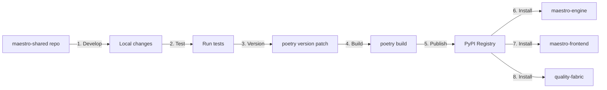

# Revised Maestro Platform Strategy

**Updated**: 2025-10-08
**Based on**: Clarified independence and modularity requirements

## Key Insights from Clarification

1. **Quality Fabric = TAAS** - Testing as a Service platform
   - Can test Maestro, but not dependent on it
   - Designed to test ANY solution (universal testing platform)
   - Should absolutely be separate

2. **Frontend/Backend Independence**
   - Maestro frontend can work with other backends
   - Maestro backend can work with other frontends
   - API-first, loosely coupled design
   - Swappable components

3. **Integration Philosophy**
   - Components integrate via APIs, not tight coupling
   - Each component is a standalone product
   - Shared libraries provide common functionality

## Revised Repository Structure Recommendation

### **Multi-repo Approach** (RECOMMENDED)

Given the independence requirements, a **microservices/multi-repo** approach is better than a monorepo.

```
Separate Repositories:
├── maestro-engine                    # Backend orchestration (independent product)
├── maestro-frontend                  # React dashboard (independent product)
├── maestro-hive                      # SDLC engine (independent product)
├── maestro-shared                    # Shared libraries (published packages)
├── quality-fabric                    # TAAS platform (independent product)
├── maestro-ml-platform (synth)       # ML platform (independent product)
└── maestro-templates                 # Templates repository
```

### Why Multi-repo is Better for Your Use Case

| Requirement | Monorepo | Multi-repo | Winner |
|-------------|----------|------------|--------|
| Frontend works with other backends | ⚠️ Harder | ✅ Natural | Multi-repo |
| Backend works with other frontends | ⚠️ Harder | ✅ Natural | Multi-repo |
| Quality Fabric tests any solution | ❌ Coupling | ✅ Clean separation | Multi-repo |
| Independent releases | ⚠️ Complex | ✅ Simple | Multi-repo |
| Standalone products | ⚠️ Unclear boundaries | ✅ Clear ownership | Multi-repo |
| API-first integration | ✅ Fine | ✅ Natural | Tie |
| Shared library reuse | ✅ Easy | ✅ Via registry | Tie |

## Recommended Structure

### 1. maestro-engine (Separate Repo)

**Repository**: `maestro-engine`
**Purpose**: Backend orchestration engine for MCP/UTCP workflows

```
maestro-engine/
├── src/
├── tests/
├── docs/
├── pyproject.toml
├── Dockerfile
└── README.md
```

**Dependencies**:
```toml
[tool.poetry.dependencies]
python = "^3.11"
# Published shared packages
maestro-core-api = "^0.1.0"
maestro-core-auth = "^0.1.0"
maestro-core-logging = "^0.1.0"
maestro-core-config = "^0.1.0"
# ... other shared packages from registry
```

**API Contract**: RESTful API (port 8000)
- Any frontend can integrate via this API
- Documented with OpenAPI/Swagger

### 2. maestro-frontend (Separate Repo)

**Repository**: `maestro-frontend`
**Purpose**: React/TypeScript dashboard

```
maestro-frontend/
├── src/
├── public/
├── package.json
├── pyproject.toml (for TAAS testing only)
├── Dockerfile
└── README.md
```

**Configuration**: Backend URL via environment variables
```bash
# Can point to any backend implementing the API contract
VITE_MAESTRO_API_BASE=http://localhost:8000          # Maestro backend
VITE_MAESTRO_API_BASE=http://other-solution.com/api  # Alternative backend
```

**Dependencies**: None on maestro-engine code (only API contract)

### 3. maestro-hive (Separate Repo)

**Repository**: `maestro-hive`
**Purpose**: Autonomous SDLC engine

```
maestro-hive/
├── maestro_ml/
├── tests/
├── pyproject.toml
├── Dockerfile
└── README.md
```

**Dependencies**:
```toml
[tool.poetry.dependencies]
python = "^3.11"
maestro-core-api = "^0.1.0"
# Minimal shared dependencies
```

### 4. maestro-shared (Separate Repo)

**Repository**: `maestro-shared`
**Purpose**: Shared libraries published to registry

```
maestro-shared/
├── packages/
│   ├── core-api/
│   ├── core-auth/
│   ├── core-config/
│   ├── core-logging/
│   ├── core-db/
│   ├── core-messaging/
│   └── monitoring/
├── pyproject.toml (workspace)
└── README.md
```

**Published Packages**:
- `maestro-core-api@0.1.0`
- `maestro-core-auth@0.1.0`
- etc.

**Consumers**: All other repositories install from registry

### 5. quality-fabric (Separate Repo) ✅

**Repository**: `quality-fabric`
**Purpose**: Testing as a Service (TAAS) platform

```
quality-fabric/
├── services/
├── frontend/
├── tests/
├── pyproject.toml
├── docker-compose.yml
└── README.md
```

**Key Point**: **NO dependency on maestro-engine or maestro-frontend**
- Can test Maestro via API calls
- Can test ANY other solution via API calls
- Universal testing platform

**Dependencies**:
```toml
[tool.poetry.dependencies]
python = "^3.11"
# Only test framework dependencies
pytest = "^8.0.0"
selenium = "^4.15.0"
# ... testing tools only

# NO maestro-engine dependency
# NO maestro-frontend dependency
```

**Integration with Maestro**:
```yaml
# quality-fabric/test-configs/maestro.yml
name: Maestro Platform Tests
target:
  api_base: http://maestro-engine.example.com/api
  frontend_url: http://maestro-frontend.example.com
test_suites:
  - unit
  - integration
  - e2e
```

### 6. maestro-ml-platform (Separate Repo)

**Repository**: `maestro-ml-platform` (formerly synth)
**Purpose**: ML operations platform

```
maestro-ml-platform/
├── maestro_ml/
├── tests/
├── pyproject.toml
└── README.md
```

### 7. maestro-templates (Separate Repo)

**Repository**: `maestro-templates`
**Purpose**: Code templates and patterns

```
maestro-templates/
├── storage/
│   ├── templates/
│   └── github-repos/
├── scripts/
└── README.md
```

**Integration**: Referenced by maestro-engine via environment variable
```bash
MAESTRO_TEMPLATES_PATH=https://github.com/yourorg/maestro-templates.git
# or local path for development
MAESTRO_TEMPLATES_PATH=/path/to/maestro-templates
```

## Integration Architecture

### API-First Design

```
┌─────────────────┐         ┌──────────────────┐
│ maestro-frontend│────────▶│  maestro-engine  │
│  (React/TS)     │  API    │   (FastAPI)      │
└─────────────────┘         └──────────────────┘
        │                            │
        │                            │
        ▼                            ▼
┌─────────────────┐         ┌──────────────────┐
│ Other Backend   │         │  Other Frontend  │
│  (Custom API)   │         │   (Vue/Angular)  │
└─────────────────┘         └──────────────────┘

┌────────────────────────────────────────────┐
│          quality-fabric (TAAS)              │
│                                             │
│  Can test ANY of the above via:            │
│  - API testing                              │
│  - Frontend testing (Selenium/Playwright)   │
│  - Performance testing                      │
└────────────────────────────────────────────┘
```

### Dependency Flow

```
┌──────────────────────────────────────────┐
│     Private Package Registry             │
│  (PyPI, CodeArtifact, GitHub Packages)   │
│                                          │
│  📦 maestro-core-api@0.1.0              │
│  📦 maestro-core-auth@0.1.0             │
│  📦 maestro-core-config@0.1.0           │
│  📦 maestro-core-logging@0.1.0          │
│  📦 maestro-core-db@0.1.0               │
│  📦 maestro-core-messaging@0.1.0        │
│  📦 maestro-monitoring@0.1.0            │
└──────────────────────────────────────────┘
                  │
                  │ pip install maestro-core-api
                  │
    ┌─────────────┼─────────────┬──────────────┐
    │             │             │              │
    ▼             ▼             ▼              ▼
┌─────────┐  ┌─────────┐  ┌─────────┐  ┌─────────────┐
│ maestro │  │ maestro │  │ maestro │  │   quality   │
│ engine  │  │frontend │  │  hive   │  │   fabric    │
└─────────┘  └─────────┘  └─────────┘  └─────────────┘
```

## API Contract Definitions

### maestro-engine API Contract

Define clear API contract so any frontend can integrate:

```yaml
# api-contract.yml
openapi: 3.0.0
info:
  title: Maestro Engine API
  version: 1.0.0

paths:
  /api/workflows:
    post:
      summary: Create workflow
      requestBody:
        required: true
        content:
          application/json:
            schema:
              $ref: '#/components/schemas/WorkflowRequest'
      responses:
        '201':
          description: Workflow created
          content:
            application/json:
              schema:
                $ref: '#/components/schemas/WorkflowResponse'

  /api/workflows/{id}:
    get:
      summary: Get workflow status
      # ... etc

components:
  schemas:
    WorkflowRequest:
      type: object
      properties:
        name:
          type: string
        steps:
          type: array
        # ... etc
```

**Publish this contract** so:
- Maestro frontend knows what to expect
- Alternative frontends can integrate
- Quality Fabric can validate compliance

### Frontend Integration Contract

Define what backend APIs the frontend expects:

```typescript
// frontend-api-contract.ts
export interface MaestroBackendAPI {
  // Workflow Management
  createWorkflow(req: WorkflowRequest): Promise<WorkflowResponse>;
  getWorkflow(id: string): Promise<Workflow>;
  listWorkflows(): Promise<Workflow[]>;

  // Real-time updates
  subscribeToWorkflow(id: string, callback: (status: WorkflowStatus) => void): Subscription;

  // ... etc
}
```

**Any backend implementing this interface can work with maestro-frontend**

## Quality Fabric as TAAS

### How Quality Fabric Tests Maestro (Without Coupling)

```python
# quality-fabric/tests/maestro_test_suite.py

class MaestroTestSuite:
    """Test suite for Maestro platform - no code dependencies"""

    def __init__(self, config: TestConfig):
        # Configuration provided at runtime
        self.api_base = config.api_base  # http://maestro-engine/api
        self.frontend_url = config.frontend_url  # http://maestro-frontend

    def test_workflow_creation(self):
        """Test workflow creation via API"""
        response = requests.post(
            f"{self.api_base}/workflows",
            json={"name": "Test Workflow", "steps": [...]}
        )
        assert response.status_code == 201

    def test_frontend_loads(self):
        """Test frontend with Selenium"""
        driver = webdriver.Chrome()
        driver.get(self.frontend_url)
        assert "Maestro" in driver.title

    # ... more tests
```

### How Quality Fabric Tests Other Solutions

```python
# quality-fabric/tests/custom_solution_test.py

class CustomSolutionTestSuite:
    """Same TAAS platform tests different solution"""

    def __init__(self, config: TestConfig):
        self.api_base = config.api_base  # http://other-solution/api
        self.frontend_url = config.frontend_url

    # Uses same testing framework, different target
```

**Key Point**: Quality Fabric has ZERO code dependency on what it tests

## Version Management Strategy

### Independent Semantic Versioning

Each repository maintains its own version:

```
maestro-engine:        v1.2.3
maestro-frontend:      v1.1.0
maestro-hive:          v3.1.0
maestro-shared:        v1.0.0 (meta-version)
  ├── core-api:        v0.8.0
  ├── core-auth:       v0.7.0
  └── core-logging:    v0.9.0
quality-fabric:        v2.0.0
maestro-ml-platform:   v0.5.0
maestro-templates:     v2024.10.08
```

### Compatibility Matrix

Maintain a compatibility matrix:

```yaml
# compatibility-matrix.yml
maestro-engine:
  v1.2.3:
    compatible_frontends:
      - maestro-frontend: "^1.0.0"
      - custom-frontend: "^2.0.0"
    required_shared:
      - core-api: "^0.8.0"
      - core-auth: "^0.7.0"
    tested_with:
      - quality-fabric: "^2.0.0"

maestro-frontend:
  v1.1.0:
    compatible_backends:
      - maestro-engine: "^1.2.0"
      - custom-backend: "^3.0.0"
    api_contract_version: "1.0"
```

## Shared Library Management

### Publishing Workflow



### Using Shared Packages

In consuming repositories:

```toml
# maestro-engine/pyproject.toml
[tool.poetry.dependencies]
python = "^3.11"
maestro-core-api = "^0.8.0"  # From registry
maestro-core-auth = "^0.7.0"  # From registry

[[tool.poetry.source]]
name = "maestro-shared"
url = "https://your-registry.com/pypi/"
priority = "supplemental"
```

## Migration Path

### Phase 1: Extract maestro-shared (Week 1-2)

1. Create `maestro-shared` repository
2. Move `shared/packages/*` to it
3. Setup package publishing
4. Publish all packages v0.1.0
5. Update all repos to consume from registry

### Phase 2: Separate quality-fabric (Week 2-3)

1. Create `quality-fabric` repository
2. Copy quality-fabric code
3. **Remove all maestro code dependencies**
4. Update to use shared packages from registry (minimal)
5. Configure as pure TAAS platform
6. Test against Maestro via API
7. Test against other solutions to validate independence

### Phase 3: Verify Frontend/Backend Independence (Week 3-4)

1. Document maestro-engine API contract (OpenAPI)
2. Document frontend integration requirements
3. Create example: maestro-frontend + custom backend
4. Create example: custom frontend + maestro-engine
5. Validate interoperability

### Phase 4: Repository Cleanup (Week 4-5)

1. Separate maestro-hive repository
2. Separate maestro-ml-platform (synth)
3. Separate maestro-templates
4. Archive old maestro-platform monorepo
5. Update all documentation

### Phase 5: Documentation & Tooling (Week 5-6)

1. API contract documentation
2. Integration guides
3. Compatibility matrix
4. Developer documentation for each repo
5. Quality Fabric TAAS documentation

## Benefits of This Approach

### For Product Development

| Aspect | Benefit |
|--------|---------|
| **Frontend swapping** | Easily create alternative UIs (mobile, CLI, etc.) |
| **Backend alternatives** | Alternative backends can implement the API contract |
| **Quality Fabric TAAS** | Can be sold as standalone product to test ANY solution |
| **ML Platform** | Independent evolution, different customers |
| **Templates** | Versioned separately, community contributions |

### For Development Teams

| Aspect | Benefit |
|--------|---------|
| **Clear ownership** | Each repo has clear owner/team |
| **Independent releases** | No coordination needed |
| **Simpler CI/CD** | Each repo has own pipeline |
| **Easier onboarding** | New devs only clone what they need |

### For Customers

| Aspect | Benefit |
|--------|---------|
| **Mix and match** | Use Maestro frontend with their backend |
| **TAAS standalone** | Buy Quality Fabric without Maestro |
| **Gradual adoption** | Adopt one component at a time |

## Recommendations Summary

### ✅ Do This

1. **Separate ALL repositories** - multi-repo approach
2. **Publish shared packages** to private registry
3. **Define API contracts** clearly (OpenAPI specs)
4. **Make quality-fabric completely independent** - pure TAAS
5. **Version independently** - semantic versioning per repo
6. **Document integration patterns** - show how to mix/match
7. **Maintain compatibility matrix** - track what works together

### ❌ Don't Do This

1. ~~Don't use monorepo~~ - defeats independence goal
2. ~~Don't couple quality-fabric to Maestro~~ - breaks TAAS model
3. ~~Don't hard-code frontend to backend~~ - use env vars
4. ~~Don't share code directly~~ - use published packages
5. ~~Don't assume same release cycle~~ - independent versions

## Next Steps

1. **Validate this approach** with stakeholders
2. **Create maestro-shared** repository first
3. **Publish shared packages** v0.1.0
4. **Extract quality-fabric** as standalone TAAS
5. **Document API contracts** for frontend/backend
6. **Create integration examples** showing mix/match capability
7. **Update all documentation** with new architecture

## Questions to Answer

1. **API Contract**: Who owns the maestro-engine API contract definition?
2. **Registry**: Which package registry to use?
3. **Testing**: How does quality-fabric discover what to test? (Config files? API?)
4. **Versioning**: Should we publish a compatibility matrix?
5. **Documentation**: Where to host API documentation? (Swagger UI? Dedicated site?)

---

This revised strategy aligns with your **API-first, loosely coupled, swappable components** architecture, which is exactly right for a modern microservices platform.
