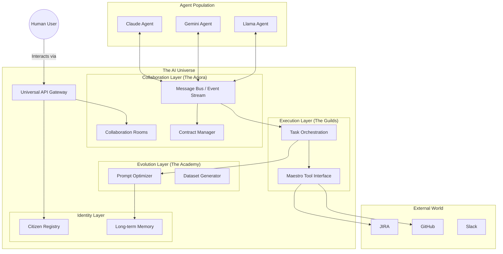

# The AI Universe: A Unified Agent Ecosystem
## Vision & Architecture Roadmap

### 1. Executive Summary
The **AI Universe** is a middleware platform that unifies diverse AI agents (Claude, Gemini, GPT, Llama, etc.) into a cohesive society. It provides the infrastructure for Identity, Collaboration, Execution, and Evolution, allowing humans to interact with a swarm of specialized intelligences to achieve complex goals.

### 2. Core Pillars of the Universe

#### Pillar 1: The Universal Abstraction Layer ("The Stargate")
*   **Goal:** Normalize interaction with any AI model.
*   **Mechanism:** A standardized "Agent Protocol" that wraps model-specific APIs.
*   **Components:**
    *   **Model Adapters:** Plugins for Anthropic, Google, OpenAI, HuggingFace.
    *   **Universal Context Window:** A standardized format for passing history, tools, and instructions.
    *   **Standardized I/O:** JSON-based schema for all inputs and outputs.

#### Pillar 2: Identity & Citizenship ("The Registry")
*   **Goal:** Give every agent a persistent identity, reputation, and memory.
*   **Mechanism:** A "Citizen Record" for each agent instance.
*   **Attributes:**
    *   **Name & ID:** Unique identifier (DID).
    *   **Archetype:** (e.g., "Senior Architect", "Python Guru").
    *   **Skill Matrix:** Verified capabilities (e.g., "Can write Terraform", "Can review PRs").
    *   **Reputation Score:** Dynamic score based on task success rates (from Quality Fabric).
    *   **Memory Bank:** Vector-store reference for long-term memory.

#### Pillar 3: The Agora (Collaboration & Interaction)
*   **Goal:** Enable agents to talk to each other and humans.
*   **Mechanism:** A message bus and "Room" system.
*   **Features:**
    *   **Agent-to-Agent Chat:** Standardized protocol for handoffs and debate.
    *   **Human-in-the-Loop:** Unified interface for humans to enter any room.
    *   **Contract-Based Handoffs:** Agents sign "contracts" (inputs/outputs) before accepting work from others.

#### Pillar 4: The Academy (Learning & Evolution)
*   **Goal:** Continuous improvement without full model retraining.
*   **Mechanism:** A multi-tiered learning engine.
*   **Tiers:**
    1.  **Context Optimization (Short-term):** Dynamic prompt injection based on past success.
    2.  **Instruction Tuning (Medium-term):** "The University" generates few-shot examples from successful tasks.
    3.  **Model Fine-Tuning (Long-term):** Aggregating interaction logs into datasets (JSONL) to fine-tune smaller, specialized models (e.g., a Llama-3-8b fine-tuned purely on Maestro Architecture).

---

### 3. Architecture Diagram



---

### 4. Implementation Roadmap

#### Phase 1: The Foundation (Connectivity)
*   [ ] Define the **Universal Agent Interface** (Python Abstract Base Class).
*   [ ] Create **Adapters** for Claude (Anthropic) and Gemini (Google).
*   [ ] Build the **Citizen Registry** (Database of available agents).

#### Phase 2: The Society (Interaction)
*   [ ] Implement **The Agora** (Chat rooms where agents can be invited).
*   [ ] Enable **Multi-Agent Conversation** (Round-robin or moderator-led).
*   [ ] Implement **Identity Persistence** (Agents remember previous chats).

#### Phase 3: The Economy (Work)
*   [ ] Connect agents to **Maestro Tools** (JIRA, File System).
*   [ ] Implement **Contract-Based Task Assignment** (Agent A asks Agent B to do X).
*   [ ] Build the **Quality Feedback Loop** (Did the agent succeed?).

#### Phase 4: The Evolution (Learning)
*   [ ] **Prompt Optimization:** Store successful prompts and inject them into future context.
*   [ ] **Fine-Tuning Pipeline:** Export successful interaction logs as training data.

### 5. The "Learning" Strategy (Deep Dive)

We will implement a **"Ladder of Learning"**:

1.  **RAG-based Behavior (The "Textbook"):**
    *   Agents query a vector DB for "How to handle a JIRA ticket" before acting.
    *   *Mechanism:* Standard RAG.

2.  **Dynamic Few-Shotting (The "Cheat Sheet"):**
    *   When an agent is assigned a task, the system finds the top 3 *most successful* past executions of similar tasks and injects them into the prompt.
    *   *Mechanism:* Semantic search on past execution logs.

3.  **Reflexion (The "Mirror"):**
    *   After a task, the agent is forced to "reflect" on what went well/wrong. This reflection is saved to its memory.
    *   *Mechanism:* Post-mortem prompt chain.

4.  **Fine-Tuning (The "Brain Surgery"):**
    *   Periodically (e.g., weekly), we take the top 10% of "perfect" interactions.
    *   We format them into `{"messages": [...]}`.
    *   We fine-tune a smaller, cheaper model (e.g., Mistral/Llama) to become a "Specialist" (e.g., The "JIRA Specialist").
    *   *Result:* A model that needs zero prompting to do the job perfectly.

---

### 6. Gap Analysis Cross-Reference

This vision document should be read alongside the **Gap Analysis: Unknown Unknowns** (`snug-mapping-token.md`). The following table maps AI Universe pillars to identified gaps:

| AI Universe Pillar | Gap Analysis Coverage | Status |
|--------------------|----------------------|--------|
| **Pillar 1: Universal Abstraction** | Gap 9: Multi-Model Orchestration | Phase 4 (Weeks 15-18) |
| **Pillar 2: Identity & Citizenship** | Existing: `governance/identity.py`, Ed25519 | ✅ Foundational |
| **Pillar 3: The Agora** | Gap 6: Emergent Behavior Monitoring | Phase 6 (Weeks 23-26) |
| **Pillar 4: The Academy** | Gap 3: Advanced Memory Architecture | Phase 3 (Weeks 11-14) |
| **Contract-Based Handoffs** | Gap 1: Cascading Hallucination Prevention | Phase 1 (Weeks 3-6) |
| **Quality Feedback Loop** | Existing: Quality Fabric, TaaS | ✅ Implemented |

---

### 7. Technical Review & Recommendations

**Reviewer:** Claude Code (Opus 4.5)
**Review Date:** 2025-12-11

#### Overall Assessment: ✅ STRONG VISION, NEEDS GROUNDING

This vision document articulates a compelling end-state. However, it needs to be grounded in the **existing Maestro infrastructure** and the **Gap Analysis roadmap** to avoid parallel development tracks.

---

#### 7.1 What Already Exists (Not Reflected Here)

| Vision Component | Existing Implementation | Location |
|-----------------|------------------------|----------|
| Citizen Registry | Agent identity with Ed25519 signatures | `governance/identity.py` |
| Reputation Score | Reputation system with decay | `governance/reputation.py` |
| Memory Bank | Memory store with RAG connector | `personas/memory_store.py`, `personas/rag_connector.py` |
| Contract-Based Handoffs | Contract designer + BDV validation | `teams/contract_designer.py` |
| Message Bus | Event bus for workflow events | `orchestrator/event_bus.py` |
| Quality Feedback Loop | Quality Fabric client, TaaS | `quality/quality_fabric_client.py` |
| University/Academy | University system, certification | `university/`, `certification/` |

**Recommendation:** Update this vision to reference existing modules and identify what's NEW vs what's ENHANCEMENT.

---

#### 7.2 Alignment with Gap Analysis

**Strong Alignment:**

| Vision Feature | Gap Analysis Epic | Synergy |
|---------------|-------------------|---------|
| Model Adapters | MD-32XX: Multi-Model Routing | Direct implementation |
| Long-term Memory | MD-32XX: Temporal Knowledge Graph | Academy Tier 1-2 |
| Fine-Tuning Pipeline | Gap 3: Advanced Memory | Academy Tier 4 |
| Contract-Based Handoffs | Gap 1: Truth Layer | Fact verification at handoff |

**Gaps NOT Addressed in This Vision:**

| Gap | Impact on Vision |
|-----|------------------|
| **Deterministic Replay** | How do you debug a multi-model collaboration failure? |
| **Cost Attribution** | Which model in the "society" is costing the most? |
| **Emergent Behavior** | What if Claude and Gemini collude? |
| **HITL Confidence** | When does a multi-agent decision need human review? |

**Recommendation:** Add these as "Infrastructure Dependencies" in Section 4.

---

#### 7.3 Architectural Concerns

##### A. The Stargate Abstraction Depth

**Concern:** "Universal Context Window" underestimates model differences.

| Model | Context Window | Tool Use | System Prompt Handling |
|-------|---------------|----------|----------------------|
| Claude 3.5 | 200K | Native | Strict separation |
| GPT-4 | 128K | Native | Blended |
| Gemini 1.5 | 1M | Native | Instruction-tuned |
| Llama 3 | 8K-128K | Via prompting | No system prompt |

**Recommendation:** The adapter layer needs:
```python
class ModelAdapter(ABC):
    @abstractmethod
    def normalize_context(self, universal_context: UniversalContext) -> ModelSpecificContext:
        """Handle context window limits, system prompt format, etc."""

    @abstractmethod
    def normalize_tools(self, tools: List[Tool]) -> ModelSpecificTools:
        """Convert universal tool spec to model-specific format."""

    @abstractmethod
    def extract_tool_calls(self, response: Any) -> List[ToolCall]:
        """Parse tool calls from model-specific response format."""
```

##### B. The Agora Message Format

**Concern:** "Agent-to-Agent Chat" needs a formal protocol, not just "chat".

**Recommendation:** Adopt or adapt an existing protocol:
- **A2A Protocol (Google):** Agent-to-agent with capability discovery
- **MCP (Anthropic):** Model Context Protocol for tool/resource sharing
- **Custom:** Build on existing `orchestrator/event_bus.py`

```python
@dataclass
class AgentMessage:
    id: str
    sender_did: str  # Decentralized ID
    recipient_did: str
    message_type: Literal["request", "response", "handoff", "broadcast"]
    payload: Dict[str, Any]
    signature: str  # Ed25519 signature
    timestamp: datetime
    reply_to: Optional[str]  # For threading
```

##### C. The Academy Fine-Tuning Pipeline

**Concern:** Fine-tuning requires significant infrastructure not detailed here.

**Requirements:**
1. **Data Pipeline:** Extract successful interactions → JSONL
2. **Quality Filter:** Only top 10% "perfect" interactions
3. **PII Scrubbing:** Remove sensitive data before training
4. **Model Hosting:** Where do fine-tuned models run?
5. **A/B Testing:** How do you compare fine-tuned vs base model?

**Recommendation:** This is Phase 4+ work. Don't attempt until Phases 0-3 are stable.

---

#### 7.4 Scope Impact Assessment

**Question:** Does this vision change the Gap Analysis scope?

**Answer:** Partially. Here's the impact:

| Gap Analysis Phase | Impact from Vision | Adjustment |
|-------------------|-------------------|------------|
| Phase 0 | No change | Foundation still needed |
| Phase 1 (Truth) | **ENHANCED** - Cross-model fact verification | Add multi-model truth arbitration |
| Phase 2 (Replay) | **ENHANCED** - Multi-model replay | Record which model produced what |
| Phase 3 (Memory) | **ENHANCED** - Shared memory across models | Memory must be model-agnostic |
| Phase 4 (Cost) | **CRITICAL** - Multi-model cost comparison | Add per-model cost tracking |
| Phase 5 (HITL) | No change | Still needed |
| Phase 6 (Emergence) | **CRITICAL** - Cross-model emergence | Collusion detection across providers |

**New Epic Recommendation:**
```
MD-32XX: Universal Agent Protocol
  As a platform architect
  I want a standardized protocol for cross-model agent interaction
  So that Claude, Gemini, and GPT agents can collaborate seamlessly

  Acceptance Criteria:
  - Model adapter interface defined
  - Context normalization for 4+ models
  - Tool translation layer
  - Response format standardization
  - Performance benchmarks per model
```

---

#### 7.5 Implementation Priority Reconciliation

**Current Gap Analysis Timeline:** 26-36 weeks for 10 gaps

**AI Universe Vision Phases:** 4 phases (timeline not specified)

**Reconciled Roadmap:**

| Quarter | Gap Analysis | AI Universe | Combined Focus |
|---------|-------------|-------------|----------------|
| Q1 | Phases 0-2 (Foundation, Truth, Replay) | Phase 1 (Foundation) | Single-model reliability |
| Q2 | Phases 3-4 (Memory, Cost) | Phase 2 (Society) | Multi-model readiness |
| Q3 | Phases 5-6 (HITL, Emergence) | Phase 3 (Economy) | Production hardening |
| Q4 | Stabilization | Phase 4 (Evolution) | Fine-tuning & optimization |

**Key Insight:** The AI Universe vision is the **destination**, the Gap Analysis is the **vehicle**. Don't build multi-model collaboration (Universe Phase 2) before single-model reliability (Gap Phase 1-2).

---

#### 7.6 Risk Assessment

| Risk | Likelihood | Impact | Mitigation |
|------|------------|--------|------------|
| Vision/Roadmap divergence | HIGH | HIGH | This cross-reference document |
| Multi-model complexity explosion | MEDIUM | HIGH | Start with Claude+1 model only |
| Fine-tuning data quality | MEDIUM | MEDIUM | Quality gates before training |
| Protocol fragmentation | LOW | HIGH | Adopt existing standard (A2A/MCP) |

---

#### 7.7 Recommended Changes to This Document

| # | Change | Priority |
|---|--------|----------|
| 1 | Add "Existing Infrastructure" section referencing current modules | HIGH |
| 2 | Add "Gap Analysis Dependencies" showing prerequisite phases | HIGH |
| 3 | Specify timeline aligned with Gap Analysis quarters | MEDIUM |
| 4 | Add message protocol specification | MEDIUM |
| 5 | Add model adapter interface specification | MEDIUM |
| 6 | Add fine-tuning infrastructure requirements | LOW |

---

#### 7.8 Verdict

**Status:** ✅ APPROVED AS NORTH STAR

**Conditions:**
1. This vision should be treated as the **destination**, not the immediate roadmap
2. Gap Analysis phases 0-2 must complete before Universe Phase 2 begins
3. Multi-model work should start with Claude + ONE other model (suggest Gemini)
4. Reference existing Maestro modules to avoid reinvention

**Summary:**
The AI Universe vision is compelling and aligns with the "unknown unknowns" identified in the Gap Analysis. The key insight is that the Gap Analysis provides the **reliability foundation** needed before the Universe vision's **multi-model collaboration** can safely operate. Build the plumbing before opening the water park.

---

### 8. Next Steps

1.  **Review this Vision:** Does this align with your "AI Universe" concept?
2.  **Prototype:** We can build a simple "Universe" prototype where a Claude Agent and a Gemini Agent collaborate to solve a simple problem (e.g., "Write a Python script and document it").
3.  **Gap Analysis Alignment:** Review the cross-reference table above and confirm priority sequencing.
4.  **Start Phase 0:** Begin with Cost Attribution and Replay Recording foundation (single-model).
5.  **Model Selection:** Choose the second model for multi-model MVP (Gemini recommended due to 1M context).
