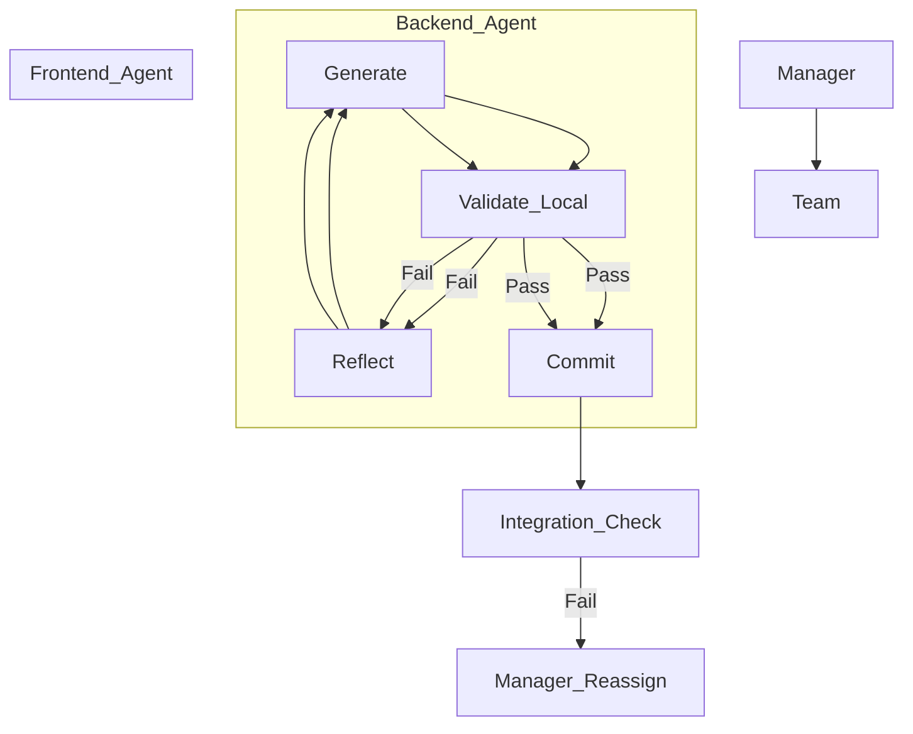

# Critical Architecture Review: Maestro Hive

## 1. Executive Summary
The current Maestro Hive architecture relies on a **"Manager-Forced Retry"** model that is functionally equivalent to a "brute-force" approach. While it uses sophisticated components (DDE, BDV, ACC), they are orchestrated in a **Waterfall** manner: *Generate All -> Validate All -> Fail All -> Retry All*.

This is a **Level 2 (Partial Automation)** pattern trying to pass as **Level 5 (Autonomous)**. Modern agentic frameworks (LangGraph, CrewAI) prioritize **internal reflection** and **state persistence**, whereas Maestro Hive relies on **external iteration** and **stateless resets**.

## 2. Identified Anti-Patterns

### 🔴 The "Amnesiac Retry" (Stateless Iteration)
*   **Current Behavior:** `IterativeExecutor` runs `team_execution_v2.py`. If *any* part fails (e.g., a syntax error in the Frontend), the process exits, and the manager restarts the *entire* team execution from scratch.
*   **Anti-Pattern:** This violates the **"Partial Success"** principle. You are discarding valid work (e.g., a perfect Backend) because of a minor error elsewhere.
*   **Cost:** Massive token waste and time loss. A 95% correct solution is treated identically to a 0% correct solution.

### 🔴 "Waterfall in Disguise" (Late Validation)
*   **Current Behavior:** Validation (DDE, BDV, ACC) happens only after the team has finished execution.
*   **Anti-Pattern:** **"Post-Mortem Quality."** In modern software development (and Agentic workflows), quality is "shifted left." Waiting until the end to check for syntax errors or architectural violations is inefficient.
*   **Impact:** The feedback loop is the length of the *entire* generation process (minutes) rather than the length of a single function generation (seconds).

### 🔴 The "Silent Worker" (Lack of Reflection)
*   **Current Behavior:** The personas in `team_execution_v2.py` appear to operate in "Single-Shot" mode. They receive a prompt and output code. They do not "read" their own code, run it, or fix it before handing it off.
*   **Anti-Pattern:** **"Open Loop Control."** Effective coding agents require a "Closed Loop" (Generate -> Test -> Reflect -> Refine) *before* considering the task done.

## 3. JIT (Just-In-Time) Improvements

To modernize the architecture, "Just-In-Time" concepts must be applied to the agent workflow:

### JIT Validation (The "Micro-Loop")
Instead of waiting for the `IterativeExecutor` to catch a failure, the **Persona Agent** should perform JIT validation:
*   **Syntax/Linting:** Immediately after generating a file, run `ast.parse()` or `pylint`. If it fails, the agent self-corrects *without* notifying the manager.
*   **Unit Testing:** Generate a test *before* or *with* the code (TDD). Run it immediately.

### JIT Context Injection
Instead of dumping a massive context into the prompt at the start:
*   **Dynamic Retrieval:** If the agent is working on `auth.py`, JIT fetch the `security_policy.md` and `user_schema.sql`.
*   **Error-Driven Context:** If an agent encounters an `ImportError`, JIT fetch the project structure to understand the correct path, rather than guessing.

## 4. Architectural Recommendations: From "Retry" to "Refinement"

### Step 1: Kill the `IterativeExecutor` Loop
The external loop in `IterativeExecutor` is a crutch. Move the "Retry" logic *inside* the `PersonaExecutor` components.

### Step 2: Implement "Stateful Orchestration" (The Blackboard Pattern)
Replace the stateless execution with a persistent state model (e.g., a `state.json` or a database).
*   **State:** `Backend: DONE`, `Frontend: FAILED`, `QA: PENDING`.
*   **Action:** When the system retries, it sees `Backend: DONE` and **skips** it, loading the artifacts from disk. It only re-allocates resources to `Frontend`.

### Step 3: The "Refinement Loop" Architecture
Change the flow from Linear to Circular:

**Current (Linear):**
`Manager -> [Backend | Frontend | QA] -> Validator -> (Fail/Restart)`

**Proposed (Refinement):**

### Step 4: "Brutal" Efficiency Fixes
1.  **Stop generating "Plans" if you don't use them:** If the agents generate a plan but then ignore it during execution, remove the planning step or force adherence.
2.  **Token Budgeting:** Implement a "Give Up" threshold inside the agent. If an agent fails validation 3 times, it should raise a `HelpNeeded` exception rather than hallucinating a 4th fix.
3.  **Diff-Based Editing:** Stop rewriting entire files. Agents should output *diffs* or use tools like `sed`/`patch` to modify existing code, preserving context and saving tokens.

## 5. Conclusion
Maestro Hive is currently a **"Manager-Driven"** system. To become an **"AI Agent"** system, it must empower the individual workers (Personas) to validate and fix their own work (JIT Validation) and respect the work that has already been successfully completed (Stateful Execution). The `IterativeExecutor` should be a safety net of last resort, not the primary driver of quality.
