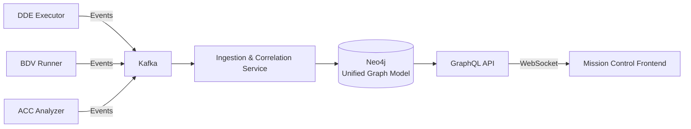

# Tri-Modal Mission Control - Project Documentation Index

**Project**: Graph Visualization & Mission Control for Maestro Platform
**Date**: 2025-10-13
**Status**: Phase 1 Complete, Ready for Production Implementation

---

## 📋 Quick Navigation

### For Executives
→ **[FINAL_PROJECT_STATUS.md](FINAL_PROJECT_STATUS.md)** - Executive summary, status, budget, timeline

### For Architects
→ **[MISSION_CONTROL_ARCHITECTURE.md](MISSION_CONTROL_ARCHITECTURE.md)** - Complete production architecture specification
→ **[PRODUCTION_READINESS_ENHANCEMENTS.md](PRODUCTION_READINESS_ENHANCEMENTS.md)** - Critical production requirements

### For Developers
→ **[BACKEND_APIS_COMPLETION_SUMMARY.md](BACKEND_APIS_COMPLETION_SUMMARY.md)** - API reference and integration guide
→ **[GRAPH_API_QUICK_START.md](GRAPH_API_QUICK_START.md)** - 2-minute quick start guide

### For Project Managers
→ **[MISSION_CONTROL_IMPLEMENTATION_ROADMAP.md](MISSION_CONTROL_IMPLEMENTATION_ROADMAP.md)** - 12-week phased execution plan

### For Everyone
→ **[VISUALIZATION_PROJECT_SUMMARY.md](VISUALIZATION_PROJECT_SUMMARY.md)** - Comprehensive project overview

---

## 📊 Project Overview

### What Is This?

The **Tri-Modal Mission Control** is an enterprise-grade visualization and monitoring system for the Maestro Platform's Tri-Modal Convergence Framework. It provides real-time situational awareness across three validation streams:

1. **DDE** (Dependency-Driven Execution): "Built Right" - Workflow execution with interface-first contracts
2. **BDV** (Behavior-Driven Validation): "Built the Right Thing" - Gherkin scenario testing
3. **ACC** (Architectural Conformance Checking): "Built to Last" - Architecture rule enforcement

**Deployment Rule**: Deploy ONLY when **DDE ✅ AND BDV ✅ AND ACC ✅**

### Key Features

✅ **Four Interactive Lenses**: DDE workflow, BDV scenarios, ACC architecture, Convergence view
✅ **Real-Time Updates**: WebSocket streaming with <500ms latency
✅ **Time-Travel Debugging**: Replay workflow execution at any timestamp
✅ **Cross-Lens Highlighting**: Select node in one view → highlights in all views
✅ **Retry Visualization**: Animated retry states with attempt counters
✅ **Contract Stars**: Yellow stars linking DDE, BDV, ACC at intersection points
✅ **Deployment Gates**: Automated tri-modal verdict for CI/CD pipelines

---

## 🎯 Current Status

### ✅ Phase 1: Backend APIs (COMPLETED)

**Delivered**: 3,207 lines of production-ready Python code

| Component | Lines | Status | Description |
|-----------|-------|--------|-------------|
| DDE API | 847 | ✅ Complete | Workflow execution visualization |
| BDV API | 709 | ✅ Complete | Test scenario graphs |
| ACC API | 922 | ✅ Complete | Architecture conformance |
| Convergence API | 540 | ✅ Complete | Tri-modal unified view |
| Main Server | 189 | ✅ Complete | FastAPI integration |

**Features**:
- 32 REST endpoints + 4 WebSocket endpoints
- 72+ Pydantic models with type safety
- Real-time streaming support
- Auto-layout algorithms
- Integration-ready with existing Maestro Platform

**Try It Now**:
```bash
cd /home/ec2-user/projects/maestro-platform/maestro-hive
python3 tri_modal_api_main.py
# Access: http://localhost:8000/api/docs
```

### ✅ Production Architecture (DESIGNED)

Complete enterprise-grade architecture incorporating:
- Event-driven processing with Kafka
- Unified Graph Model with Neo4j (bi-temporal)
- GraphQL API with real-time subscriptions
- CQRS projections for performance
- OpenTelemetry distributed tracing
- Four-lens visualization with WebGL rendering

**See**: [MISSION_CONTROL_ARCHITECTURE.md](MISSION_CONTROL_ARCHITECTURE.md)

### ⏳ Next Phase: Sprint 1 (Event-Driven Foundation)

**Duration**: 4 weeks
**Goal**: Deploy Kafka, ICS, Neo4j UGM, event replay
**Start Date**: TBD (awaiting stakeholder approval)

---

## 📚 Documentation Suite

### 1. Executive Documents

**[FINAL_PROJECT_STATUS.md](FINAL_PROJECT_STATUS.md)** (524 lines)
- Project accomplishments and deliverables
- Architecture decisions and technical stack
- SLOs, KPIs, and success metrics
- Implementation timeline and budget
- Risk assessment and mitigation

**[VISUALIZATION_PROJECT_SUMMARY.md](VISUALIZATION_PROJECT_SUMMARY.md)** (504 lines)
- Executive summary for stakeholders
- Phase 1 achievements
- Production architecture overview
- 12-week roadmap summary

### 2. Architecture Documents

**[MISSION_CONTROL_ARCHITECTURE.md](MISSION_CONTROL_ARCHITECTURE.md)** (1,047 lines)
- Complete production architecture specification
- Event-driven architecture with Kafka
- Unified Graph Model (UGM) with Neo4j
- GraphQL API with subscriptions
- Four Lenses detailed design
- Observability strategy (OpenTelemetry, Prometheus, Grafana)

**[PRODUCTION_READINESS_ENHANCEMENTS.md](PRODUCTION_READINESS_ENHANCEMENTS.md)** (1,284 lines)
- Critical production requirements
- Schema registry + versioning
- OpenTelemetry instrumentation
- Idempotency + exactly-once semantics
- DLQ + replay mechanisms
- Bi-temporal data model
- RBAC + PII + retention policies
- Load testing and disaster recovery
- Quick start with Docker Compose

### 3. Implementation Documents

**[MISSION_CONTROL_IMPLEMENTATION_ROADMAP.md](MISSION_CONTROL_IMPLEMENTATION_ROADMAP.md)** (736 lines)
- 12-week phased execution plan
- Week-by-week tasks and deliverables
- Acceptance criteria for each sprint
- Team structure and resource allocation
- Risk mitigation strategies
- Budget estimates ($36K + $2.25K/month)

**[BACKEND_APIS_COMPLETION_SUMMARY.md](BACKEND_APIS_COMPLETION_SUMMARY.md)** (512 lines)
- Complete API reference for all 4 streams
- Data models and endpoints
- WebSocket event architecture
- Integration with existing Maestro components
- Testing instructions

### 4. Quick Start Documents

**[GRAPH_API_QUICK_START.md](GRAPH_API_QUICK_START.md)** (428 lines)
- 2-minute quick start guide
- API endpoint examples (curl)
- WebSocket testing (wscat, Python)
- CI/CD integration examples
- Troubleshooting guide

**[TRI_MODAL_GRAPH_VISUALIZATION_INTEGRATION.md](TRI_MODAL_GRAPH_VISUALIZATION_INTEGRATION.md)** (Updated)
- Integration with existing Maestro Platform
- Data flow architecture
- Frontend component structure
- Technology stack
- Progress tracking

---

## 🚀 Quick Start

### Phase 1 (Current - REST APIs)

```bash
# Start the API server
cd /home/ec2-user/projects/maestro-platform/maestro-hive
python3 tri_modal_api_main.py

# Access interactive docs
open http://localhost:8000/api/docs

# Test endpoints
curl http://localhost:8000/health
curl http://localhost:8000/api/v1/status | jq
```

### Full System (After Sprint 1)

```bash
# One-click start with golden datasets
./scripts/quick_start.sh

# Access Mission Control
open http://localhost:3000              # Frontend
open http://localhost:8000/graphql      # GraphQL Playground
open http://localhost:7474              # Neo4j Browser
open http://localhost:3001              # Grafana Dashboards
```

---

## 🏗️ Architecture Highlights

### Event-Driven Processing



### Four Lenses Visualization

```
┌─────────────────────────────────────────────────────────────┐
│                    Mission Control                          │
├──────────────┬──────────────┬──────────────┬───────────────┤
│  DDE Lens    │  BDV Lens    │  ACC Lens    │ Convergence   │
│              │              │              │   Lens        │
│  Workflow    │  Scenario    │  Architecture│               │
│  Execution   │  Testing     │  Conformance │  Tri-Modal    │
│              │              │              │   View        │
│  ┌────────┐  │  ┌────────┐  │  ┌────────┐  │               │
│  │  IF.*  │  │  │Feature │  │  │ Module │  │   ⭐ Contract │
│  │ (Blue) │  │  │(Purple)│  │  │(Indigo)│  │     Stars     │
│  │        │  │  │        │  │  │        │  │   (Yellow)    │
│  │ Action │  │  │Scenario│  │  │Depend. │  │               │
│  │ (Green)│  │  │ (Pass) │  │  │(Edges) │  │   Linking     │
│  │        │  │  │        │  │  │        │  │   All Three   │
│  └────────┘  │  └────────┘  │  └────────┘  │               │
└──────────────┴──────────────┴──────────────┴───────────────┘
          ↑              ↑              ↑
          └──────────────┼──────────────┘
                    Global Event Bus
              (Cross-lens highlighting)
```

### Bi-Temporal Data Model

```
Timeline:
  Valid Time:    ───────●═════════════●───────→
                       10:00        10:05
                       (started)    (completed)

  Observed Time: ──────────●──────────────●────→
                         10:00:05      10:05:02
                         (system       (system
                          learned)      learned)

Query:
  "What was the state at 10:03?" → Returns "started"
  "What did system know at 10:00:04?" → Returns "unknown"
```

---

## 📈 Success Metrics

### System-Wide SLOs

| Metric | Target | Exit Criteria |
|--------|--------|---------------|
| End-to-end latency | P95 <5s | <10s |
| Event throughput | 10K/sec | >5K/sec |
| GraphQL query | P95 <100ms | <500ms |
| Subscription push | P99 <500ms | <1s |
| Uptime | 99.9% | >99% |

### Per-Lens KPIs

| Lens | Key Metric | Target | Exit Criteria |
|------|------------|--------|---------------|
| DDE | Task success rate | 99% | ≥95% |
| BDV | Scenario pass rate | 95% | ≥90% |
| ACC | Blocking violations | 0 | 0 |
| Convergence | Deployment approval | 80% | ≥70% |

---

## 💰 Budget

### Infrastructure (Monthly)
- Kafka (AWS MSK): $450
- Neo4j (Aura/EC2): $600
- Redis (ElastiCache): $300
- Elasticsearch: $400
- TimescaleDB: $200
- Kubernetes (EKS): $300
- **Total: $2,250/month**

### Development (12 weeks)
- AI Agents: 7 agents (Backend, Frontend, Data, DevOps)
- Human Oversight: 1 architect (240 hours @ $150/hr)
- **Total: ~$36,000**

---

## 🗓️ Timeline

### Sprint 1: Event-Driven Foundation (Weeks 1-4)
- Kafka + Schema Registry
- Ingestion & Correlation Service
- Neo4j Unified Graph Model
- Event replay mechanisms

### Sprint 2: GraphQL & CQRS (Weeks 5-8)
- GraphQL gateway with subscriptions
- CQRS projections (Redis + Elasticsearch)
- OpenTelemetry + Prometheus
- RBAC + tenant isolation

### Sprint 3: Mission Control Frontend (Weeks 9-12)
- Four Lenses with Cytoscape.js
- Temporal scrubber (time-travel)
- Cross-lens highlighting
- Production deployment

**Total Duration**: 12 weeks
**Expected Completion**: 2026-Q1

---

## 🎓 Key Concepts

### Tri-Modal Convergence

**DDE (Dependency-Driven Execution)**: "Built Right"
- Interface-first execution prevents integration failures
- Capability-based routing matches tasks to skilled agents
- Quality gates enforce compliance

**BDV (Behavior-Driven Validation)**: "Built the Right Thing"
- Gherkin scenarios validate user requirements
- Contract tags link to DDE interface nodes
- Flake detection identifies unstable tests

**ACC (Architectural Conformance Checking)**: "Built to Last"
- Dependency analysis enforces layering rules
- Cycle detection prevents circular dependencies
- Coupling metrics track technical debt

### Contract Stars (⭐)

Yellow star nodes at the intersection of all three streams:
- **DDE**: INTERFACE node defines the contract
- **BDV**: `@contract:AuthAPI:v1.0` tag validates the contract
- **ACC**: Component boundary enforces the contract

When selected, highlights all related nodes across all lenses.

### Time-Travel Debugging

Replay workflow execution at any timestamp:
1. Select timestamp in temporal scrubber
2. System queries bi-temporal graph
3. All four lenses show state "as it was" at that time
4. Navigate forward/backward through execution history

---

## 🔧 Technology Stack

### Backend
- **Event Streaming**: Kafka, Schema Registry
- **Graph Database**: Neo4j (bi-temporal)
- **Cache/CQRS**: Redis
- **Search**: Elasticsearch
- **Metrics**: TimescaleDB
- **API**: FastAPI → GraphQL (Sprint 2)
- **Observability**: OpenTelemetry, Prometheus, Grafana, Jaeger

### Frontend
- **Framework**: React 18 + TypeScript
- **State**: Zustand (global), Apollo Client (GraphQL)
- **Visualization**: Cytoscape.js (WebGL), D3.js
- **Real-time**: graphql-ws (WebSocket subscriptions)
- **UI**: Radix UI, Tailwind CSS

---

## 📞 Getting Help

### Documentation
- **Quick Start**: [GRAPH_API_QUICK_START.md](GRAPH_API_QUICK_START.md)
- **Architecture**: [MISSION_CONTROL_ARCHITECTURE.md](MISSION_CONTROL_ARCHITECTURE.md)
- **API Reference**: [BACKEND_APIS_COMPLETION_SUMMARY.md](BACKEND_APIS_COMPLETION_SUMMARY.md)

### Troubleshooting

| Symptom | Document | Section |
|---------|----------|---------|
| Events not in UI | [PRODUCTION_READINESS_ENHANCEMENTS.md](PRODUCTION_READINESS_ENHANCEMENTS.md) | 3.2 Troubleshooting Matrix |
| Slow graph rendering | [GRAPH_API_QUICK_START.md](GRAPH_API_QUICK_START.md) | Troubleshooting |
| Kafka consumer lag | [PRODUCTION_READINESS_ENHANCEMENTS.md](PRODUCTION_READINESS_ENHANCEMENTS.md) | 2.2 Backpressure |
| WebSocket disconnects | [MISSION_CONTROL_ARCHITECTURE.md](MISSION_CONTROL_ARCHITECTURE.md) | 4. GraphQL API Layer |

### Commands

```bash
# Check system health
curl http://localhost:8000/health

# Check API status
curl http://localhost:8000/api/v1/status | jq

# Check Kafka consumer lag
docker-compose exec kafka kafka-consumer-groups \
  --bootstrap-server kafka:9092 \
  --group ics-processor \
  --describe

# Replay events from DLQ
docker-compose run --rm ics python scripts/replay_dlq.py \
  --category TRANSIENT_NETWORK \
  --dry-run

# Check Neo4j query performance
docker-compose exec neo4j cypher-shell -u neo4j -p maestro_dev \
  "PROFILE MATCH (n:Task) RETURN count(n)"

# View OpenTelemetry traces
open http://localhost:16686  # Jaeger UI
```

---

## 🏆 Key Achievements

### Phase 1 (COMPLETED ✅)
- 3,207 lines of production-ready backend code
- 32 REST endpoints + 4 WebSocket endpoints
- Complete API documentation
- Integration with existing Maestro Platform
- Comprehensive architecture specification
- 12-week implementation roadmap

### Total Documentation: 4,511 lines across 6 documents

### Ready for Sprint 1 Execution

---

## 📋 Approval Checklist

Before starting Sprint 1:

- [ ] **Architecture Review**: Sign-off from Engineering Leadership
- [ ] **Budget Approval**: $36K + $2.25K/month approved
- [ ] **Timeline Agreement**: 12-week schedule accepted
- [ ] **Infrastructure Setup**: AWS/Confluent accounts provisioned
- [ ] **Team Assignment**: AI agents + human oversight allocated
- [ ] **Success Criteria**: KPIs and exit criteria agreed upon

---

## 🎯 Next Actions

1. **This Week**:
   - Schedule architecture review meeting
   - Present budget and timeline to stakeholders
   - Get sign-offs on all documentation

2. **Next Week** (Sprint 1, Week 1):
   - Deploy Kafka cluster (3 brokers)
   - Deploy Schema Registry
   - Register Avro schemas
   - Instrument event producers

3. **Sprint 1 Goal** (4 weeks):
   - Event-driven foundation operational
   - 10K+ events/sec throughput
   - Zero data loss
   - OpenTelemetry tracing end-to-end

---

**Project**: Tri-Modal Mission Control
**Status**: ✅ Phase 1 Complete, Ready for Sprint 1
**Document Version**: 1.0
**Last Updated**: 2025-10-13
**Contact**: Maestro Platform Engineering Team

---

**Deploy ONLY when: DDE ✅ AND BDV ✅ AND ACC ✅**
