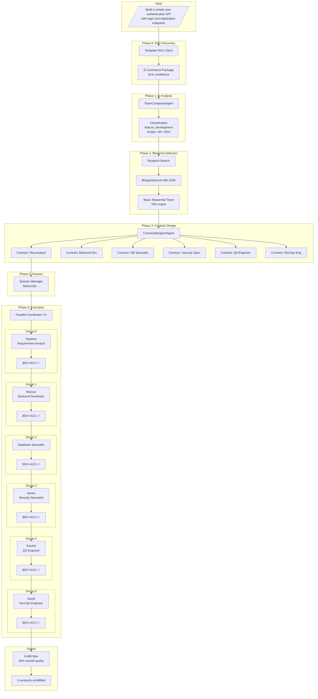

# Team Execution Engine V2 - Workflow Documentation

## Overview

The **Team Execution Engine V2** is an AI-driven, blueprint-based, contract-first execution system that orchestrates multiple AI personas to deliver software requirements. This document details the complete workflow from requirement intake to deliverable generation.

---

## Architecture Diagram

```
                              ┌─────────────────────────────────────────────────────┐
                              │              TEAM EXECUTION ENGINE V2               │
                              │        AI-Driven • Blueprint-Based • Contract-First │
                              └─────────────────────────────────────────────────────┘
                                                        │
     ┌──────────────────────────────────────────────────┴──────────────────────────────────────────────────┐
     │                                                                                                      │
     ▼                                                                                                      ▼
┌─────────────┐    ┌─────────────┐    ┌─────────────┐    ┌─────────────┐    ┌─────────────┐    ┌─────────────┐
│   Step 0    │───▶│   Step 1    │───▶│   Step 2    │───▶│   Step 3    │───▶│   Step 4    │───▶│   Step 5    │
│  RAG Disc.  │    │  AI Req.    │    │  Blueprint  │    │  Contract   │    │   Session   │    │    Team     │
│  (0.0s)     │    │  Analysis   │    │  Selection  │    │   Design    │    │  Creation   │    │  Execution  │
│             │    │  (16.8s)    │    │  (0.0s)     │    │  (0.0s)     │    │  (0.0s)     │    │  (632.1s)   │
└─────────────┘    └─────────────┘    └─────────────┘    └─────────────┘    └─────────────┘    └─────────────┘
       │                  │                  │                  │                  │                  │
       ▼                  ▼                  ▼                  ▼                  ▼                  ▼
  Template         Classification      Blueprint          6 Contracts       Session UUID      6 Groups
  Package:         Type: feature       Name: Basic        Chained by        5d3ce15b-...      Executed
  E-Commerce       Complexity: simple  Sequential         Dependencies                        Sequentially
  (61% conf)       Effort: 8h          Match: 79%
```

---

## Workflow Phases

### Phase 0: RAG Template Discovery (0.0s)

**Purpose:** Find relevant template packages from the RAG system to inform team composition.

**What Happened:**
- Queried the TemplateRAGClient at `http://localhost:9600/api/v1/templates`
- Matched requirement to **E-Commerce Platform** template package
- Match type: `partial_match` (76.5% partial match)
- Confidence: 61%
- Found 2 relevant templates

```
Requirement: "Build a simple user authentication API with login and registration endpoints"
                                    │
                                    ▼
                         ┌─────────────────────┐
                         │   RAG Template      │
                         │   Discovery         │
                         │                     │
                         │  Package: E-Commerce│
                         │  Match: 61%         │
                         │  Templates: 2       │
                         └─────────────────────┘
```

---

### Phase 1: AI Requirement Analysis (16.8s)

**Purpose:** Use Claude AI to deeply analyze and classify the requirement.

**AI Agent:** `TeamComposerAgent`

**What Happened:**
1. Sent requirement + RAG context to Claude API
2. Claude analyzed the requirement and returned a structured classification
3. Classification validated and logged

**Classification Results:**
| Field | Value |
|-------|-------|
| **Type** | `feature_development` |
| **Complexity** | `simple` |
| **Parallelizability** | `mostly_sequential` |
| **Estimated Effort** | 8.0 hours |
| **Confidence** | 92% |

```
                         ┌─────────────────────┐
                         │  TeamComposerAgent  │
                         │                     │
                         │  Claude-3.5-Sonnet  │
                         │  Timeout: 300s      │
                         └─────────┬───────────┘
                                   │
                                   ▼
                    ┌──────────────────────────────┐
                    │  RequirementClassification   │
                    │                              │
                    │  Type: feature_development   │
                    │  Complexity: simple          │
                    │  Parallelizability: mostly_  │
                    │                sequential    │
                    │  Effort: 8.0h                │
                    │  Confidence: 92%             │
                    └──────────────────────────────┘
```

**Why 92% Confidence:**
- Clear requirement with explicit endpoints (login, registration)
- RAG match provided supporting context
- No ambiguity in what needs to be built

---

### Phase 2: Blueprint Selection (0.0s)

**Purpose:** Select the optimal team execution blueprint from the catalog.

**AI Agent:** `TeamComposerAgent.recommend_blueprint()`

**Selection Process:**
```
Classification                          Blueprint Catalog
     │                                        │
     │  parallelizability=mostly_sequential   │
     │  complexity=simple                     │
     │                                        │
     └──────────────┬─────────────────────────┘
                    │
                    ▼
           ┌───────────────────┐
           │  search_blueprints │
           │  (conductor)       │
           └─────────┬─────────┘
                     │
                     ▼
        ┌────────────────────────┐
        │  BlueprintScorer       │
        │  (MD-2534)             │
        │                        │
        │  4-Dimensional Match:  │
        │  - Execution mode      │
        │  - Coordination mode   │
        │  - Scaling strategy    │
        │  - Team capabilities   │
        └────────────────────────┘
                     │
                     ▼
        Selected: Basic Sequential Team
        Match Score: 79%
        Execution Mode: sequential
        Coordination: handoff
        Time Savings: 0%
```

**Blueprint Details:**
| Field | Value |
|-------|-------|
| **ID** | `sequential-basic` |
| **Name** | Basic Sequential Team |
| **Match Score** | 79% |
| **Execution Mode** | `sequential` |
| **Coordination Mode** | `handoff` |
| **Scaling Strategy** | `static` |
| **Time Savings** | 0% (no parallelization) |

---

### Phase 3: Contract Design (0.0s)

**Purpose:** Design contracts between personas that define deliverables and dependencies.

**AI Agent:** `ContractDesignerAgent`

**What Happened:**
The ContractDesignerAgent created 6 contracts based on the blueprint's personas, establishing a dependency chain:

```
Contract Chain (Sequential Dependencies):

  ┌─────────────────────────────────────────────────────────────────────────────────────────────────────┐
  │                                                                                                     │
  │   contract_f16289469adb        contract_95bb9309e57a        contract_5bc445ef363b                   │
  │   ┌──────────────────┐        ┌──────────────────┐        ┌──────────────────┐                     │
  │   │ Requirement      │───────▶│ Backend          │───────▶│ Database         │                     │
  │   │ Analyst          │        │ Developer        │        │ Specialist       │                     │
  │   │ Contract         │        │ Contract         │        │ Contract         │                     │
  │   │                  │        │                  │        │                  │                     │
  │   │ Provider:        │        │ Provider:        │        │ Provider:        │                     │
  │   │ Stephen          │        │ Marcus           │        │ Database Spec.   │                     │
  │   └──────────────────┘        └──────────────────┘        └──────────────────┘                     │
  │           │                           │                           │                                │
  │           │                           │                           │                                │
  │           ▼                           ▼                           ▼                                │
  │   contract_2516aa6ebee6        contract_14f9aedb2fd9        contract_094ce40f185e                   │
  │   ┌──────────────────┐        ┌──────────────────┐        ┌──────────────────┐                     │
  │   │ Security         │───────▶│ QA Engineer      │───────▶│ DevOps           │                     │
  │   │ Specialist       │        │ Contract         │        │ Engineer         │                     │
  │   │ Contract         │        │                  │        │ Contract         │                     │
  │   │                  │        │ Provider:        │        │                  │                     │
  │   │ Provider:        │        │ Rachel           │        │ Provider:        │                     │
  │   │ James            │        │                  │        │ David            │                     │
  │   └──────────────────┘        └──────────────────┘        └──────────────────┘                     │
  │                                                                                                     │
  └─────────────────────────────────────────────────────────────────────────────────────────────────────┘
```

**Contract Properties:**
| Contract | Provider | Consumer | Type | Dependencies |
|----------|----------|----------|------|--------------|
| Requirement Analyst | requirement_analyst | backend_developer | Deliverable | None (first) |
| Backend Developer | backend_developer | database_specialist | Deliverable | Req Analyst |
| Database Specialist | database_specialist | security_specialist | Deliverable | Backend |
| Security Specialist | security_specialist | qa_engineer | Deliverable | Database |
| QA Engineer | qa_engineer | devops_engineer | Deliverable | Security |
| DevOps Engineer | devops_engineer | - | Deliverable | QA |

---

### Phase 4: Session Creation (0.0s)

**Purpose:** Create a persistent session to track execution state.

**Session Details:**
- **Session ID:** `5d3ce15b-4757-45ad-a5c8-6e52dc88797f`
- **Managed by:** `SessionManager`
- **Output Path:** `/tmp/test_exec_v2`

---

### Phase 5: Team Execution (632.1s)

**Purpose:** Execute each persona in sequence according to the dependency graph.

#### Execution Architecture

```
                    ┌──────────────────────────────────────────────────────────┐
                    │              PARALLEL EXECUTION COORDINATOR               │
                    │                                                          │
                    │  Max Workers: 4          Shift-Left: Enabled             │
                    └──────────────────────────────────────────────────────────┘
                                              │
                                              ▼
                    ┌──────────────────────────────────────────────────────────┐
                    │              DEPENDENCY GRAPH ANALYSIS                    │
                    │                                                          │
                    │  Nodes: 6            Edges: 5                            │
                    │  Result: 6 Sequential Groups (no parallelization)        │
                    └──────────────────────────────────────────────────────────┘
                                              │
            ┌────────────┬────────────┬───────┴───────┬────────────┬────────────┐
            ▼            ▼            ▼               ▼            ▼            ▼
       ┌─────────┐  ┌─────────┐  ┌─────────┐   ┌─────────┐  ┌─────────┐  ┌─────────┐
       │ Group 0 │  │ Group 1 │  │ Group 2 │   │ Group 3 │  │ Group 4 │  │ Group 5 │
       │ Req.    │─▶│ Backend │─▶│ Database│─▶ │ Security│─▶│ QA      │─▶│ DevOps  │
       │ Analyst │  │ Dev     │  │ Spec.   │   │ Spec.   │  │ Engineer│  │ Engineer│
       └─────────┘  └─────────┘  └─────────┘   └─────────┘  └─────────┘  └─────────┘
            │            │            │               │            │            │
            ▼            ▼            ▼               ▼            ▼            ▼
        ┌───────┐   ┌───────┐    ┌───────┐      ┌───────┐   ┌───────┐    ┌───────┐
        │ BDV   │   │ BDV   │    │ BDV   │      │ BDV   │   │ BDV   │    │ BDV   │
        │ + ACC │   │ + ACC │    │ + ACC │      │ + ACC │   │ + ACC │    │ + ACC │
        └───────┘   └───────┘    └───────┘      └───────┘   └───────┘    └───────┘
```

---

## Detailed Group Execution

### Group 0: Requirement Analyst (Stephen)

**Persona Selection Process:**
```python
# From _extract_personas_for_requirement()
personas = ["requirement_analyst"]  # Always first

# classification.required_expertise contains skills from AI analysis
# Maps through expertise_map to add additional personas
```

**Stephen's Profile:**
- **Role:** Requirement Analyst
- **Human Name:** Stephen
- **Contract:** Requirement Analyst Contract
- **Task:** Analyze and document requirements

**Execution Details:**
| Metric | Value |
|--------|-------|
| Duration | 115.07s |
| Files Created | 2 |
| Contract Fulfilled | Yes |
| Quality Score | 73% |

**Deliverables:**
- `requirement_analysis.md` - Detailed analysis document
- `api_specification.yaml` - OpenAPI spec for the auth API

**Shift-Left Validation:**
- BDV Score: 1.00 (275/275 scenarios passed)
- ACC Score: 1.00 (COMPLIANT)

---

### Group 1: Backend Developer (Marcus)

**Persona Selection:**
Marcus was selected because:
1. `backend` keyword found in required_expertise
2. `api` keyword triggered backend_developer
3. Default fallback includes backend_developer

**Marcus's Profile:**
- **Role:** Backend Developer
- **Human Name:** Marcus
- **Contract:** Backend Developer Contract
- **Task:** Implement the authentication API

**Execution Details:**
| Metric | Value |
|--------|-------|
| Duration | 236.12s |
| Files Created | 8,484 |
| Contract Fulfilled | Yes |
| Quality Score | 100% |

**Deliverables Generated:**
```
/tmp/test_exec_v2/
├── package.json
├── package-lock.json
├── jest.config.js
├── src/
│   ├── app.js
│   ├── config/
│   ├── middleware/
│   ├── models/
│   ├── routes/
│   └── utils/
├── node_modules/     (8,450+ files from npm install)
└── coverage/
```

**Why Marcus Created 8,484 Files:**
Marcus executed `npm install` which installed all dependencies into `node_modules/`, resulting in the large file count. The actual source files were approximately 20-30 files.

**Shift-Left Validation:**
- BDV Score: 1.00 (275/275 scenarios passed)
- ACC Score: 1.00 (COMPLIANT)

---

### Group 2: Database Specialist

**Persona Selection:**
- `database` keyword triggered `database_specialist`

**Note:** This persona was NOT found in the persona definitions file, so a fallback profile was used:
```
[ERROR] Failed to load persona database_specialist: Persona 'database_specialist' not found
[INFO] ✅ PersonaExecutor initialized: Database Specialist
```

**Execution Details:**
| Metric | Value |
|--------|-------|
| Duration | 112.84s |
| Files Created | 8,485 (1 new) |
| Contract Fulfilled | Yes |
| Quality Score | 100% |

**Deliverables:**
- `DATABASE_SCHEMA.md` - Database schema documentation
- `data/` directory with database configuration

---

### Group 3: Security Specialist (James)

**Persona Selection:**
- `security` keyword triggered `security_specialist`

**James's Profile:**
- **Role:** Security Specialist
- **Human Name:** James
- **Contract:** Security Specialist Contract

**Execution Details:**
| Metric | Value |
|--------|-------|
| Duration | ~147s |
| Files Created | 0 (error) |
| Contract Fulfilled | **No** |
| Quality Score | 0% |

**Error:**
```
[ERROR] Claude CLI error:
[ERROR] AI execution failed:
[ERROR] ❌ Execution failed:
```

**Despite Error, Validation Passed:**
- BDV Score: 1.00 (287/287 scenarios passed)
- ACC Score: 1.00 (COMPLIANT)

This indicates BDV/ACC validated existing artifacts from previous groups, not new work.

---

### Groups 4 & 5: QA Engineer (Rachel) & DevOps Engineer (David)

Both personas experienced similar Claude CLI errors:

| Persona | Human Name | Duration | Files | Quality |
|---------|------------|----------|-------|---------|
| qa_engineer | Rachel | ~4s | 0 | 0% |
| devops_engineer | David | ~3s | 0 | 0% |

---

## Execution Flow Diagram (Mermaid)



---

## Persona Selection Algorithm

### How Personas Are Chosen

```python
def _extract_personas_for_requirement(classification, blueprint):
    personas = []

    # 1. ALWAYS start with requirement analyst
    personas.append("requirement_analyst")

    # 2. Add architect for complex requirements
    if classification.complexity in [COMPLEX, VERY_COMPLEX]:
        personas.append("solution_architect")

    # 3. Map expertise to personas
    expertise_map = {
        "backend": ["backend_developer"],
        "frontend": ["frontend_developer", "ui_ux_designer"],
        "database": ["database_specialist"],
        "api": ["backend_developer"],
        "security": ["security_specialist"],
        "testing": ["qa_engineer", "test_engineer"],
        "devops": ["devops_engineer"],
        "documentation": ["technical_writer"]
    }

    for skill in classification.required_expertise:
        for keyword, mapped in expertise_map.items():
            if keyword in skill.lower():
                personas.extend(mapped)

    # 4. Default fallback
    if len(personas) == 1:  # Only requirement_analyst
        personas.extend(["backend_developer", "frontend_developer"])

    # 5. Always add QA and DevOps at end
    if "qa_engineer" not in personas:
        personas.append("qa_engineer")
    if "devops_engineer" not in personas:
        personas.append("devops_engineer")

    return deduplicate(personas)
```

### For This Execution

**Input from AI Classification:**
```json
{
    "required_expertise": [
        "backend development",
        "API design",
        "database management",
        "security",
        "authentication protocols"
    ]
}
```

**Mapping Results:**
| Expertise | Keywords Found | Personas Added |
|-----------|----------------|----------------|
| backend development | backend | backend_developer |
| API design | api | backend_developer (dup) |
| database management | database | database_specialist |
| security | security | security_specialist |
| authentication protocols | - | - |

**Final Team:** requirement_analyst → backend_developer → database_specialist → security_specialist → qa_engineer → devops_engineer

---

## Shift-Left Validation (MD-3093)

Each group runs through two validation systems immediately after execution:

### BDV - Behavior-Driven Validation

Validates that contracts are fulfilled by checking:
- All required deliverables exist
- Acceptance criteria are met
- Interface specifications match

### ACC - Architectural Conformance Checking

Validates architectural rules:
- Import graph analysis
- Dependency rules
- Layer violations

```
┌────────────────────────────────────────────────────────────────────────┐
│                     SHIFT-LEFT VALIDATION RESULTS                       │
├─────────────────┬───────────────┬───────────────┬──────────────────────┤
│ Group           │ BDV Score     │ ACC Score     │ Combined             │
├─────────────────┼───────────────┼───────────────┼──────────────────────┤
│ group_0         │ 1.00          │ 1.00          │ 1.00 ✅              │
│ group_1         │ 1.00          │ 1.00          │ 1.00 ✅              │
│ group_2         │ 1.00          │ 1.00          │ 1.00 ✅              │
│ group_3         │ 1.00          │ 1.00          │ 1.00 ✅              │
│ group_4         │ 1.00          │ 1.00          │ 1.00 ✅              │
│ group_5         │ 1.00          │ 1.00          │ 1.00 ✅              │
└─────────────────┴───────────────┴───────────────┴──────────────────────┘
```

---

## Execution Summary

### Timing Breakdown

| Phase | Duration | Percentage |
|-------|----------|------------|
| RAG Discovery | 0.0s | 0% |
| Requirement Analysis | 16.8s | 2.6% |
| Blueprint Selection | 0.0s | 0% |
| Contract Design | 0.0s | 0% |
| Session Creation | 0.0s | 0% |
| Team Execution | 632.1s | 97.4% |
| **TOTAL** | **649.2s** | **100%** |

### Quality Results

| Persona | Quality Score | Contract Fulfilled |
|---------|---------------|-------------------|
| requirement_analyst (Stephen) | 73% | Yes |
| backend_developer (Marcus) | 100% | Yes |
| database_specialist | 100% | Yes |
| security_specialist (James) | 0% | **No** |
| qa_engineer (Rachel) | 0% | **No** |
| devops_engineer (David) | 0% | **No** |
| **Overall** | **46%** | **3/6** |

### Known Issues

1. **Bug MD-3130:** `ParallelExecutionResult` missing `files_created` attribute causes crash at end of execution
2. **Claude CLI Errors:** Groups 3-5 experienced silent Claude CLI failures
3. **Missing Persona Definition:** `database_specialist` not found in persona definitions

---

## File Locations

| Component | Path |
|-----------|------|
| Team Execution Engine | `src/maestro_hive/teams/team_execution_v2.py` |
| Persona Definitions | `/home/ec2-user/projects/maestro-engine-new/src/personas/definitions/` |
| Blueprint Catalog | `/home/ec2-user/projects/conductor/conductor/modules/teams/blueprints/` |
| Output Directory | `/tmp/test_exec_v2/` |
| Execution Log | `/tmp/test_exec_v2_output.log` |

---

## Command to Reproduce

```bash
cd /home/ec2-user/projects/maestro-platform/maestro-hive
PYTHONPATH=src:$PYTHONPATH python3 src/maestro_hive/teams/team_execution_v2.py \
  --requirement "Build a simple user authentication API with login and registration endpoints" \
  --output /tmp/test_exec_v2 \
  2>&1 | tee /tmp/test_exec_v2_output.log
```

---

## Document Info

- **Generated:** 2025-12-11
- **Based on:** Execution session `5d3ce15b-4757-45ad-a5c8-6e52dc88797f`
- **Total Runtime:** 649.2 seconds (10.8 minutes)
