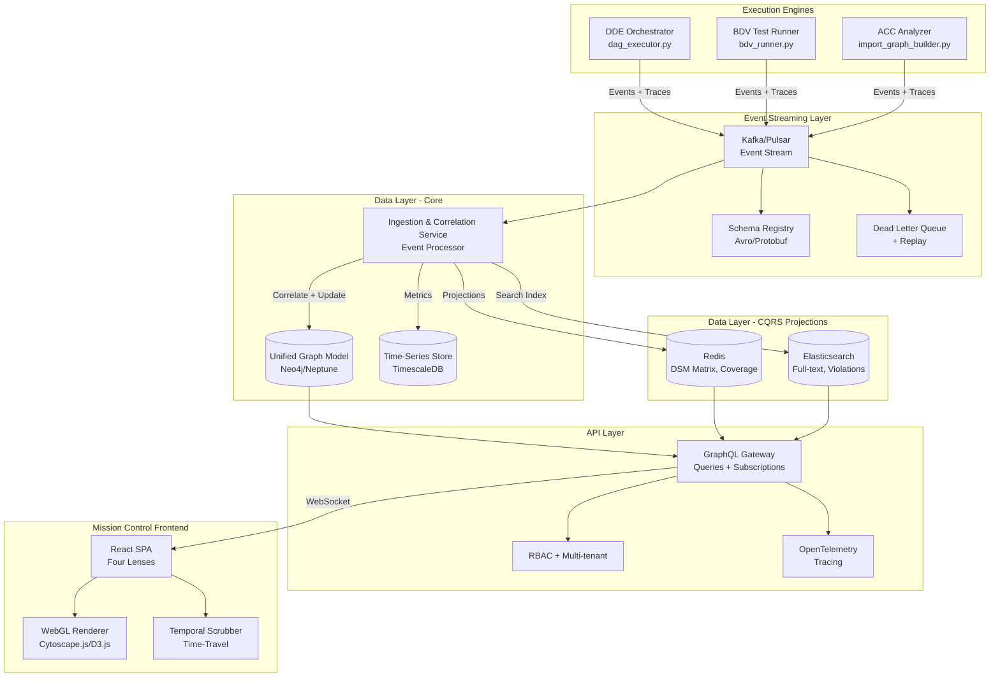

# Tri-Modal Visualization Engine (TMVE) - Mission Control Architecture

**Date**: 2025-10-13
**Status**: Production Architecture Design
**Target**: Enterprise-Grade Mission Control for Maestro Platform

---

## Executive Summary

This document defines the production-ready architecture for the **Tri-Modal Visualization Engine (TMVE)**, transforming the basic REST APIs into a comprehensive "Mission Control" system with:

- ✅ Event-driven architecture with Kafka/Pulsar
- ✅ Unified Graph Model (UGM) with Neo4j/Neptune
- ✅ GraphQL API with real-time subscriptions
- ✅ Bi-temporal data model for time-travel debugging
- ✅ OpenTelemetry distributed tracing
- ✅ CQRS with Redis/Elastic projections
- ✅ Four-lens visualization with WebGL rendering
- ✅ Chaos engineering and SLO/SLI monitoring

**Vision**: Transform from reporting tool → Live situational awareness platform

---

## Architecture Overview



---

## 1. Event-Driven Architecture

### 1.1 Standardized Event Schema

**Base Event Structure** (Avro Schema):
```json
{
  "namespace": "com.maestro.trimodal.events",
  "type": "record",
  "name": "TriModalEvent",
  "fields": [
    {"name": "event_id", "type": "string", "doc": "UUID v7 for ordering"},
    {"name": "timestamp", "type": "long", "logicalType": "timestamp-millis"},
    {"name": "iteration_id", "type": "string"},
    {"name": "requirement_id", "type": ["null", "string"], "default": null},
    {"name": "model_type", "type": {"type": "enum", "name": "ModelType", "symbols": ["DDE", "BDV", "ACC"]}},
    {"name": "node_id", "type": "string"},
    {"name": "event_type", "type": "string"},

    // OpenTelemetry Integration
    {"name": "trace_id", "type": "string", "doc": "W3C Trace Context"},
    {"name": "span_id", "type": "string"},
    {"name": "parent_span_id", "type": ["null", "string"], "default": null},

    // Idempotency & Transactional
    {"name": "idempotency_key", "type": "string", "doc": "For exactly-once processing"},
    {"name": "causation_id", "type": ["null", "string"], "default": null},
    {"name": "correlation_id", "type": "string"},

    // Provenance & Confidence
    {"name": "source", "type": "string", "doc": "Originating service"},
    {"name": "confidence_score", "type": ["null", "float"], "default": null},
    {"name": "explainability", "type": ["null", "string"], "default": null},

    // PII & Compliance
    {"name": "pii_tags", "type": {"type": "array", "items": "string"}, "default": []},
    {"name": "retention_policy", "type": "string", "default": "standard"},

    // Payload
    {"name": "metadata", "type": "map", "values": "string"},
    {"name": "error", "type": ["null", {
      "type": "record",
      "name": "ErrorPayload",
      "fields": [
        {"name": "code", "type": "string"},
        {"name": "message", "type": "string"},
        {"name": "stack_trace", "type": ["null", "string"], "default": null},
        {"name": "retry_count", "type": "int", "default": 0},
        {"name": "max_retries", "type": "int", "default": 3}
      ]
    }], "default": null}
  ]
}
```

### 1.2 Event Types by Stream

**DDE Events**:
```
dde.task.created
dde.task.started
dde.task.running
dde.task.retry_initiated      # NEW: Track retry attempts
dde.task.retry_exhausted      # NEW: Max retries reached
dde.task.completed
dde.task.failed
dde.contract.locked
dde.artifact.stamped
dde.gate.passed
dde.gate.failed
```

**BDV Events**:
```
bdv.feature.discovered
bdv.scenario.started
bdv.scenario.completed
bdv.scenario.failed
bdv.step.executed
bdv.flake.detected           # NEW: Flake detection
bdv.scenario.quarantined     # NEW: Auto-quarantine
```

**ACC Events**:
```
acc.module.analyzed
acc.violation.detected
acc.violation.suppressed     # NEW: ADR-based suppression
acc.cycle.detected
acc.coupling.exceeded
```

### 1.3 Kafka Configuration

**Topics**:
```yaml
topics:
  - name: trimodal.events.dde
    partitions: 12
    replication: 3
    config:
      retention.ms: 2592000000  # 30 days
      cleanup.policy: delete

  - name: trimodal.events.bdv
    partitions: 12
    replication: 3

  - name: trimodal.events.acc
    partitions: 12
    replication: 3

  - name: trimodal.events.dlq
    partitions: 6
    replication: 3
    config:
      retention.ms: 7776000000  # 90 days (for forensics)
```

**Consumer Groups**:
- `ics-processor`: Main ingestion service
- `metrics-aggregator`: Time-series metrics
- `projection-builder`: CQRS projections
- `audit-logger`: Compliance logging

### 1.4 Dead Letter Queue (DLQ) & Replay

```python
# In ICS: ics/event_processor.py
class EventProcessor:
    async def process_event(self, event: TriModalEvent):
        try:
            # Idempotency check
            if await self.is_duplicate(event.idempotency_key):
                return  # Skip duplicate

            # Validate schema
            self.schema_registry.validate(event)

            # Process with exactly-once semantics
            async with self.transaction():
                await self.correlate_and_update_ugm(event)
                await self.update_projections(event)
                await self.mark_processed(event.idempotency_key)

        except TransientError as e:
            # Retry with exponential backoff
            await self.schedule_retry(event, delay=2**event.retry_count)

        except PermanentError as e:
            # Send to DLQ
            await self.send_to_dlq(event, error=e)
            await self.alert_ops(event, error=e)
```

**Replay Mechanism**:
```python
# Replay events from DLQ or specific time window
await event_replayer.replay(
    from_timestamp="2025-10-13T00:00:00Z",
    to_timestamp="2025-10-13T23:59:59Z",
    filter_fn=lambda e: e.model_type == "DDE"
)
```

---

## 2. Unified Graph Model (UGM)

### 2.1 Neo4j/Neptune Schema

**Core Node Types**:
```cypher
// DDE Nodes
CREATE CONSTRAINT requirement_id IF NOT EXISTS
FOR (r:Requirement) REQUIRE r.id IS UNIQUE;

CREATE CONSTRAINT task_id IF NOT EXISTS
FOR (t:Task) REQUIRE t.id IS UNIQUE;

CREATE CONSTRAINT interface_contract_id IF NOT EXISTS
FOR (i:InterfaceContract) REQUIRE i.id IS UNIQUE;

CREATE CONSTRAINT artifact_id IF NOT EXISTS
FOR (a:Artifact) REQUIRE a.id IS UNIQUE;

// BDV Nodes
CREATE CONSTRAINT behavioral_spec_id IF NOT EXISTS
FOR (b:BehavioralSpec) REQUIRE b.id IS UNIQUE;

CREATE CONSTRAINT scenario_id IF NOT EXISTS
FOR (s:Scenario) REQUIRE s.id IS UNIQUE;

CREATE CONSTRAINT test_run_id IF NOT EXISTS
FOR (tr:TestRun) REQUIRE tr.id IS UNIQUE;

// ACC Nodes
CREATE CONSTRAINT arch_component_id IF NOT EXISTS
FOR (ac:ArchitectureComponent) REQUIRE ac.id IS UNIQUE;

CREATE CONSTRAINT code_module_id IF NOT EXISTS
FOR (cm:CodeModule) REQUIRE cm.id IS UNIQUE;

CREATE CONSTRAINT violation_id IF NOT EXISTS
FOR (v:Violation) REQUIRE v.id IS UNIQUE;
```

### 2.2 Bi-Temporal Data Model

**Node Properties** (Bi-Temporal):
```cypher
CREATE (:Task {
  id: "T-123",
  iteration_id: "Iter-001",
  requirement_id: "REQ-42",

  // Live workflow state
  status: "Retrying",         // Enum: Pending, Ready, Running, Retrying, Failed, Complete
  retry_count: 2,
  max_retries: 3,
  last_updated: datetime(),

  // Bi-temporal tracking (NEW)
  valid_from: datetime(),     // When this version became valid
  valid_to: null,             // null = current version
  observed_at: datetime(),    // When system observed this state

  // OpenTelemetry
  trace_id: "abc123",
  span_id: "def456",

  // Metadata
  name: "Deploy Auth Service",
  capability: "Backend:Python:FastAPI",
  estimated_effort: 120
})
```

**Temporal Queries**:
```cypher
// Get state as of specific time (time-travel)
MATCH (t:Task {id: "T-123"})
WHERE t.valid_from <= $timestamp
  AND (t.valid_to IS NULL OR t.valid_to > $timestamp)
RETURN t

// Get all historical versions
MATCH (t:Task {id: "T-123"})
RETURN t ORDER BY t.valid_from DESC
```

### 2.3 Cross-Model Relationships

**First-Class Edges** (with metadata):
```cypher
// Requirement → Task
CREATE (req:Requirement {id: "REQ-42"})-[r:FULFILLED_BY {
  type: "implementation",
  status: "active",
  last_updated: datetime(),
  confidence: 0.95
}]->(task:Task {id: "T-123"})

// Requirement → BehavioralSpec
CREATE (req)-[r:VALIDATED_BY {
  type: "verification",
  status: "active",
  coverage: 0.85
}]->(spec:BehavioralSpec)

// Task → Artifact
CREATE (task)-[r:GENERATES {
  type: "produces",
  artifact_type: "openapi_spec",
  sha256: "abc123..."
}]->(artifact:Artifact)

// Artifact → CodeModule
CREATE (artifact)-[r:CONTAINS {
  type: "implementation",
  file_path: "src/api.py",
  line_range: [1, 100]
}]->(module:CodeModule)

// CodeModule → ArchitectureComponent
CREATE (module)-[r:BELONGS_TO {
  type: "membership",
  component_layer: "BusinessLogic"
}]->(component:ArchitectureComponent)
```

### 2.4 Correlation Logic (ICS)

```python
# In ICS: ics/correlator.py
class CorrelationEngine:
    """Correlate events across DDE, BDV, ACC streams."""

    async def correlate_dde_task_to_requirement(self, task_event):
        """Link Task → Requirement using embedded requirement_id."""
        if task_event.requirement_id:
            await self.ugm.create_relationship(
                source=("Task", task_event.node_id),
                target=("Requirement", task_event.requirement_id),
                rel_type="FULFILLED_BY",
                properties={
                    "status": "active",
                    "last_updated": task_event.timestamp
                }
            )

    async def correlate_artifact_to_code_module(self, artifact_event):
        """Link Artifact → CodeModule by analyzing file paths."""
        artifact_path = artifact_event.metadata.get("file_path")
        if not artifact_path:
            return

        # Query ACC for matching code module
        module = await self.ugm.query(
            "MATCH (cm:CodeModule) WHERE cm.file_path = $path RETURN cm",
            path=artifact_path
        )

        if module:
            await self.ugm.create_relationship(
                source=("Artifact", artifact_event.node_id),
                target=("CodeModule", module["id"]),
                rel_type="CONTAINS",
                properties={
                    "confidence": 1.0,  # Exact path match
                    "correlation_method": "file_path_exact"
                }
            )

    async def correlate_scenario_to_interface_contract(self, scenario_event):
        """Link BDV Scenario → DDE InterfaceContract via @contract tags."""
        contract_tags = scenario_event.metadata.get("contract_tags", [])

        for tag in contract_tags:
            # Parse @contract:AuthAPI:v1.0
            contract_name, contract_version = self.parse_contract_tag(tag)

            # Find matching interface contract
            contract = await self.ugm.query(
                """
                MATCH (ic:InterfaceContract)
                WHERE ic.name = $name AND ic.version = $version
                RETURN ic
                """,
                name=contract_name,
                version=contract_version
            )

            if contract:
                await self.ugm.create_relationship(
                    source=("Scenario", scenario_event.node_id),
                    target=("InterfaceContract", contract["id"]),
                    rel_type="VALIDATES",
                    properties={
                        "contract_version": contract_version,
                        "alignment": "aligned"
                    }
                )
```

---

## 3. CQRS Projections (Performance Optimization)

### 3.1 Redis Projections

**DSM Matrix Cache**:
```python
# Pre-compute Dependency Structure Matrix for ACC
class DSMProjection:
    """Build sparse DSM matrix for fast rendering."""

    async def build_dsm_matrix(self, iteration_id: str):
        """Query UGM and build DSM in Redis."""
        # Query all modules and dependencies
        modules = await self.ugm.query(
            """
            MATCH (cm:CodeModule)
            WHERE cm.iteration_id = $iteration_id
            RETURN cm.id AS id, cm.name AS name
            ORDER BY cm.name
            """,
            iteration_id=iteration_id
        )

        dependencies = await self.ugm.query(
            """
            MATCH (cm1:CodeModule)-[d:DEPENDS_ON]->(cm2:CodeModule)
            WHERE cm1.iteration_id = $iteration_id
            RETURN cm1.id AS source, cm2.id AS target, d.weight AS weight
            """,
            iteration_id=iteration_id
        )

        # Build DSM matrix (sparse format)
        dsm = {
            "modules": [m["name"] for m in modules],
            "dependencies": [
                {
                    "row": modules.index({"id": d["source"]}),
                    "col": modules.index({"id": d["target"]}),
                    "weight": d["weight"]
                }
                for d in dependencies
            ]
        }

        # Cache in Redis (30 min TTL)
        await self.redis.setex(
            key=f"dsm:{iteration_id}",
            value=json.dumps(dsm),
            time=1800
        )

        return dsm
```

**Coverage Rollup Cache**:
```python
# Pre-compute BDV coverage metrics
class CoverageProjection:
    async def build_coverage_rollup(self, iteration_id: str):
        """Aggregate scenario pass/fail status."""
        rollup = await self.ugm.query(
            """
            MATCH (req:Requirement)<-[:VALIDATED_BY]-(spec:BehavioralSpec)
            OPTIONAL MATCH (spec)<-[:BELONGS_TO]-(scenario:Scenario)
            OPTIONAL MATCH (scenario)<-[:EXECUTED]-(run:TestRun)
            WHERE req.iteration_id = $iteration_id
            RETURN
                req.id AS requirement_id,
                COUNT(DISTINCT scenario) AS total_scenarios,
                COUNT(DISTINCT CASE WHEN run.status = 'passed' THEN run END) AS passed_scenarios,
                COUNT(DISTINCT CASE WHEN run.status = 'failed' THEN run END) AS failed_scenarios
            """,
            iteration_id=iteration_id
        )

        # Cache in Redis
        await self.redis.hset(
            f"coverage:{iteration_id}",
            mapping={r["requirement_id"]: json.dumps(r) for r in rollup}
        )
```

**Critical Path Cache**:
```python
# Pre-compute DDE critical path
class CriticalPathProjection:
    async def build_critical_path(self, iteration_id: str):
        """Find longest path through DAG."""
        critical_path = await self.ugm.query(
            """
            MATCH path = (start:Task)-[:DEPENDS_ON*]->(end:Task)
            WHERE start.iteration_id = $iteration_id
              AND NOT EXISTS((:Task)-[:DEPENDS_ON]->(start))
              AND NOT EXISTS((end)-[:DEPENDS_ON]->(:Task))
            WITH path, reduce(effort = 0, n IN nodes(path) | effort + n.estimated_effort) AS total_effort
            RETURN nodes(path) AS tasks, total_effort
            ORDER BY total_effort DESC
            LIMIT 1
            """,
            iteration_id=iteration_id
        )

        await self.redis.setex(
            f"critical_path:{iteration_id}",
            value=json.dumps(critical_path),
            time=1800
        )
```

### 3.2 Elasticsearch Projections

**Full-Text Search Index**:
```python
# Index violations for search
class ViolationSearchProjection:
    async def index_violation(self, violation_event):
        """Index violation for full-text search."""
        await self.es.index(
            index="trimodal-violations",
            id=violation_event.node_id,
            document={
                "iteration_id": violation_event.iteration_id,
                "violation_type": violation_event.metadata["type"],
                "severity": violation_event.metadata["severity"],
                "rule_id": violation_event.metadata["rule_id"],
                "description": violation_event.metadata["description"],
                "source_module": violation_event.metadata["source"],
                "target_module": violation_event.metadata.get("target"),
                "timestamp": violation_event.timestamp,
                "status": "active"
            }
        )
```

---

## 4. GraphQL API Layer

### 4.1 Schema Definition

```graphql
# schema.graphql
type Query {
  # DDE Queries
  getDDEGraph(iterationId: ID!, asOf: DateTime): DDEGraph
  getTaskLineage(taskId: ID!): [Task!]!
  getCriticalPath(iterationId: ID!): [Task!]!

  # BDV Queries
  getBDVGraph(iterationId: ID!): BDVGraph
  getCoverageRollup(iterationId: ID!): CoverageReport
  getFlakeReport(iterationId: ID!, minFlakeRate: Float): [FlakeInfo!]!

  # ACC Queries
  getACCGraph(iterationId: ID!, manifestName: String!): ACCGraph
  getDSMMatrix(iterationId: ID!): DSMMatrix
  getViolations(iterationId: ID!, severity: ViolationSeverity): [Violation!]!

  # Convergence Queries
  getConvergenceView(iterationId: ID!): ConvergenceGraph
  getTriModalVerdict(iterationId: ID!): Verdict
  getDeploymentGate(iterationId: ID!): DeploymentGateStatus

  # Temporal Queries (Time-Travel)
  getGraphSnapshot(iterationId: ID!, timestamp: DateTime!): UnifiedGraphSnapshot
  getGraphDiff(iterationId: ID!, from: DateTime!, to: DateTime!): GraphDiff
}

type Subscription {
  # Real-time updates
  nodeStatusUpdated(iterationId: ID!, lenses: [LensType!]): NodeStatusEvent!
  violationDetected(iterationId: ID!): Violation!
  verdictChanged(iterationId: ID!): Verdict!

  # Filtered subscriptions (RBAC)
  taskUpdates(iterationId: ID!, requirementIds: [ID!]): TaskEvent!
}

enum LensType {
  DDE
  BDV
  ACC
  CONVERGENCE
}

type DDEGraph {
  iterationId: ID!
  timestamp: DateTime!
  nodes: [DDENode!]!
  edges: [DDEEdge!]!
  criticalPath: [ID!]!

  # Snapshot metadata
  snapshotVersion: Int!
}

type DDENode {
  id: ID!
  type: NodeType!
  status: NodeStatus!

  # Retry tracking
  retryCount: Int!
  maxRetries: Int!
  nextRetryAt: DateTime

  # Bi-temporal
  validFrom: DateTime!
  validTo: DateTime
  observedAt: DateTime!

  # OpenTelemetry
  traceId: String!
  spanId: String!

  # Relationships
  upstreamDependencies: [DDENode!]!
  downstreamDependents: [DDENode!]!
  requirementLinks: [Requirement!]!
}

type BDVGraph {
  iterationId: ID!
  features: [Feature!]!
  scenarios: [Scenario!]!
  coverageRollup: CoverageReport!
}

type ACCGraph {
  iterationId: ID!
  components: [ArchitectureComponent!]!
  modules: [CodeModule!]!
  violations: [Violation!]!
  dsmMatrix: DSMMatrix!
}

type ConvergenceGraph {
  iterationId: ID!
  ddeGraph: DDEGraph!
  bdvGraph: BDVGraph!
  accGraph: ACCGraph!
  contractStars: [ContractStar!]!
  crossStreamEdges: [CrossStreamEdge!]!
  verdict: Verdict!
}

type ContractStar {
  id: ID!
  contractName: String!
  contractVersion: String!

  # Links to all three streams
  ddeInterfaceNode: DDENode
  bdvScenarios: [Scenario!]!
  accComponents: [ArchitectureComponent!]!

  # Alignment status
  allStreamsAligned: Boolean!
  versionMismatches: [VersionMismatch!]!
}

type NodeStatusEvent {
  nodeId: ID!
  modelType: ModelType!
  previousStatus: NodeStatus
  currentStatus: NodeStatus!
  timestamp: DateTime!

  # For retry events
  retryCount: Int
  retryReason: String
}

type UnifiedGraphSnapshot {
  iterationId: ID!
  snapshotTimestamp: DateTime!
  version: Int!
  ddeGraph: DDEGraph!
  bdvGraph: BDVGraph!
  accGraph: ACCGraph!
}

type GraphDiff {
  from: DateTime!
  to: DateTime!
  addedNodes: [Node!]!
  removedNodes: [Node!]!
  modifiedNodes: [NodeDiff!]!
  addedEdges: [Edge!]!
  removedEdges: [Edge!]!
}
```

### 4.2 RBAC Implementation

```python
# graphql/rbac.py
class RBACMiddleware:
    """GraphQL RBAC with tenant isolation."""

    async def resolve_field(self, next, root, info, **kwargs):
        # Extract user from context
        user = info.context["user"]
        tenant_id = info.context["tenant_id"]

        # Check permissions
        if not await self.has_permission(user, info.field_name):
            raise PermissionDenied(f"No access to {info.field_name}")

        # Filter by tenant
        if "iterationId" in kwargs:
            iteration = await self.get_iteration(kwargs["iterationId"])
            if iteration.tenant_id != tenant_id:
                raise PermissionDenied("Iteration not in your tenant")

        return await next(root, info, **kwargs)
```

### 4.3 Filtered Subscriptions

```python
# graphql/subscriptions.py
class SubscriptionFilter:
    """Filter subscription events based on user permissions."""

    async def filter_task_updates(self, event, user, requirement_ids):
        """Only send events for tasks user has access to."""
        task = await self.ugm.get_task(event.node_id)

        # Check requirement access
        if task.requirement_id not in requirement_ids:
            return None  # Don't send to this client

        # Check tenant
        if task.tenant_id != user.tenant_id:
            return None

        return event
```

---

## 5. Mission Control Frontend - Four Lenses

### 5.1 Technology Stack

**Core Technologies**:
```json
{
  "dependencies": {
    "react": "^18.2.0",
    "typescript": "^5.2.0",

    // Graph Rendering (WebGL-capable)
    "cytoscape": "^3.26.0",
    "cytoscape-cola": "^2.5.1",
    "cytoscape-dagre": "^2.5.0",
    "react-cytoscapejs": "^2.0.0",

    // Alternative: D3.js + WebGL
    "d3": "^7.8.0",
    "d3-force-3d": "^3.0.5",

    // State Management
    "zustand": "^4.4.0",
    "immer": "^10.0.0",

    // GraphQL Client
    "@apollo/client": "^3.8.0",
    "graphql": "^16.8.0",
    "graphql-ws": "^5.14.0",

    // Virtualization
    "react-window": "^1.8.10",
    "react-virtualized-auto-sizer": "^1.0.20",

    // Time-Travel Scrubber
    "rc-slider": "^10.3.1",

    // UI Components
    "@radix-ui/react-*": "^1.0.0",
    "tailwindcss": "^3.3.0",

    // Observability
    "@opentelemetry/api": "^1.6.0",
    "@opentelemetry/instrumentation-fetch": "^0.43.0"
  }
}
```

### 5.2 Global State & Event Bus

```typescript
// frontend/src/stores/globalStore.ts
import create from 'zustand';
import { immer } from 'zustand/middleware/immer';

interface GlobalState {
  // Current iteration
  currentIterationId: string | null;

  // Selected nodes (for cross-lens highlighting)
  selectedNodes: {
    requirementId?: string;
    taskId?: string;
    scenarioId?: string;
    moduleId?: string;
  };

  // Active lens
  activeLens: 'DDE' | 'BDV' | 'ACC' | 'CONVERGENCE';

  // Temporal navigation
  temporalMode: boolean;
  temporalTimestamp: Date | null;

  // Filters
  filters: {
    statusFilter: string[];
    severityFilter: string[];
  };

  // Actions
  selectNode: (nodeType: string, nodeId: string) => void;
  setActiveLens: (lens: string) => void;
  enableTemporalMode: (timestamp: Date) => void;
  disableTemporalMode: () => void;
}

export const useGlobalStore = create<GlobalState>()(
  immer((set) => ({
    currentIterationId: null,
    selectedNodes: {},
    activeLens: 'CONVERGENCE',
    temporalMode: false,
    temporalTimestamp: null,
    filters: {
      statusFilter: [],
      severityFilter: []
    },

    selectNode: (nodeType, nodeId) => set((state) => {
      // Global selection triggers cross-lens highlighting
      state.selectedNodes[nodeType] = nodeId;

      // Emit event for all lenses
      window.dispatchEvent(new CustomEvent('node-selected', {
        detail: { nodeType, nodeId }
      }));
    }),

    setActiveLens: (lens) => set((state) => {
      state.activeLens = lens;
    }),

    enableTemporalMode: (timestamp) => set((state) => {
      state.temporalMode = true;
      state.temporalTimestamp = timestamp;
    }),

    disableTemporalMode: () => set((state) => {
      state.temporalMode = false;
      state.temporalTimestamp = null;
    })
  }))
);
```

### 5.3 Lens 1: DDE Execution Flow

```typescript
// frontend/src/components/lenses/DDELens.tsx
import React, { useEffect, useRef } from 'react';
import CytoscapeComponent from 'react-cytoscapejs';
import { useDDEGraph } from '../../hooks/useDDEGraph';
import { useGlobalStore } from '../../stores/globalStore';

export const DDELens: React.FC<{ iterationId: string }> = ({ iterationId }) => {
  const { data: graph, loading } = useDDEGraph(iterationId);
  const { selectedNodes, selectNode, temporalTimestamp } = useGlobalStore();
  const cyRef = useRef<any>(null);

  // Subscribe to real-time updates
  useEffect(() => {
    const subscription = subscribeToDDEUpdates(iterationId, (event) => {
      // Update node status in real-time
      const node = cyRef.current?.getElementById(event.nodeId);
      if (node) {
        node.data('status', event.currentStatus);
        node.data('retryCount', event.retryCount);

        // Trigger retry animation
        if (event.currentStatus === 'Retrying') {
          node.addClass('retrying-pulse');
        } else {
          node.removeClass('retrying-pulse');
        }
      }
    });

    return () => subscription.unsubscribe();
  }, [iterationId]);

  // Cross-lens highlighting
  useEffect(() => {
    const handler = (e: CustomEvent) => {
      if (e.detail.nodeType === 'requirement') {
        // Highlight all tasks linked to this requirement
        highlightTasksByRequirement(e.detail.nodeId);
      }
    };

    window.addEventListener('node-selected', handler as EventListener);
    return () => window.removeEventListener('node-selected', handler as EventListener);
  }, []);

  const cytoscapeStylesheet = [
    {
      selector: 'node[type="INTERFACE"]',
      style: {
        'shape': 'diamond',
        'background-color': '#3b82f6',
        'label': 'data(name)',
        'width': 60,
        'height': 60
      }
    },
    {
      selector: 'node[status="Retrying"]',
      style: {
        'background-color': '#eab308',
        'border-width': 3,
        'border-color': '#facc15'
      }
    },
    {
      selector: 'node.retrying-pulse',
      style: {
        'transition-property': 'background-color, border-color',
        'transition-duration': '0.5s'
      }
    },
    {
      selector: 'edge',
      style: {
        'width': 2,
        'line-color': '#94a3b8',
        'target-arrow-color': '#94a3b8',
        'target-arrow-shape': 'triangle',
        'curve-style': 'bezier'
      }
    }
  ];

  const layout = {
    name: 'dagre',
    rankDir: 'LR',  // Left to right
    nodeSep: 100,
    rankSep: 200
  };

  return (
    <div className="dde-lens h-full">
      <CytoscapeComponent
        elements={graph?.elements || []}
        stylesheet={cytoscapeStylesheet}
        layout={layout}
        style={{ width: '100%', height: '100%' }}
        cy={(cy) => {
          cyRef.current = cy;

          // Click handler
          cy.on('tap', 'node', (evt) => {
            const node = evt.target;
            selectNode('task', node.id());

            // Show detail panel
            showTaskDetailPanel(node.data());
          });

          // Hover for lineage highlighting
          cy.on('mouseover', 'node', (evt) => {
            const node = evt.target;
            highlightLineage(cy, node);
          });
        }}
      />

      {/* Retry Status Overlay */}
      <RetryStatusOverlay nodes={graph?.nodes.filter(n => n.status === 'Retrying')} />
    </div>
  );
};

// Retry visualization component
const RetryStatusOverlay: React.FC<{ nodes: any[] }> = ({ nodes }) => {
  return (
    <div className="absolute top-4 right-4 space-y-2">
      {nodes?.map((node) => (
        <div key={node.id} className="bg-yellow-100 border-2 border-yellow-400 rounded-lg p-3 animate-pulse">
          <div className="font-semibold">{node.name}</div>
          <div className="text-sm">
            Retry {node.retryCount}/{node.maxRetries}
          </div>
          {node.nextRetryAt && (
            <CountdownTimer targetTime={node.nextRetryAt} />
          )}
        </div>
      ))}
    </div>
  );
};
```

### 5.4 Lens 2: BDV Behavioral Coverage

```typescript
// frontend/src/components/lenses/BDVLens.tsx
export const BDVLens: React.FC<{ iterationId: string }> = ({ iterationId }) => {
  const { data: graph } = useBDVGraph(iterationId);
  const { selectNode } = useGlobalStore();

  // Hierarchical tree layout
  const layout = {
    name: 'breadthfirst',
    directed: true,
    spacingFactor: 1.5
  };

  const stylesheet = [
    {
      selector: 'node[type="Feature"]',
      style: {
        'shape': 'roundrectangle',
        'background-color': '#8b5cf6',
        'label': 'data(name)',
        'font-size': 14,
        'text-valign': 'center'
      }
    },
    {
      selector: 'node[type="Scenario"][status="passed"]',
      style: {
        'shape': 'ellipse',
        'background-color': '#22c55e',
        'label': 'data(name)'
      }
    },
    {
      selector: 'node[type="Scenario"][status="failed"]',
      style: {
        'background-color': '#ef4444'
      }
    },
    {
      selector: 'node[type="Scenario"][status="flaky"]',
      style: {
        'background-color': '#f97316',
        'border-width': 3,
        'border-style': 'dashed',
        'border-color': '#fb923c'
      }
    },
    {
      selector: 'node.quarantined',
      style: {
        'opacity': 0.5,
        'text-decoration': 'line-through'
      }
    }
  ];

  // Status roll-up: parent inherits child status
  const elementsWithRollup = computeStatusRollup(graph?.elements);

  return (
    <div className="bdv-lens h-full">
      <CytoscapeComponent
        elements={elementsWithRollup}
        stylesheet={stylesheet}
        layout={layout}
        style={{ width: '100%', height: '100%' }}
      />

      {/* Coverage Summary Panel */}
      <CoverageSummaryPanel coverage={graph?.coverageRollup} />

      {/* Flake Report */}
      <FlakeReportPanel flakes={graph?.flakes} />
    </div>
  );
};

// Status roll-up logic
function computeStatusRollup(elements: any[]) {
  // If any child scenario fails, parent feature is marked as failing
  const features = elements.filter(e => e.data.type === 'Feature');
  const scenarios = elements.filter(e => e.data.type === 'Scenario');

  features.forEach(feature => {
    const childScenarios = scenarios.filter(s =>
      elements.some(e => e.data.source === feature.data.id && e.data.target === s.data.id)
    );

    const hasFailures = childScenarios.some(s => s.data.status === 'failed');
    const allPassed = childScenarios.every(s => s.data.status === 'passed');

    feature.data.rollupStatus = hasFailures ? 'failed' : allPassed ? 'passed' : 'partial';
  });

  return elements;
}
```

### 5.5 Lens 3: ACC Structural Conformance

```typescript
// frontend/src/components/lenses/ACCLens.tsx
export const ACCLens: React.FC<{ iterationId: string }> = ({ iterationId }) => {
  const { data: graph } = useACCGraph(iterationId);
  const [viewMode, setViewMode] = useState<'graph' | 'dsm'>('graph');

  if (viewMode === 'dsm') {
    return <DSMMatrixView iterationId={iterationId} />;
  }

  // Force-directed layout for complex dependency graphs
  const layout = {
    name: 'cola',
    animate: true,
    refresh: 1,
    maxSimulationTime: 4000,
    ungrabifyWhileSimulating: false,
    fit: true,
    padding: 30,
    nodeDimensionsIncludeLabels: true,

    // Clustering by component
    componentSpacing: 100
  };

  const stylesheet = [
    {
      selector: 'node[type="Component"]',
      style: {
        'shape': 'roundrectangle',
        'background-color': '#6366f1',
        'label': 'data(name)',
        'width': 120,
        'height': 80,
        'font-size': 12
      }
    },
    {
      selector: 'node[type="Module"]',
      style: {
        'shape': 'ellipse',
        'background-color': '#94a3b8',
        'label': 'data(name)',
        'width': 40,
        'height': 40
      }
    },
    {
      selector: 'node[status="violation"]',
      style: {
        'background-color': '#ef4444',
        'border-width': 3,
        'border-color': '#dc2626'
      }
    },
    {
      selector: 'edge.allowed',
      style: {
        'line-color': '#22c55e',
        'target-arrow-color': '#22c55e'
      }
    },
    {
      selector: 'edge.violation',
      style: {
        'line-color': '#ef4444',
        'target-arrow-color': '#ef4444',
        'line-style': 'dashed',
        'width': 3
      }
    },
    {
      selector: 'edge.cycle',
      style: {
        'line-color': '#a855f7',
        'target-arrow-color': '#a855f7',
        'line-style': 'solid',
        'width': 4
      }
    }
  ];

  return (
    <div className="acc-lens h-full">
      {/* View Toggle */}
      <div className="absolute top-4 right-4 z-10">
        <button onClick={() => setViewMode('graph')}>Graph View</button>
        <button onClick={() => setViewMode('dsm')}>DSM Matrix</button>
      </div>

      <CytoscapeComponent
        elements={graph?.elements}
        stylesheet={stylesheet}
        layout={layout}
        style={{ width: '100%', height: '100%' }}
      />

      {/* Violation Overlay */}
      <ViolationOverlay violations={graph?.violations} />

      {/* Coupling Metrics Panel */}
      <CouplingMetricsPanel metrics={graph?.couplingMetrics} />
    </div>
  );
};

// DSM Matrix View (Sparse Rendering)
const DSMMatrixView: React.FC<{ iterationId: string }> = ({ iterationId }) => {
  const { data: dsm } = useDSMMatrix(iterationId);

  return (
    <div className="dsm-matrix">
      {/* Virtualized rendering for large matrices */}
      <VirtualizedGrid
        columnCount={dsm?.modules.length || 0}
        rowCount={dsm?.modules.length || 0}
        columnWidth={50}
        rowHeight={50}
        height={800}
        width={1200}
      >
        {({ columnIndex, rowIndex, style }) => {
          const cell = dsm?.dependencies.find(
            d => d.row === rowIndex && d.col === columnIndex
          );

          return (
            <div
              style={style}
              className={cell ? 'bg-blue-500' : 'bg-gray-100'}
              title={cell ? `${dsm.modules[rowIndex]} → ${dsm.modules[columnIndex]}` : ''}
            >
              {cell?.weight}
            </div>
          );
        }}
      </VirtualizedGrid>
    </div>
  );
};
```

### 5.6 Lens 4: Convergence View

```typescript
// frontend/src/components/lenses/ConvergenceLens.tsx
export const ConvergenceLens: React.FC<{ iterationId: string }> = ({ iterationId }) => {
  const { data: convergence } = useConvergenceGraph(iterationId);
  const { selectedNodes, selectNode } = useGlobalStore();

  // Contract stars as central hubs
  const layout = {
    name: 'cose',  // Compound Spring Embedder
    idealEdgeLength: 200,
    nodeOverlap: 20,
    refresh: 20,
    fit: true,
    padding: 30,
    randomize: false,
    componentSpacing: 100,
    nodeRepulsion: 400000,
    edgeElasticity: 100,
    nestingFactor: 5,
    gravity: 80,
    numIter: 1000,
    initialTemp: 200,
    coolingFactor: 0.95,
    minTemp: 1.0
  };

  const stylesheet = [
    // Contract stars (yellow)
    {
      selector: 'node.contract-star',
      style: {
        'shape': 'star',
        'background-color': '#facc15',
        'border-width': 3,
        'border-color': '#eab308',
        'label': 'data(contractName)',
        'width': 80,
        'height': 80,
        'font-size': 14,
        'font-weight': 'bold'
      }
    },

    // DDE nodes (blue)
    {
      selector: 'node.dde-node',
      style: {
        'background-color': '#3b82f6',
        'label': 'data(name)'
      }
    },

    // BDV nodes (purple)
    {
      selector: 'node.bdv-node',
      style: {
        'background-color': '#8b5cf6',
        'label': 'data(name)'
      }
    },

    // ACC nodes (indigo)
    {
      selector: 'node.acc-node',
      style: {
        'background-color': '#6366f1',
        'label': 'data(name)'
      }
    },

    // Cross-stream edges
    {
      selector: 'edge.cross-stream',
      style: {
        'line-color': '#facc15',
        'line-style': 'dashed',
        'width': 2,
        'target-arrow-color': '#facc15'
      }
    },

    // Misaligned contracts (red)
    {
      selector: 'edge.misaligned',
      style: {
        'line-color': '#ef4444',
        'line-style': 'dotted'
      }
    },

    // Highlight selected node and related
    {
      selector: 'node.highlighted',
      style: {
        'border-width': 5,
        'border-color': '#10b981',
        'z-index': 999
      }
    },
    {
      selector: 'edge.highlighted',
      style: {
        'width': 4,
        'line-color': '#10b981',
        'z-index': 999
      }
    }
  ];

  // Cross-lens highlighting
  useEffect(() => {
    if (selectedNodes.requirementId) {
      highlightTraceabilityChain(selectedNodes.requirementId);
    }
  }, [selectedNodes]);

  return (
    <div className="convergence-lens h-full relative">
      <CytoscapeComponent
        elements={convergence?.elements}
        stylesheet={stylesheet}
        layout={layout}
        style={{ width: '100%', height: '100%' }}
        cy={(cy) => {
          // Cross-graph highlighting
          cy.on('tap', 'node', (evt) => {
            const node = evt.target;

            // Highlight traceability spine
            const spine = findTraceabilitySpine(cy, node);
            spine.forEach(n => n.addClass('highlighted'));

            // Update global selection
            if (node.hasClass('contract-star')) {
              selectNode('contract', node.id());
            } else if (node.hasClass('dde-node')) {
              selectNode('task', node.id());
            } else if (node.hasClass('bdv-node')) {
              selectNode('scenario', node.id());
            } else if (node.hasClass('acc-node')) {
              selectNode('module', node.id());
            }
          });
        }}
      />

      {/* Verdict Panel */}
      <VerdictPanel verdict={convergence?.verdict} />

      {/* Deployment Gate Status */}
      <DeploymentGatePanel gate={convergence?.deploymentGate} />

      {/* Traceability Spine Visualization */}
      <TraceabilitySpinePanel selectedNode={selectedNodes} />
    </div>
  );
};

// Find traceability chain
function findTraceabilitySpine(cy: any, node: any) {
  const spine = [];

  // Traverse: Requirement → BehavioralSpec → Task → Artifact → CodeModule → Component
  let current = node;
  while (current) {
    spine.push(current);

    // Find connected nodes
    const neighbors = current.neighborhood();
    current = neighbors.filter('.highlighted-next')[0];  // Follow chain
  }

  return spine;
}
```

### 5.7 Temporal Scrubber (Time-Travel)

```typescript
// frontend/src/components/shared/TemporalScrubber.tsx
import React, { useState, useEffect } from 'react';
import Slider from 'rc-slider';
import { useGlobalStore } from '../../stores/globalStore';

export const TemporalScrubber: React.FC<{ iterationId: string }> = ({ iterationId }) => {
  const [timestamps, setTimestamps] = useState<Date[]>([]);
  const [currentIndex, setCurrentIndex] = useState<number>(0);
  const [isPlaying, setIsPlaying] = useState(false);
  const { enableTemporalMode, disableTemporalMode } = useGlobalStore();

  // Fetch available snapshots
  useEffect(() => {
    fetchSnapshotTimestamps(iterationId).then(setTimestamps);
  }, [iterationId]);

  // Auto-play
  useEffect(() => {
    if (!isPlaying) return;

    const interval = setInterval(() => {
      setCurrentIndex(prev => {
        const next = prev + 1;
        if (next >= timestamps.length) {
          setIsPlaying(false);
          return prev;
        }
        return next;
      });
    }, 1000);  // 1 second per snapshot

    return () => clearInterval(interval);
  }, [isPlaying, timestamps.length]);

  // Update global temporal state
  useEffect(() => {
    if (timestamps[currentIndex]) {
      enableTemporalMode(timestamps[currentIndex]);
    }
  }, [currentIndex, timestamps]);

  return (
    <div className="temporal-scrubber fixed bottom-0 left-0 right-0 bg-gray-900 text-white p-4">
      <div className="flex items-center gap-4">
        {/* Playback Controls */}
        <button
          onClick={() => setIsPlaying(!isPlaying)}
          className="px-4 py-2 bg-blue-600 rounded"
        >
          {isPlaying ? '⏸ Pause' : '▶ Play'}
        </button>

        <button
          onClick={() => setCurrentIndex(Math.max(0, currentIndex - 1))}
          disabled={currentIndex === 0}
          className="px-4 py-2 bg-gray-700 rounded"
        >
          ⏮ Prev
        </button>

        <button
          onClick={() => setCurrentIndex(Math.min(timestamps.length - 1, currentIndex + 1))}
          disabled={currentIndex === timestamps.length - 1}
          className="px-4 py-2 bg-gray-700 rounded"
        >
          Next ⏭
        </button>

        <button
          onClick={disableTemporalMode}
          className="px-4 py-2 bg-red-600 rounded"
        >
          ✖ Exit Time-Travel
        </button>

        {/* Timeline Slider */}
        <div className="flex-1">
          <Slider
            min={0}
            max={timestamps.length - 1}
            value={currentIndex}
            onChange={setCurrentIndex}
            marks={timestamps.reduce((acc, ts, idx) => {
              acc[idx] = ts.toLocaleTimeString();
              return acc;
            }, {})}
          />
        </div>

        {/* Current Timestamp */}
        <div className="text-sm">
          {timestamps[currentIndex]?.toLocaleString() || 'N/A'}
        </div>
      </div>

      {/* Event Timeline */}
      <EventTimeline
        events={getEventsAtTimestamp(timestamps[currentIndex])}
      />
    </div>
  );
};

// Event timeline visualization
const EventTimeline: React.FC<{ events: any[] }> = ({ events }) => {
  return (
    <div className="mt-4 flex gap-2 overflow-x-auto">
      {events.map((event, idx) => (
        <div
          key={idx}
          className={`
            px-3 py-2 rounded text-xs whitespace-nowrap
            ${event.eventType === 'node_failed' ? 'bg-red-600' : ''}
            ${event.eventType === 'node_retry' ? 'bg-yellow-600' : ''}
            ${event.eventType === 'node_completed' ? 'bg-green-600' : ''}
          `}
        >
          <div className="font-semibold">{event.eventType}</div>
          <div>{event.nodeId}</div>
        </div>
      ))}
    </div>
  );
};
```

---

## 6. Production Features

### 6.1 OpenTelemetry Integration

```python
# backend/observability/tracing.py
from opentelemetry import trace
from opentelemetry.exporter.jaeger import JaegerExporter
from opentelemetry.sdk.trace import TracerProvider
from opentelemetry.sdk.trace.export import BatchSpanProcessor

# Initialize tracer
tracer_provider = TracerProvider()
jaeger_exporter = JaegerExporter(
    agent_host_name="localhost",
    agent_port=6831
)
tracer_provider.add_span_processor(BatchSpanProcessor(jaeger_exporter))
trace.set_tracer_provider(tracer_provider)

tracer = trace.get_tracer(__name__)

# Instrument DAGExecutor
class DAGExecutor:
    async def execute_task(self, task: Task):
        with tracer.start_as_current_span(
            "dde.task.execute",
            attributes={
                "task.id": task.id,
                "task.type": task.type,
                "iteration.id": self.iteration_id
            }
        ) as span:
            try:
                result = await self._execute_task_impl(task)
                span.set_status(trace.Status(trace.StatusCode.OK))
                span.set_attribute("task.result", "success")
                return result
            except Exception as e:
                span.set_status(trace.Status(trace.StatusCode.ERROR, str(e)))
                span.record_exception(e)
                raise
```

### 6.2 SLO/SLI Monitoring

```python
# backend/observability/slo.py
from prometheus_client import Counter, Histogram, Gauge

# Define SLIs
task_execution_latency = Histogram(
    'trimodal_dde_task_execution_seconds',
    'Task execution latency',
    buckets=[1, 5, 10, 30, 60, 120, 300]
)

task_success_rate = Counter(
    'trimodal_dde_task_outcomes_total',
    'Task execution outcomes',
    ['status']  # success, failure, retry
)

scenario_pass_rate = Gauge(
    'trimodal_bdv_scenario_pass_rate',
    'Percentage of passing scenarios'
)

violation_count = Gauge(
    'trimodal_acc_violations_total',
    'Total architectural violations',
    ['severity']
)

# SLO Definitions
SLOs = {
    "dde.task.success_rate": {
        "target": 0.99,  # 99% tasks succeed
        "window": "30d"
    },
    "bdv.scenario.pass_rate": {
        "target": 0.95,  # 95% scenarios pass
        "window": "7d"
    },
    "acc.violations.blocking": {
        "target": 0,  # Zero blocking violations
        "window": "1d"
    }
}
```

### 6.3 Chaos Engineering

```python
# backend/chaos/chaos_runner.py
class ChaosExperiment:
    """Run chaos experiments on workflow execution."""

    async def inject_task_failure(self, task_id: str, failure_rate: float = 0.1):
        """Randomly fail tasks to test retry logic."""
        import random

        if random.random() < failure_rate:
            raise ChaosException(f"Chaos: Injected failure in {task_id}")

    async def inject_network_latency(self, delay_ms: int = 1000):
        """Inject network latency to test timeouts."""
        await asyncio.sleep(delay_ms / 1000)

    async def inject_dependency_unavailability(self, service: str, duration: int = 60):
        """Simulate service outage."""
        # Mark service as unavailable in circuit breaker
        self.circuit_breaker.open(service, duration_seconds=duration)
```

---

## 7. Deployment Architecture

### 7.1 Infrastructure

```yaml
# kubernetes/deployment.yaml
apiVersion: apps/v1
kind: Deployment
metadata:
  name: trimodal-ics
spec:
  replicas: 3
  selector:
    matchLabels:
      app: trimodal-ics
  template:
    metadata:
      labels:
        app: trimodal-ics
    spec:
      containers:
      - name: ics
        image: maestro/trimodal-ics:latest
        env:
        - name: KAFKA_BROKERS
          value: "kafka-0:9092,kafka-1:9092,kafka-2:9092"
        - name: NEO4J_URI
          value: "bolt://neo4j:7687"
        - name: REDIS_HOST
          value: "redis-cluster"
        resources:
          requests:
            memory: "2Gi"
            cpu: "1000m"
          limits:
            memory: "4Gi"
            cpu: "2000m"

---
apiVersion: apps/v1
kind: Deployment
metadata:
  name: trimodal-graphql
spec:
  replicas: 5
  selector:
    matchLabels:
      app: trimodal-graphql
  template:
    metadata:
      labels:
        app: trimodal-graphql
    spec:
      containers:
      - name: graphql
        image: maestro/trimodal-graphql:latest
        env:
        - name: NEO4J_URI
          value: "bolt://neo4j:7687"
        - name: REDIS_HOST
          value: "redis-cluster"
        resources:
          requests:
            memory: "1Gi"
            cpu: "500m"
```

### 7.2 Scaling Strategy

**Horizontal Scaling**:
- ICS: 3-10 replicas (auto-scale based on Kafka consumer lag)
- GraphQL API: 5-20 replicas (auto-scale based on request rate)
- Frontend: CDN + edge caching

**Database Scaling**:
- Neo4j: Causal clustering (3 core, 5 read replicas)
- Redis: Cluster mode (6 shards, 2 replicas per shard)
- Kafka: 3 brokers minimum, 6 for production

---

## Summary

This architecture transforms the basic REST APIs into a production-grade Mission Control system with:

✅ **Event-Driven**: Kafka/Pulsar with schema registry, DLQ, and replay
✅ **Unified Graph Model**: Neo4j with bi-temporal data and first-class edges
✅ **CQRS Projections**: Redis (DSM, coverage) + Elasticsearch (search)
✅ **GraphQL Gateway**: Real-time subscriptions with RBAC and tenant isolation
✅ **Four Lenses**: WebGL-rendered interactive visualizations
✅ **Temporal Navigation**: Time-travel debugging with snapshot + delta
✅ **Cross-Lens Highlighting**: Global event bus for traceability
✅ **Retry Visualization**: Rate-limited animations with counters
✅ **Production Observability**: OpenTelemetry, Prometheus, SLO/SLI
✅ **Chaos Engineering**: Fault injection for resilience testing

**Next Implementation Priority**:
1. Event schema standardization + Kafka integration
2. Neo4j UGM + ICS correlation logic
3. GraphQL subscriptions
4. Frontend Four Lenses with Cytoscape.js
5. Temporal scrubber
6. CQRS projections for performance
7. OpenTelemetry instrumentation
8. Production deployment

---

**Document Version**: 1.0
**Date**: 2025-10-13
**Status**: Production Architecture - Ready for Implementation
