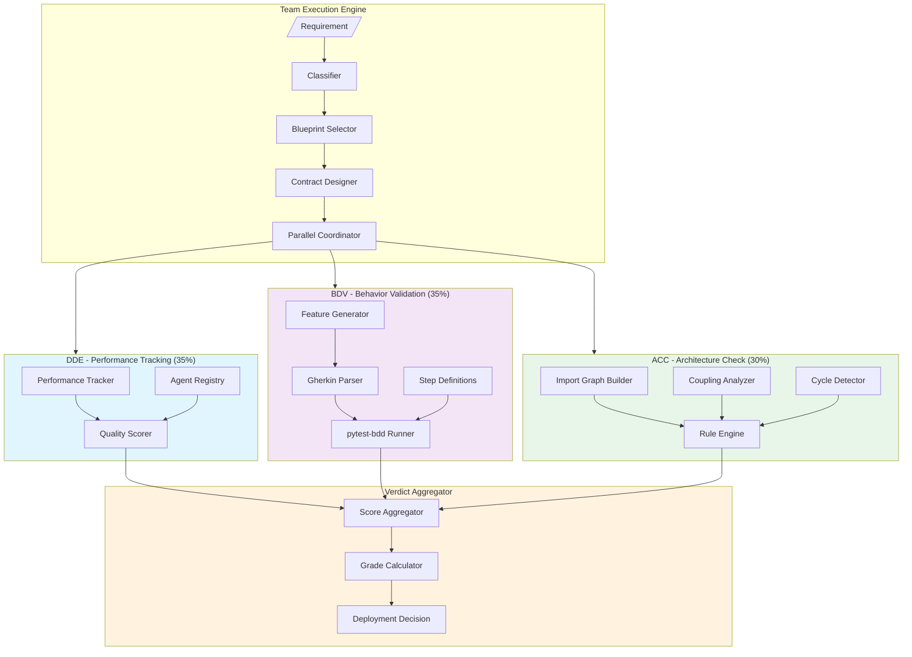
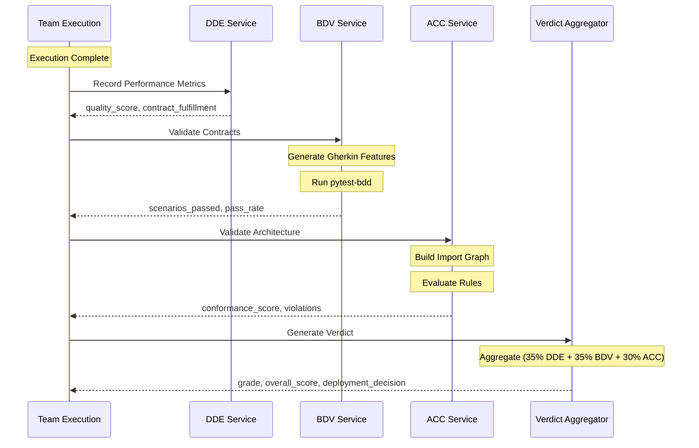
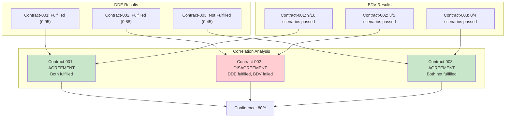
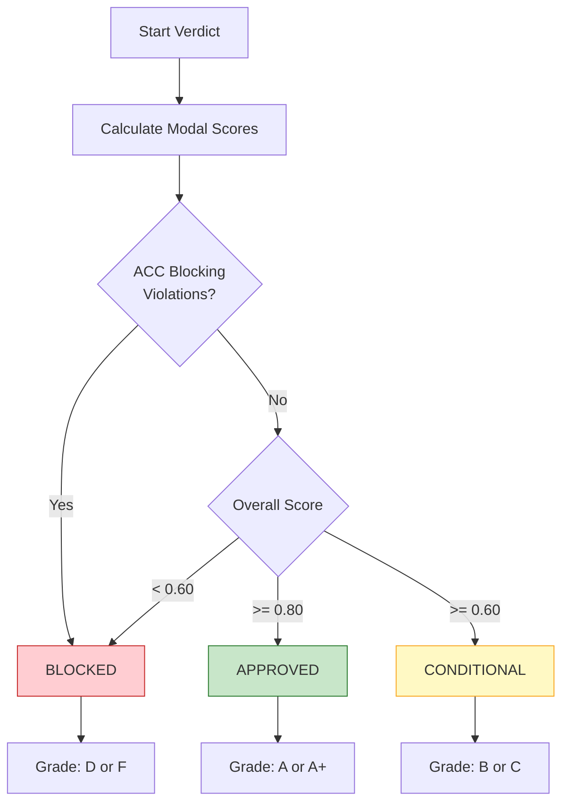

# Trimodal Validation System Architecture

## Overview

The Trimodal Validation System integrates three complementary quality assurance approaches:
- **DDE** (Dependency-Driven Execution) - Performance & Contract Tracking
- **BDV** (Behavior-Driven Validation) - Gherkin Scenario Testing
- **ACC** (Architectural Conformance Checking) - Code Structure Analysis

## Architecture Diagram



## Data Flow Sequence



## Component Details

### DDE (Dependency-Driven Execution)
- **Weight**: 35%
- **Metrics**: Quality score, contract fulfillment rate, error rate
- **Location**: `dde/`

### BDV (Behavior-Driven Validation)
- **Weight**: 35%
- **Metrics**: Pass rate, scenarios passed/failed, contracts fulfilled
- **Location**: `bdv/`
- **Key Files**:
  - `bdv/integration_service.py` - Main service
  - `bdv/bdv_runner.py` - pytest-bdd executor
  - `features/conftest.py` - Step definitions
  - `features/generated/` - Auto-generated feature files

### ACC (Architectural Conformance Checking)
- **Weight**: 30%
- **Metrics**: Conformance score, violation counts, cycle detection
- **Location**: `acc/`
- **Key Files**:
  - `acc/integration_service.py` - Main service
  - `acc/rule_engine.py` - Rule evaluation
  - `acc/import_graph_builder.py` - Dependency analysis

### Verdict Aggregator
- **Location**: `dde/verdict_aggregator.py`
- **Grades**: A+ (>0.95), A (>0.90), B (>0.80), C (>0.70), D (>0.60), F
- **Decisions**: approved, conditional, blocked

## Correlation ID Tracking

All Trimodal validation logs include a correlation ID for debugging:

```
[trimodal-sdlc_abc123] 🧪 Starting BDV validation...
[trimodal-sdlc_abc123] ✅ BDV: 4/4 contracts, 12/12 scenarios passed
[trimodal-sdlc_abc123] 🏗️ Starting ACC validation...
[trimodal-sdlc_abc123] ✅ ACC: COMPLIANT (score: 1.00, violations: 0)
[trimodal-sdlc_abc123] ✅ VERDICT: Grade A | Score 0.92 | Decision: approved
```

## Configuration

### pytest.ini Markers
```ini
markers =
    criterion_1: BDV acceptance criterion 1
    criterion_2: BDV acceptance criterion 2
    deliverable: BDV deliverable validation
```

### Feature File Generation
Contracts are converted to Gherkin format:
```gherkin
@contract:contract_id:v1.0
Feature: Contract Name

  @criterion_1
  Scenario: Acceptance Criterion 1
    Given the system is in initial state
    When the criterion is evaluated
    Then it should satisfy: [criterion text]
```

## Execution Timeline (MD-2025)

```mermaid
gantt
    title Trimodal Validation Execution Timeline
    dateFormat X
    axisFormat %s

    section DDE
    Contract Design          :active, dde1, 0, 3
    Agent Execution          :active, dde2, 3, 8
    Performance Recording    :active, dde3, 8, 9

    section BDV
    Feature Generation       :active, bdv1, 8, 9
    Test Execution           :active, bdv2, 9, 12
    Result Mapping           :active, bdv3, 12, 13

    section ACC
    Import Graph Build       :active, acc1, 8, 10
    Rule Evaluation          :active, acc2, 10, 12
    Cycle Detection          :active, acc3, 12, 13

    section Integration
    DDE-BDV Correlation      :crit, corr, 13, 14
    Verdict Generation       :crit, verdict, 14, 16
```



## DDE-BDV Correlation (MD-2023)



## Verdict Decision Tree (MD-2025)



## Quality Gates

| Gate | Description | Threshold | Blocking |
|------|-------------|-----------|----------|
| min_overall_score | Minimum weighted score | >= 0.60 | Yes |
| no_blocking_violations | No ACC blocking violations | 0 | Yes |
| test_pass_rate | BDV scenario pass rate | >= 0.70 | No |
| contract_fulfillment | DDE contract fulfillment | >= 0.80 | No |
| architectural_compliance | ACC compliant | true | Yes |
| dde_bdv_correlation | DDE-BDV agreement | >= 0.70 | No |

## Recent Fixes (Epic MD-2020)

| Story | Issue | Fix |
|-------|-------|-----|
| MD-2021 | BDV empty features | Pass original contracts with acceptance_criteria |
| MD-2022 | ACC TypeError | Added to_dependencies_dict() method |
| MD-2023 | No DDE-BDV sync | Created CorrelationService |
| MD-2024 | Poor logging | Added correlation IDs and structured logging |
| MD-2025 | No visualization | Enhanced this documentation |
| MD-2026 | No integration tests | Added trimodal test suite |

---
*Updated by Claude Code - MD-2025 Trimodal Architecture Visualization*
