# Sunday.com Architecture Diagrams

## 🏗️ Overview

This document provides visual representations of Sunday.com's architecture, from high-level system overview to detailed component interactions. These diagrams help developers, architects, and stakeholders understand how the platform is designed and how different components work together.

## 📋 Table of Contents

1. [System Architecture Overview](#system-architecture-overview)
2. [Microservices Architecture](#microservices-architecture)
3. [Data Architecture](#data-architecture)
4. [Security Architecture](#security-architecture)
5. [Deployment Architecture](#deployment-architecture)
6. [Real-time Collaboration](#real-time-collaboration)
7. [API Architecture](#api-architecture)
8. [User Journey Flows](#user-journey-flows)

---

## 🌐 System Architecture Overview

### High-Level System Architecture

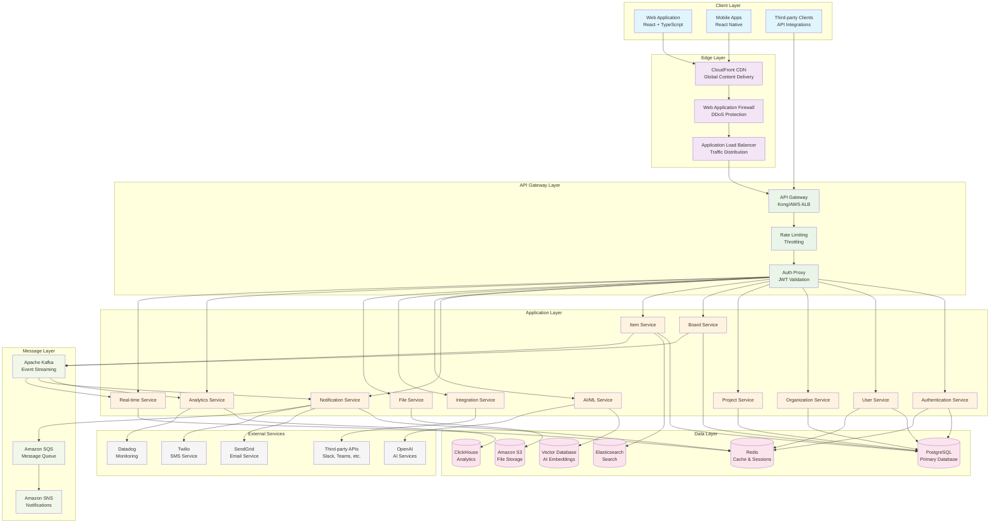

### Component Responsibilities

| Component | Responsibility | Technology |
|-----------|----------------|------------|
| **Web Application** | User interface, client-side logic | React 18, TypeScript, Vite |
| **Mobile Apps** | Native mobile experience | React Native, TypeScript |
| **API Gateway** | Request routing, authentication, rate limiting | Kong/AWS ALB |
| **Authentication Service** | User auth, JWT tokens, SSO | Node.js, Passport.js |
| **User Service** | User management, profiles | Node.js, Prisma |
| **Organization Service** | Multi-tenancy, workspace management | Node.js, Prisma |
| **Project Service** | Project lifecycle, permissions | Node.js, Prisma |
| **Board Service** | Board management, customization | Node.js, Prisma |
| **Item Service** | Work items, tasks, relationships | Node.js, Prisma |
| **Real-time Service** | Live collaboration, WebSocket | Node.js, Socket.IO |
| **AI Service** | ML models, intelligent features | Python, TensorFlow |
| **Analytics Service** | Metrics, reporting, dashboards | Node.js, ClickHouse |

---

## 🔧 Microservices Architecture

### Service Decomposition

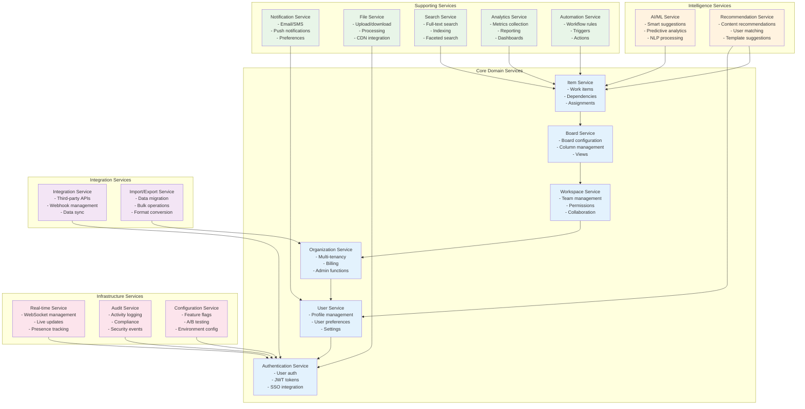

### Service Communication Patterns

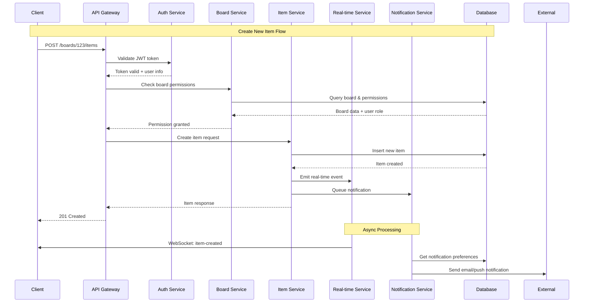

---

## 💾 Data Architecture

### Database Schema Overview

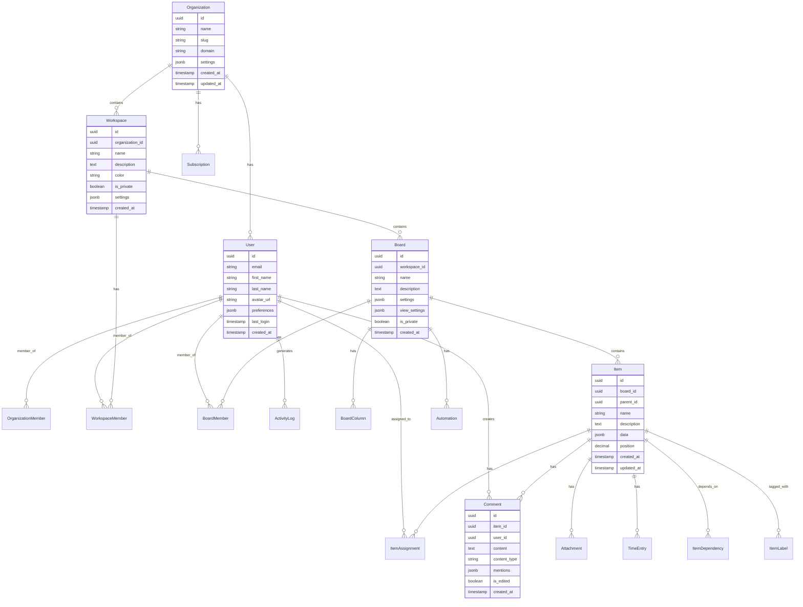

### Data Flow Architecture

```mermaid
graph TB
    subgraph "Application Layer"
        API[REST/GraphQL APIs]
        WEBSOCKET[WebSocket Handlers]
        WORKERS[Background Workers]
    end

    subgraph "Caching Layer"
        REDIS_CACHE[Redis Cache<br/>- Session data<br/>- API responses<br/>- Real-time data]
        MEMORY_CACHE[In-Memory Cache<br/>- Static data<br/>- Configuration<br/>- User preferences]
    end

    subgraph "Primary Storage"
        POSTGRES[PostgreSQL<br/>- Transactional data<br/>- User accounts<br/>- Business logic]

        subgraph "Postgres Partitions"
            ORG_SHARD[Organization Shards]
            TIME_PARTITION[Time-based Partitions]
            AUDIT_PARTITION[Audit Log Partitions]
        end
    end

    subgraph "Specialized Storage"
        ELASTICSEARCH[Elasticsearch<br/>- Full-text search<br/>- Log aggregation<br/>- Analytics queries]
        CLICKHOUSE[ClickHouse<br/>- Time-series data<br/>- Analytics events<br/>- Reporting]
        S3[Amazon S3<br/>- File storage<br/>- Backups<br/>- Static assets]
        VECTOR_DB[Vector Database<br/>- AI embeddings<br/>- Semantic search<br/>- ML features]
    end

    subgraph "Event Streaming"
        KAFKA[Apache Kafka<br/>- Event sourcing<br/>- Data streaming<br/>- Service communication]

        subgraph "Kafka Topics"
            USER_EVENTS[user.events]
            ITEM_EVENTS[item.events]
            ANALYTICS_EVENTS[analytics.events]
            NOTIFICATION_EVENTS[notification.events]
        end
    end

    %% Data flow connections
    API --> REDIS_CACHE
    API --> POSTGRES
    WEBSOCKET --> REDIS_CACHE
    WORKERS --> POSTGRES

    REDIS_CACHE -.-> MEMORY_CACHE
    POSTGRES --> ORG_SHARD
    POSTGRES --> TIME_PARTITION
    POSTGRES --> AUDIT_PARTITION

    %% Event streaming
    API --> KAFKA
    WEBSOCKET --> KAFKA
    KAFKA --> USER_EVENTS
    KAFKA --> ITEM_EVENTS
    KAFKA --> ANALYTICS_EVENTS
    KAFKA --> NOTIFICATION_EVENTS

    %% Specialized storage sync
    KAFKA --> ELASTICSEARCH
    KAFKA --> CLICKHOUSE
    POSTGRES --> S3
    API --> S3

    %% AI/ML data flow
    POSTGRES --> VECTOR_DB
    KAFKA --> VECTOR_DB

    classDef application fill:#e3f2fd
    classDef cache fill:#e8f5e8
    classDef primary fill:#fff3e0
    classDef specialized fill:#f3e5f5
    classDef streaming fill:#fce4ec

    class API,WEBSOCKET,WORKERS application
    class REDIS_CACHE,MEMORY_CACHE cache
    class POSTGRES,ORG_SHARD,TIME_PARTITION,AUDIT_PARTITION primary
    class ELASTICSEARCH,CLICKHOUSE,S3,VECTOR_DB specialized
    class KAFKA,USER_EVENTS,ITEM_EVENTS,ANALYTICS_EVENTS,NOTIFICATION_EVENTS streaming
```

---

## 🔐 Security Architecture

### Zero-Trust Security Model

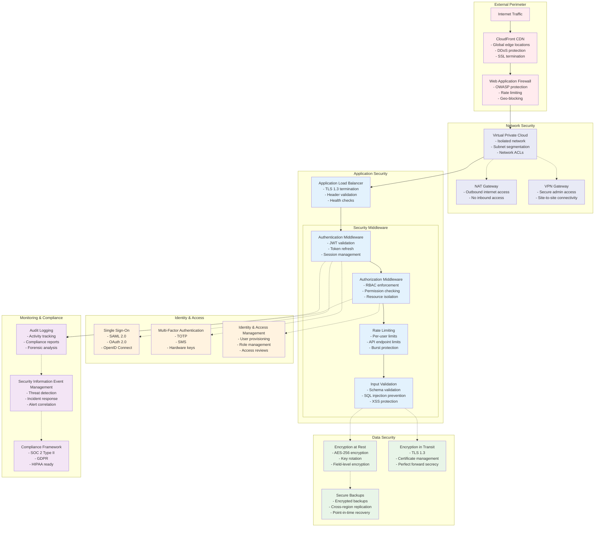

### Authentication Flow

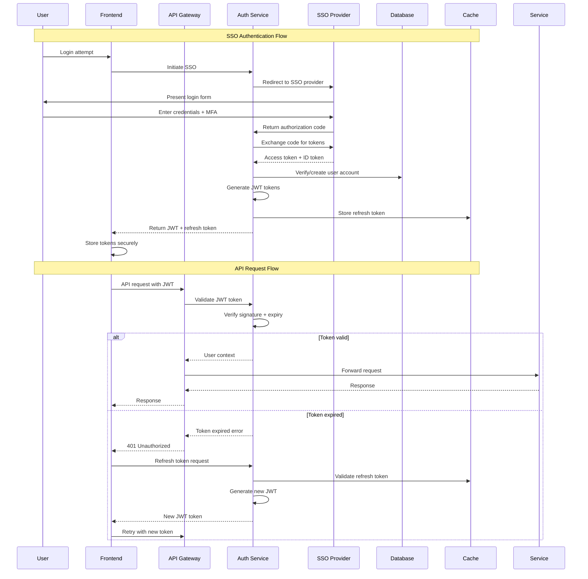

---

## 🚀 Deployment Architecture

### Multi-Environment Deployment

```mermaid
graph TB
    subgraph "Development Environment"
        DEV_CODE[Developer Workstation<br/>- Local development<br/>- Hot reload<br/>- Debug mode]
        DEV_DB[(Local Databases<br/>- PostgreSQL<br/>- Redis<br/>- Docker containers)]
        DEV_CODE -.-> DEV_DB
    end

    subgraph "CI/CD Pipeline"
        GITHUB[GitHub Repository<br/>- Source code<br/>- Pull requests<br/>- Code reviews]
        ACTIONS[GitHub Actions<br/>- Automated testing<br/>- Security scanning<br/>- Build automation]
        REGISTRY[Container Registry<br/>- Docker images<br/>- Version tagging<br/>- Vulnerability scanning]

        GITHUB --> ACTIONS
        ACTIONS --> REGISTRY
    end

    subgraph "Staging Environment"
        STAGING_K8S[Kubernetes Cluster<br/>- AWS EKS<br/>- Staging workloads<br/>- Integration testing]
        STAGING_DB[(Staging Databases<br/>- RDS instances<br/>- Masked data<br/>- Performance testing)]
        STAGING_CACHE[(Redis Cluster<br/>- ElastiCache<br/>- Session storage)]

        STAGING_K8S --> STAGING_DB
        STAGING_K8S --> STAGING_CACHE
    end

    subgraph "Production Environment"
        subgraph "Multi-Region Setup"
            US_EAST[US-East-1 (Primary)<br/>- Active workloads<br/>- Full traffic]
            US_WEST[US-West-2 (Secondary)<br/>- Standby<br/>- Disaster recovery]
        end

        subgraph "Production Infrastructure"
            PROD_K8S[Kubernetes Clusters<br/>- AWS EKS<br/>- Auto-scaling<br/>- Load balancing]
            PROD_DB[(Production Databases<br/>- RDS Multi-AZ<br/>- Read replicas<br/>- Automated backups)]
            PROD_CACHE[(Redis Clusters<br/>- ElastiCache<br/>- Cross-AZ replication)]
            PROD_STORAGE[(S3 Storage<br/>- Cross-region replication<br/>- Lifecycle policies)]
        end
    end

    subgraph "Monitoring & Observability"
        MONITORING[Monitoring Stack<br/>- Datadog APM<br/>- Prometheus<br/>- Grafana dashboards]
        LOGGING[Centralized Logging<br/>- ELK Stack<br/>- Log aggregation<br/>- Search & analytics]
        ALERTING[Alerting System<br/>- PagerDuty<br/>- Slack notifications<br/>- Email alerts]
    end

    %% Development to CI/CD
    DEV_CODE --> GITHUB

    %% CI/CD to environments
    REGISTRY --> STAGING_K8S
    REGISTRY --> PROD_K8S

    %% Production setup
    PROD_K8S --> PROD_DB
    PROD_K8S --> PROD_CACHE
    PROD_K8S --> PROD_STORAGE
    US_EAST -.-> US_WEST

    %% Monitoring connections
    STAGING_K8S -.-> MONITORING
    PROD_K8S -.-> MONITORING
    MONITORING -.-> LOGGING
    MONITORING -.-> ALERTING

    classDef dev fill:#e8f5e8
    classDef cicd fill:#e3f2fd
    classDef staging fill:#fff3e0
    classDef prod fill:#ffebee
    classDef monitoring fill:#f3e5f5

    class DEV_CODE,DEV_DB dev
    class GITHUB,ACTIONS,REGISTRY cicd
    class STAGING_K8S,STAGING_DB,STAGING_CACHE staging
    class US_EAST,US_WEST,PROD_K8S,PROD_DB,PROD_CACHE,PROD_STORAGE prod
    class MONITORING,LOGGING,ALERTING monitoring
```

### Kubernetes Architecture

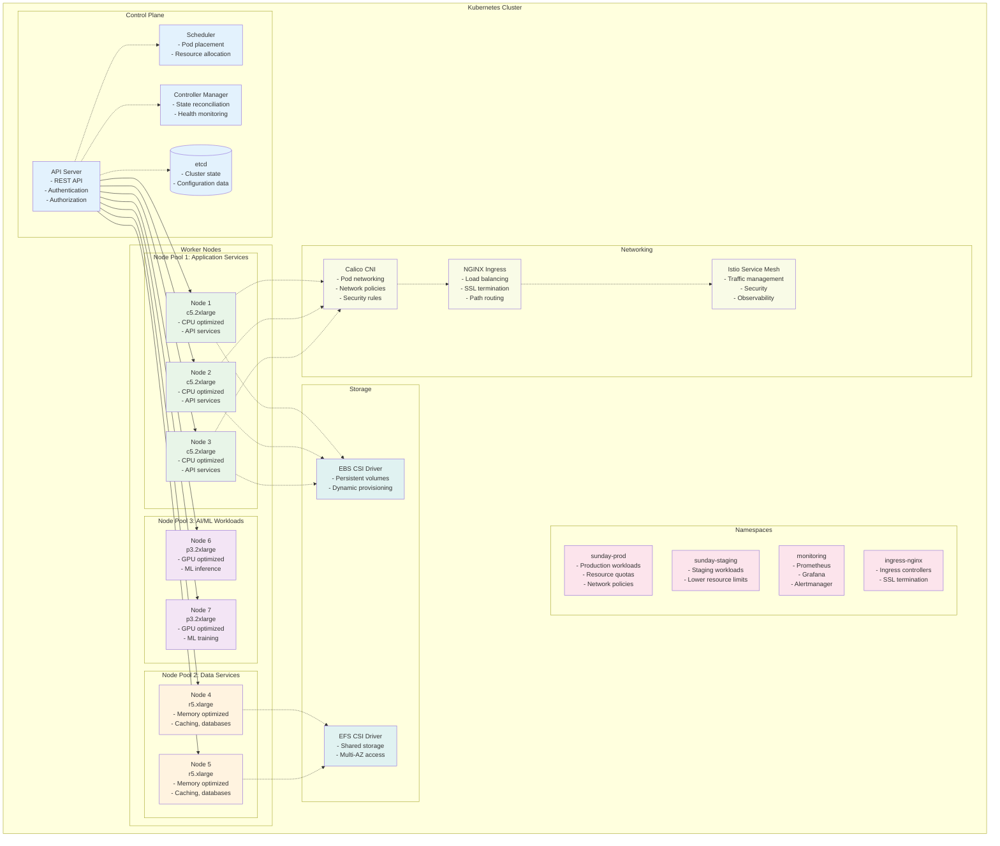

---

## ⚡ Real-time Collaboration

### WebSocket Architecture

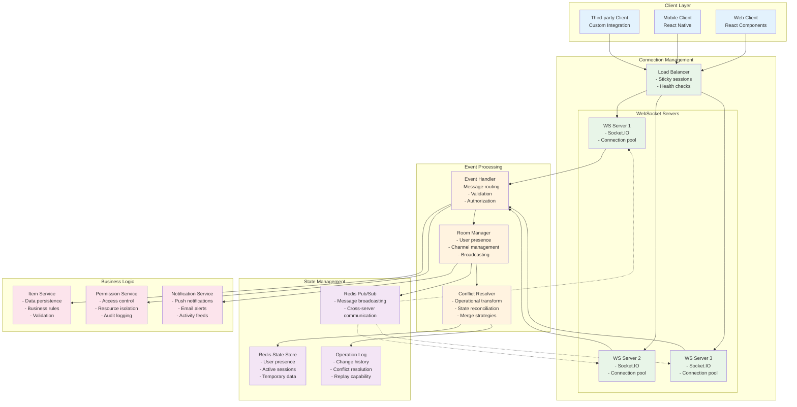

### Real-time Event Flow

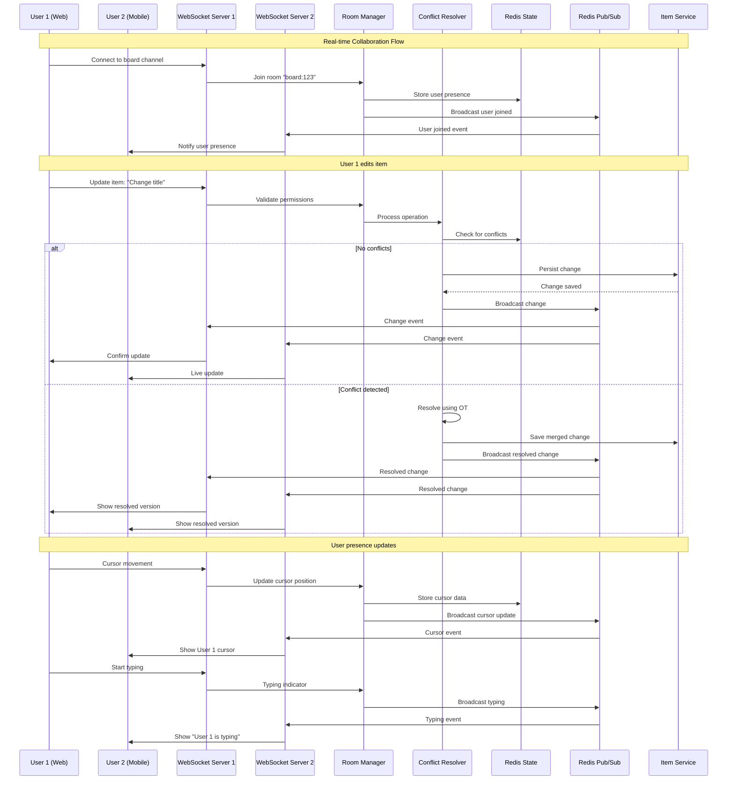

---

## 📡 API Architecture

### API Layer Design

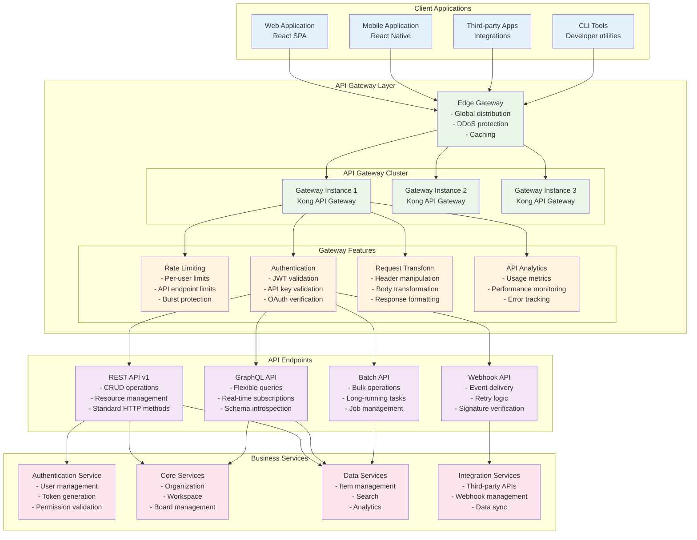

---

## 🎯 User Journey Flows

### User Onboarding Flow

```mermaid
flowchart TD
    START[User visits Sunday.com] --> SIGNUP{Sign up method}

    SIGNUP -->|Email| EMAIL_SIGNUP[Email Registration]
    SIGNUP -->|SSO| SSO_SIGNUP[SSO Registration]
    SIGNUP -->|Invitation| INVITE_SIGNUP[Team Invitation]

    EMAIL_SIGNUP --> EMAIL_VERIFY[Email Verification]
    EMAIL_VERIFY --> PROFILE_SETUP[Profile Setup]

    SSO_SIGNUP --> SSO_AUTH[SSO Authentication]
    SSO_AUTH --> PROFILE_SETUP

    INVITE_SIGNUP --> INVITE_ACCEPT[Accept Invitation]
    INVITE_ACCEPT --> PROFILE_SETUP

    PROFILE_SETUP --> ORG_SETUP{Organization exists?}

    ORG_SETUP -->|No| CREATE_ORG[Create Organization]
    ORG_SETUP -->|Yes| JOIN_ORG[Join Organization]

    CREATE_ORG --> WORKSPACE_SETUP[Create First Workspace]
    JOIN_ORG --> WORKSPACE_SETUP

    WORKSPACE_SETUP --> BOARD_SETUP[Create First Board]
    BOARD_SETUP --> TEMPLATE_SELECT[Select Template]
    TEMPLATE_SELECT --> BOARD_CUSTOMIZE[Customize Board]
    BOARD_CUSTOMIZE --> INVITE_TEAM[Invite Team Members]
    INVITE_TEAM --> TUTORIAL[Interactive Tutorial]
    TUTORIAL --> FIRST_ITEM[Create First Item]
    FIRST_ITEM --> ONBOARDING_COMPLETE[Onboarding Complete]

    classDef start fill:#e8f5e8
    classDef process fill:#e3f2fd
    classDef decision fill:#fff3e0
    classDef end fill:#fce4ec

    class START,ONBOARDING_COMPLETE start
    class EMAIL_SIGNUP,SSO_SIGNUP,INVITE_SIGNUP,EMAIL_VERIFY,PROFILE_SETUP,SSO_AUTH,INVITE_ACCEPT,CREATE_ORG,JOIN_ORG,WORKSPACE_SETUP,BOARD_SETUP,TEMPLATE_SELECT,BOARD_CUSTOMIZE,INVITE_TEAM,TUTORIAL,FIRST_ITEM process
    class SIGNUP,ORG_SETUP decision
```

### Item Creation & Collaboration Flow

```mermaid
flowchart TD
    USER_ACTION[User creates new item] --> VALIDATE_PERMS{Has permissions?}

    VALIDATE_PERMS -->|No| ACCESS_DENIED[Access Denied]
    VALIDATE_PERMS -->|Yes| CREATE_ITEM[Create Item in Database]

    CREATE_ITEM --> EMIT_EVENT[Emit Real-time Event]
    EMIT_EVENT --> NOTIFY_USERS[Notify Relevant Users]

    NOTIFY_USERS --> UPDATE_UI[Update UI for All Users]
    UPDATE_UI --> TRIGGER_AUTOMATION{Automation rules?}

    TRIGGER_AUTOMATION -->|Yes| RUN_AUTOMATION[Execute Automation]
    TRIGGER_AUTOMATION -->|No| LOG_ACTIVITY[Log Activity]

    RUN_AUTOMATION --> AUTO_ASSIGN[Auto-assign Users]
    AUTO_ASSIGN --> SEND_NOTIFICATIONS[Send Notifications]
    SEND_NOTIFICATIONS --> LOG_ACTIVITY

    LOG_ACTIVITY --> UPDATE_ANALYTICS[Update Analytics]
    UPDATE_ANALYTICS --> INDEX_SEARCH[Index for Search]
    INDEX_SEARCH --> PROCESS_COMPLETE[Process Complete]

    %% Parallel processes
    EMIT_EVENT --> AI_PROCESSING[AI Processing]
    AI_PROCESSING --> GENERATE_SUGGESTIONS[Generate Suggestions]
    GENERATE_SUGGESTIONS --> UPDATE_ML_MODELS[Update ML Models]

    classDef action fill:#e8f5e8
    classDef process fill:#e3f2fd
    classDef decision fill:#fff3e0
    classDef ai fill:#f3e5f5
    classDef end fill:#fce4ec

    class USER_ACTION action
    class CREATE_ITEM,EMIT_EVENT,NOTIFY_USERS,UPDATE_UI,RUN_AUTOMATION,AUTO_ASSIGN,SEND_NOTIFICATIONS,LOG_ACTIVITY,UPDATE_ANALYTICS,INDEX_SEARCH process
    class VALIDATE_PERMS,TRIGGER_AUTOMATION decision
    class AI_PROCESSING,GENERATE_SUGGESTIONS,UPDATE_ML_MODELS ai
    class ACCESS_DENIED,PROCESS_COMPLETE end
```

---

## 📊 Performance Architecture

### Caching Strategy

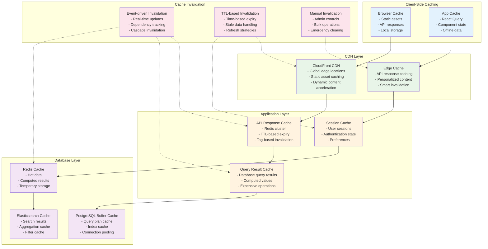

---

## 🔍 Monitoring & Observability

### Observability Stack

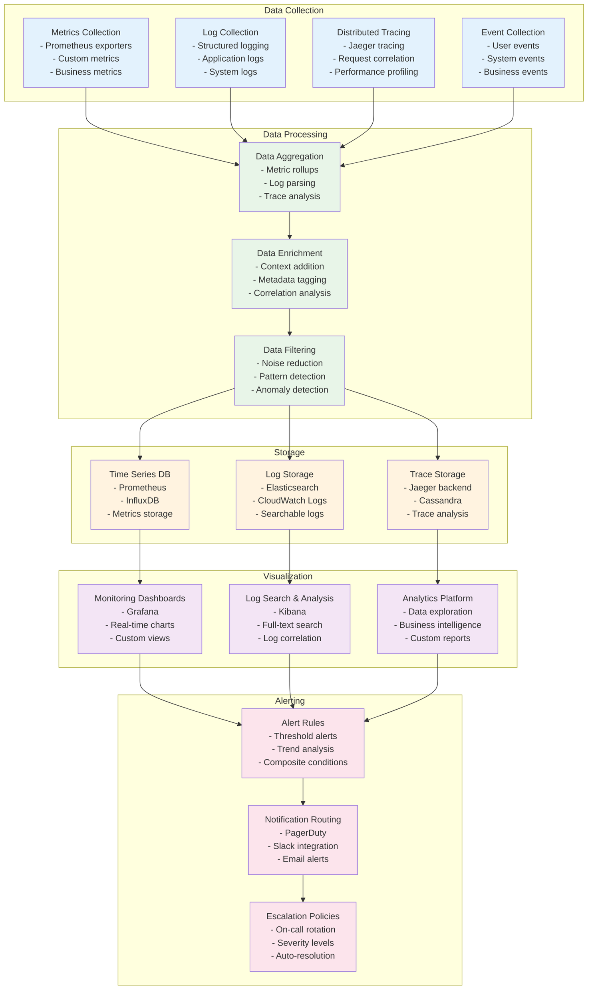

---

## 📝 Conclusion

This architecture documentation provides a comprehensive view of Sunday.com's technical design, from high-level system architecture to detailed component interactions. The diagrams serve as a reference for:

### For Developers
- **Understanding system boundaries** and service interactions
- **Implementing new features** within the existing architecture
- **Debugging issues** by tracing data flow through components
- **Planning integrations** with external systems

### For Architects
- **Reviewing design decisions** and architectural patterns
- **Planning system evolution** and scaling strategies
- **Identifying optimization opportunities** and bottlenecks
- **Ensuring consistency** across different system components

### For Operations Teams
- **Understanding deployment architecture** and infrastructure
- **Planning capacity** and scaling requirements
- **Implementing monitoring** and observability
- **Managing security** and compliance requirements

### For Stakeholders
- **Visualizing system complexity** and technical investment
- **Understanding scalability** and growth capabilities
- **Assessing security** and compliance posture
- **Planning technical roadmap** and resource allocation

These architectural diagrams are living documents that should be updated as the system evolves. They represent the current state and planned architecture for Sunday.com's work management platform.

---

*Document Version: 1.0*
*Created: December 2024*
*Next Review: Q1 2025*