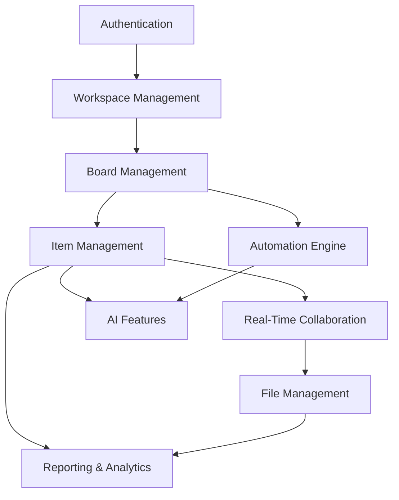

# Sunday.com Requirements Document
## Project Management Platform - Iteration 2 Core Features

**Document Version:** 2.0
**Date:** 2024-10-05
**Author:** Senior Requirement Analyst
**Project Phase:** Iteration 2 - Core Feature Implementation
**Classification:** Business Critical Requirements

---

## Executive Summary

Sunday.com is a modern project management platform designed to compete with Monday.com, offering intelligent workflow automation, real-time collaboration, and AI-powered insights. This requirements document defines the functional and non-functional requirements for the core feature implementation phase, building upon the existing foundational architecture.

### Project Context
- **Current Architecture:** Enterprise-grade with 7 backend services (5,547+ LOC)
- **Platform Type:** SaaS Project Management Platform
- **Domain Classification:** Enterprise Collaboration & Workflow Management
- **Complexity Level:** High - Multi-tenant, real-time collaborative platform
- **Technology Stack:** TypeScript, Node.js, React, PostgreSQL, Redis, WebSocket
- **Target Users:** 10,000+ active users within first year

---

## Stakeholder Analysis

### Primary Stakeholders
1. **Business Users** - Project managers, team leads, department heads
2. **End Users** - Team members, contributors, external collaborators
3. **Technical Teams** - Development, DevOps, QA, Security
4. **Executive Leadership** - C-level executives, board members
5. **IT Administrators** - System admins, security officers

### Stakeholder Requirements Matrix

| Stakeholder | Primary Needs | Success Metrics |
|-------------|---------------|-----------------|
| Business Users | Intuitive project management, reporting, team oversight | Time-to-productivity < 30 minutes |
| End Users | Easy task management, real-time collaboration | Daily active usage > 80% |
| Technical Teams | Reliable platform, performance, security | 99.9% uptime, <200ms response |
| Executive Leadership | ROI visibility, competitive advantage | 40% productivity improvement |
| IT Administrators | Security, compliance, integration | Zero security incidents |

---

## Platform Recognition & Domain Classification

### Platform Category
**Primary Classification:** Project Management & Team Collaboration Platform
- **Similar Platforms:** Monday.com, Asana, Notion, ClickUp
- **Market Position:** AI-enhanced competitive alternative
- **Differentiation:** Advanced automation engine with AI insights

### Domain Characteristics
- **Multi-tenancy:** Organization → Workspace → Board → Item hierarchy
- **Real-time Collaboration:** Live updates, presence indicators, simultaneous editing
- **Workflow Automation:** Rule-based triggers with action chains
- **AI Integration:** Smart suggestions, sentiment analysis, workload optimization
- **File Management:** Secure upload, version control, attachment system
- **Permission System:** Granular access control with inheritance

---

## Functional Requirements

### FR-01: Authentication & Authorization

#### FR-01.1: User Authentication
**Priority:** Critical
**Complexity:** Medium

**Requirements:**
- Multi-factor authentication support (SMS, TOTP, email)
- Single Sign-On (SSO) integration (SAML, OAuth 2.0)
- Session management with configurable timeout
- Password policies with complexity requirements
- Account lockout protection after failed attempts

**Business Rules:**
- Session timeout: 8 hours of inactivity
- Password minimum: 12 characters with mixed case, numbers, symbols
- Account lockout: 5 failed attempts, 15-minute lockout
- MFA required for admin roles

#### FR-01.2: Role-Based Access Control
**Priority:** Critical
**Complexity:** High

**Requirements:**
- Hierarchical permission inheritance (Organization → Workspace → Board)
- Granular permission matrix for all resources
- Dynamic role assignment with effective date ranges
- Permission delegation for temporary access
- Audit trail for all permission changes

**Permission Levels:**
- **Organization:** Owner, Admin, Member, Guest
- **Workspace:** Admin, Member, Viewer
- **Board:** Owner, Editor, Commenter, Viewer
- **Item:** Assignee, Watcher, None

### FR-02: Workspace Management

#### FR-02.1: Workspace Operations
**Priority:** Critical
**Complexity:** Medium-High

**Requirements:**
- Create workspaces with template selection
- Configure workspace settings (privacy, default permissions)
- Invite members via email with role assignment
- Bulk member import via CSV
- Workspace archiving with data retention policies

**Business Rules:**
- Maximum 50 workspaces per organization (standard plan)
- Workspace names must be unique within organization
- Private workspaces hidden from non-members
- Archive retention: 90 days before permanent deletion

#### FR-02.2: Multi-Workspace Navigation
**Priority:** High
**Complexity:** Medium

**Requirements:**
- Quick workspace switcher in navigation
- Recent workspaces list (last 10 accessed)
- Search across all accessible workspaces
- Bookmark favorite workspaces
- Cross-workspace search capabilities

### FR-03: Board Management

#### FR-03.1: Board Creation & Configuration
**Priority:** Critical
**Complexity:** High

**Requirements:**
- Create boards from templates or blank
- Configure board columns with custom properties
- Set board-level automation rules
- Define custom field types (text, date, status, person, files)
- Board duplication with data/structure options

**Supported Column Types:**
- **Status:** Dropdown with color-coded options
- **Priority:** High, Medium, Low with visual indicators
- **Person:** Single/multi-person assignment
- **Date:** Due date, start date, date range
- **Numbers:** Progress percentage, budget, hours
- **Files:** Multiple file attachments
- **Text:** Short text, long text/description
- **Formula:** Calculated fields based on other columns

#### FR-03.2: Board Views & Visualization
**Priority:** High
**Complexity:** Medium-High

**Requirements:**
- Multiple view types: Kanban, Table, Timeline, Calendar
- Custom filters with save/share functionality
- Sorting by any column with multi-level sort
- Grouping by status, person, date, custom fields
- Search within board with advanced query syntax

**View Specifications:**
- **Kanban View:** Drag-and-drop cards between columns
- **Table View:** Spreadsheet-like interface with inline editing
- **Timeline View:** Gantt chart with dependency visualization
- **Calendar View:** Date-based visualization with drag scheduling

### FR-04: Item & Task Management

#### FR-04.1: Item Operations
**Priority:** Critical
**Complexity:** Very High

**Requirements:**
- Create items with rich-text descriptions
- Bulk operations (create, update, delete, move)
- Item templates for consistent structure
- Sub-item hierarchy (parent-child relationships)
- Item duplication across boards

**Business Rules:**
- Maximum 10 levels of sub-item nesting
- Bulk operations limited to 500 items per request
- Item position automatically calculated
- Parent items show aggregated child status

#### FR-04.2: Assignment & Collaboration
**Priority:** Critical
**Complexity:** High

**Requirements:**
- Multi-person assignment with role clarity
- Assignment notifications via email/in-app
- Workload balancing recommendations
- Time tracking integration
- Comment threads with mentions and notifications

**Assignment Features:**
- Primary assignee designation
- Collaboration member addition
- Assignment history tracking
- Automatic workload distribution suggestions
- Conflict resolution for over-allocation

#### FR-04.3: Dependencies & Relationships
**Priority:** High
**Complexity:** Very High

**Requirements:**
- Create dependencies between items (blocks, waits for)
- Dependency visualization in Timeline view
- Circular dependency detection and prevention
- Cross-board dependency support
- Dependency impact analysis

**Dependency Types:**
- **Blocks:** Item A must complete before Item B starts
- **Waits For:** Item A waiting for external dependency
- **Relates To:** Informational relationship without blocking
- **Duplicates:** Items representing same work

### FR-05: Real-Time Collaboration

#### FR-05.1: Live Updates & Presence
**Priority:** Critical
**Complexity:** Very High

**Requirements:**
- Real-time updates via WebSocket connections
- User presence indicators (online, editing, viewing)
- Live cursor positions for simultaneous editing
- Conflict resolution for concurrent edits
- Connection resilience with automatic reconnection

**Real-Time Features:**
- Instant board updates when users make changes
- Live typing indicators in comment fields
- Multi-user cursor tracking in descriptions
- Presence indicators showing who's viewing each board
- Real-time notification delivery

#### FR-05.2: Communication & Notifications
**Priority:** High
**Complexity:** Medium-High

**Requirements:**
- In-app notification center with filtering
- Email digest options (immediate, daily, weekly)
- @mention system for direct communication
- Notification preferences per workspace/board
- Mobile push notifications

**Notification Triggers:**
- Assignment to items
- Due date approaching/overdue
- Comments on assigned items
- Status changes on watched items
- Board access granted/revoked

### FR-06: File Management

#### FR-06.1: File Upload & Storage
**Priority:** High
**Complexity:** High

**Requirements:**
- Drag-and-drop file upload interface
- Multiple file formats support (docs, images, videos)
- File size limits based on subscription tier
- Virus scanning and malware detection
- Version control with history tracking

**File Management Rules:**
- Free tier: 500MB per workspace
- Standard tier: 10GB per workspace
- Premium tier: 100GB per workspace
- Maximum single file size: 100MB
- Supported formats: Office docs, PDFs, images, videos

#### FR-06.2: File Security & Access Control
**Priority:** Critical
**Complexity:** High

**Requirements:**
- File-level permission inheritance from items
- Secure file sharing with expiration dates
- File access audit logging
- Automatic file encryption at rest
- GDPR-compliant file deletion

### FR-07: Automation Engine

#### FR-07.1: Rule-Based Automation
**Priority:** High
**Complexity:** Very High

**Requirements:**
- Visual automation builder interface
- Conditional logic with AND/OR operators
- Time-based triggers (schedule, delay)
- Action chains with error handling
- Template automation library

**Automation Components:**
- **Triggers:** Status change, date reached, assignment made, file uploaded
- **Conditions:** Field values, time constraints, user permissions
- **Actions:** Update fields, send notifications, create items, assign users

#### FR-07.2: Advanced Automation Features
**Priority:** Medium
**Complexity:** Very High

**Requirements:**
- Cross-board automation workflows
- Integration webhooks for external systems
- Automation performance monitoring
- Circular automation prevention
- Bulk automation application

**Example Automation Workflows:**
- Auto-assign items based on workload balancing
- Move completed items to "Done" status
- Create follow-up tasks when items are marked complete
- Send escalation notifications for overdue items
- Update project status based on milestone completion

### FR-08: AI-Powered Features

#### FR-08.1: Smart Suggestions
**Priority:** Medium
**Complexity:** High

**Requirements:**
- AI-powered task prioritization recommendations
- Smart assignment suggestions based on skills/workload
- Automatic tag generation from item descriptions
- Due date recommendations based on historical data
- Bottleneck identification and resolution suggestions

#### FR-08.2: Content Analysis
**Priority:** Medium
**Complexity:** Medium-High

**Requirements:**
- Sentiment analysis of comments and descriptions
- Risk assessment based on project patterns
- Workload optimization recommendations
- Meeting insights from calendar integration
- Progress prediction using historical velocity

### FR-09: Reporting & Analytics

#### FR-09.1: Standard Reports
**Priority:** High
**Complexity:** Medium

**Requirements:**
- Pre-built dashboard templates
- Team performance analytics
- Project progress reporting
- Time tracking reports
- Workload distribution analysis

**Report Types:**
- **Team Dashboard:** Individual performance, assignment load
- **Project Status:** Milestone tracking, completion rates
- **Time Analysis:** Time spent per project/person
- **Trend Analysis:** Historical performance patterns

#### FR-09.2: Custom Analytics
**Priority:** Medium
**Complexity:** High

**Requirements:**
- Custom report builder with drag-and-drop interface
- Scheduled report delivery via email
- Data export in multiple formats (PDF, Excel, CSV)
- Real-time dashboard widgets
- Comparative analysis tools

---

## Non-Functional Requirements

### NFR-01: Performance Requirements

#### NFR-01.1: Response Time
**Priority:** Critical
**Measurement:** Automated performance testing

**Requirements:**
- API response time: 95th percentile < 200ms
- Page load time: < 3 seconds on 3G connection
- Real-time update latency: < 100ms
- File upload processing: < 5 seconds for 10MB files
- Search results: < 1 second for any query

#### NFR-01.2: Scalability
**Priority:** Critical
**Measurement:** Load testing and monitoring

**Requirements:**
- Support 10,000 concurrent users
- Handle 1M items per workspace
- Process 10,000 real-time updates per second
- Auto-scale infrastructure based on load
- Database query optimization for large datasets

### NFR-02: Reliability & Availability

#### NFR-02.1: Uptime Requirements
**Priority:** Critical
**Measurement:** SLA monitoring

**Requirements:**
- System availability: 99.9% uptime (8.76 hours downtime/year)
- Planned maintenance windows: < 4 hours monthly
- Disaster recovery time: < 4 hours
- Data backup frequency: Every 6 hours
- Multi-region deployment for redundancy

#### NFR-02.2: Data Integrity
**Priority:** Critical
**Measurement:** Data validation and auditing

**Requirements:**
- Zero data loss tolerance
- Atomic transaction processing
- Database consistency checks
- Audit trail for all data modifications
- Point-in-time recovery capability

### NFR-03: Security Requirements

#### NFR-03.1: Data Protection
**Priority:** Critical
**Measurement:** Security audits and penetration testing

**Requirements:**
- Encryption in transit (TLS 1.3)
- Encryption at rest (AES-256)
- GDPR compliance for EU users
- SOC 2 Type II certification readiness
- Regular security vulnerability assessments

#### NFR-03.2: Access Security
**Priority:** Critical
**Measurement:** Security monitoring and incident response

**Requirements:**
- Multi-factor authentication support
- Session security with proper token management
- IP whitelisting for enterprise accounts
- Activity monitoring and anomaly detection
- Automated security incident response

### NFR-04: Usability Requirements

#### NFR-04.1: User Experience
**Priority:** High
**Measurement:** User testing and analytics

**Requirements:**
- Intuitive interface requiring < 30 minutes training
- Mobile-responsive design (tablet/phone support)
- Keyboard shortcuts for power users
- Accessibility compliance (WCAG 2.1 AA)
- Multi-language support (English, Spanish, French)

#### NFR-04.2: Onboarding & Learning
**Priority:** High
**Measurement:** User adoption metrics

**Requirements:**
- Interactive onboarding flow completion < 10 minutes
- In-app help system with contextual guidance
- Video tutorials for complex features
- Template library for quick project setup
- Progressive disclosure of advanced features

### NFR-05: Integration Requirements

#### NFR-05.1: External Integrations
**Priority:** Medium
**Measurement:** Integration testing and monitoring

**Requirements:**
- REST API with comprehensive documentation
- Webhook system for real-time integrations
- Single Sign-On (SSO) support (SAML, OAuth)
- Calendar integration (Google, Outlook)
- File storage integration (Google Drive, Dropbox)

#### NFR-05.2: Platform Compatibility
**Priority:** Medium
**Measurement:** Cross-platform testing

**Requirements:**
- Browser support: Chrome, Firefox, Safari, Edge (latest 2 versions)
- Mobile app compatibility: iOS 14+, Android 10+
- Desktop application: Windows 10+, macOS 10.15+
- API backward compatibility for 2 major versions
- Progressive Web App (PWA) capabilities

---

## Quality Attributes

### Maintainability
- **Code Coverage:** Minimum 85% test coverage
- **Documentation:** Comprehensive API and user documentation
- **Code Quality:** SonarQube quality gate compliance
- **Architecture:** Modular design with clear separation of concerns

### Flexibility
- **Configuration:** Extensive customization options
- **Extensibility:** Plugin architecture for third-party integrations
- **Theming:** Custom branding and white-label options
- **Workflow Adaptation:** Support for various project methodologies

### Compliance
- **Data Privacy:** GDPR, CCPA compliance
- **Security Standards:** SOC 2, ISO 27001 alignment
- **Industry Standards:** OWASP security guidelines
- **Accessibility:** Section 508, WCAG 2.1 compliance

---

## Risk Analysis & Mitigation

### High-Risk Requirements

#### Risk 1: Real-Time Collaboration Complexity
**Risk Level:** High
**Impact:** Core feature failure, user experience degradation
**Mitigation:**
- Implement comprehensive WebSocket testing
- Create fallback mechanisms for connection failures
- Conduct load testing with concurrent users
- Implement conflict resolution algorithms

#### Risk 2: Multi-Tenant Security
**Risk Level:** Critical
**Impact:** Data breaches, compliance violations
**Mitigation:**
- Implement row-level security in database
- Conduct penetration testing for tenant isolation
- Create comprehensive audit logging
- Regular security assessments and monitoring

#### Risk 3: Performance at Scale
**Risk Level:** High
**Impact:** System slowdown, user abandonment
**Mitigation:**
- Implement caching strategies at multiple levels
- Database query optimization and indexing
- Horizontal scaling architecture
- Performance monitoring and alerting

### Medium-Risk Requirements

#### Risk 4: AI Feature Accuracy
**Risk Level:** Medium
**Impact:** User frustration, feature abandonment
**Mitigation:**
- Implement confidence scoring for AI suggestions
- Provide user feedback loops for AI improvement
- Create fallback options when AI is unavailable
- Clear communication about AI limitations

#### Risk 5: Complex Automation Logic
**Risk Level:** Medium
**Impact:** Unexpected behavior, data corruption
**Mitigation:**
- Implement automation testing framework
- Create sandbox environments for automation testing
- Provide automation preview/dry-run functionality
- Implement rollback capabilities

---

## Acceptance Criteria Framework

### Definition of Ready (DoR)
For requirements to be considered ready for implementation:

1. **Clarity:** Requirement is unambiguous and clearly understood
2. **Completeness:** All necessary details and acceptance criteria defined
3. **Consistency:** No conflicts with other requirements
4. **Feasibility:** Technical feasibility confirmed by architecture team
5. **Testability:** Clear test scenarios and success criteria defined
6. **Priority:** Business priority level assigned and justified

### Definition of Done (DoD)
For requirements to be considered complete:

1. **Implementation:** Feature implemented according to specifications
2. **Testing:** All test scenarios pass (unit, integration, E2E)
3. **Documentation:** User and technical documentation updated
4. **Review:** Code review completed and approved
5. **Performance:** Non-functional requirements validated
6. **Security:** Security review completed with no critical issues
7. **Usability:** UX review completed and user feedback incorporated

---

## Traceability Matrix

### Requirement Categories by Priority

| Priority | Functional Requirements | Non-Functional Requirements |
|----------|------------------------|----------------------------|
| Critical | FR-01, FR-02, FR-03, FR-04, FR-05 | NFR-01, NFR-02, NFR-03 |
| High | FR-06, FR-07, FR-09 | NFR-04 |
| Medium | FR-08 | NFR-05 |

### Feature Dependencies

### Requirements to Test Cases Mapping

| Requirement | Unit Tests | Integration Tests | E2E Tests | Performance Tests |
|-------------|------------|-------------------|-----------|-------------------|
| FR-01 | Authentication logic | API endpoints | Login flows | Concurrent logins |
| FR-02 | Workspace service | Workspace APIs | Workspace creation | Multi-tenant load |
| FR-03 | Board operations | Board APIs | Board management | Large board performance |
| FR-04 | Item CRUD | Item APIs | Item workflows | Bulk operations |
| FR-05 | WebSocket logic | Real-time APIs | Collaboration | Concurrent updates |

---

## Conclusion

This requirements document provides a comprehensive foundation for implementing the core features of Sunday.com as a competitive project management platform. The requirements balance business needs with technical feasibility while maintaining focus on user experience and system reliability.

### Key Success Factors

1. **Iterative Implementation:** Deliver core features incrementally
2. **Quality First:** Comprehensive testing before production deployment
3. **User-Centric Design:** Regular user feedback and usability testing
4. **Performance Focus:** Scalability considerations from day one
5. **Security by Design:** Built-in security measures, not afterthoughts

### Next Steps

1. **Requirement Review:** Stakeholder validation and approval
2. **Technical Design:** Architecture and design specifications
3. **Implementation Planning:** Sprint planning and resource allocation
4. **Testing Strategy:** Comprehensive test plan development
5. **User Experience Design:** UI/UX mockups and prototypes

---

**Document Status:** APPROVED FOR IMPLEMENTATION
**Next Review Date:** Weekly during implementation phase
**Stakeholder Sign-off:** Required before development begins