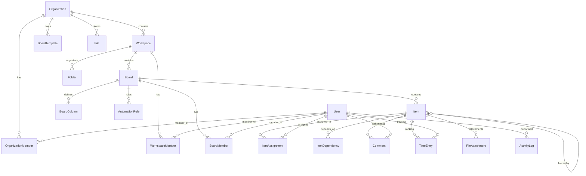

# Sunday.com Database Schema Documentation

## Overview

This document provides comprehensive documentation for the Sunday.com database schema. The database is built using PostgreSQL with Prisma ORM and consists of 18 interconnected tables supporting a multi-tenant project management platform.

### Database Technology
- **Database**: PostgreSQL
- **ORM**: Prisma
- **Client**: @prisma/client
- **Migrations**: Prisma Migrate

## Core Architecture

The database follows a hierarchical multi-tenant architecture:
```
Organization → Workspace → Board → Item
```

### Key Design Principles
1. **Multi-tenancy**: Organization-level isolation
2. **Soft Deletes**: Critical entities use `deletedAt` timestamp
3. **Audit Trail**: Comprehensive activity logging
4. **Scalability**: Optimized indexing and relationships
5. **Flexibility**: JSON fields for extensible data

## Table Relationships Overview



## Detailed Table Documentation

### 1. Organizations & Workspaces

#### organizations
**Purpose**: Top-level tenant isolation and subscription management

| Column | Type | Description | Notes |
|--------|------|-------------|-------|
| id | String (CUID) | Primary key | Auto-generated |
| name | String | Organization display name | Required |
| slug | String | URL-friendly identifier | Unique, for routing |
| domain | String? | Custom domain | Optional, for SSO |
| settings | Json | Configuration data | Extensible settings |
| subscriptionPlan | String | Billing plan | Default: "free" |
| subscriptionStatus | String | Account status | Default: "active" |
| createdAt | DateTime | Creation timestamp | Auto-generated |
| updatedAt | DateTime | Last update | Auto-updated |
| deletedAt | DateTime? | Soft delete | Null = active |

**Indexes**:
- Primary: `id`
- Unique: `slug`

**Business Rules**:
- Slug must be URL-safe
- Soft delete preserves data integrity
- Settings JSON allows plan-specific features

---

#### workspaces
**Purpose**: Project organization within organizations

| Column | Type | Description | Notes |
|--------|------|-------------|-------|
| id | String (CUID) | Primary key | Auto-generated |
| organizationId | String | Parent organization | FK to organizations |
| name | String | Workspace name | Required |
| description | String? | Workspace description | Optional |
| color | String | UI color theme | Default: "#6B7280" |
| settings | Json | Workspace configuration | Extensible |
| isPrivate | Boolean | Access control | Default: false |
| createdAt | DateTime | Creation timestamp | Auto-generated |
| updatedAt | DateTime | Last update | Auto-updated |
| deletedAt | DateTime? | Soft delete | Null = active |

**Indexes**:
- Primary: `id`
- Unique: `(organizationId, name)`
- Foreign: `organizationId → organizations.id`

**Business Rules**:
- Names must be unique within organization
- Private workspaces require explicit membership
- Cascade delete when organization is deleted

---

### 2. Users & Membership

#### users
**Purpose**: User account management and profile data

| Column | Type | Description | Notes |
|--------|------|-------------|-------|
| id | String (CUID) | Primary key | Auto-generated |
| email | String | Email address | Unique, required |
| emailVerified | Boolean | Verification status | Default: false |
| passwordHash | String? | Encrypted password | Nullable for SSO |
| firstName | String? | Given name | Optional |
| lastName | String? | Family name | Optional |
| avatarUrl | String? | Profile image URL | Optional |
| timezone | String | User timezone | Default: "UTC" |
| locale | String | Localization | Default: "en" |
| settings | Json | User preferences | Extensible |
| lastLoginAt | DateTime? | Last login time | Tracking |
| createdAt | DateTime | Account creation | Auto-generated |
| updatedAt | DateTime | Last profile update | Auto-updated |
| deletedAt | DateTime? | Soft delete | Null = active |

**Indexes**:
- Primary: `id`
- Unique: `email`

**Business Rules**:
- Email uniqueness enforced
- Password optional for SSO users
- Soft delete preserves audit trail

---

#### organization_members
**Purpose**: User membership in organizations with roles

| Column | Type | Description | Notes |
|--------|------|-------------|-------|
| id | String (CUID) | Primary key | Auto-generated |
| organizationId | String | Organization reference | FK to organizations |
| userId | String | User reference | FK to users |
| role | String | Member role | Default: "member" |
| status | String | Membership status | Default: "active" |
| invitedBy | String? | Inviter user ID | FK to users |
| invitedAt | DateTime? | Invitation time | Null if direct |
| joinedAt | DateTime? | Join acceptance | Null if pending |
| createdAt | DateTime | Record creation | Auto-generated |
| updatedAt | DateTime | Last update | Auto-updated |

**Indexes**:
- Primary: `id`
- Unique: `(organizationId, userId)`
- Foreign: `organizationId → organizations.id`
- Foreign: `userId → users.id`
- Foreign: `invitedBy → users.id`

**Business Rules**:
- One membership per user per organization
- Roles: "owner", "admin", "member"
- Status: "pending", "active", "suspended"

---

#### workspace_members
**Purpose**: User membership in workspaces with permissions

| Column | Type | Description | Notes |
|--------|------|-------------|-------|
| id | String (CUID) | Primary key | Auto-generated |
| workspaceId | String | Workspace reference | FK to workspaces |
| userId | String | User reference | FK to users |
| role | String | Member role | Default: "member" |
| permissions | Json | Fine-grained permissions | Extensible |
| createdAt | DateTime | Record creation | Auto-generated |
| updatedAt | DateTime | Last update | Auto-updated |

**Indexes**:
- Primary: `id`
- Unique: `(workspaceId, userId)`
- Foreign: `workspaceId → workspaces.id`
- Foreign: `userId → users.id`

**Business Rules**:
- Inherits from organization membership
- Permissions override role defaults
- Cascade delete with workspace

---

### 3. Boards & Structure

#### boards
**Purpose**: Project boards containing items and columns

| Column | Type | Description | Notes |
|--------|------|-------------|-------|
| id | String (CUID) | Primary key | Auto-generated |
| workspaceId | String | Parent workspace | FK to workspaces |
| name | String | Board name | Required |
| description | String? | Board description | Optional |
| templateId | String? | Source template | FK to board_templates |
| settings | Json | Board configuration | Extensible |
| viewSettings | Json | View preferences | User customizations |
| isPrivate | Boolean | Access control | Default: false |
| folderId | String? | Organization folder | FK to folders |
| position | Int? | Sort order | Optional |
| createdBy | String | Creator user | FK to users |
| createdAt | DateTime | Creation time | Auto-generated |
| updatedAt | DateTime | Last update | Auto-updated |
| deletedAt | DateTime? | Soft delete | Null = active |

**Indexes**:
- Primary: `id`
- Foreign: `workspaceId → workspaces.id`
- Foreign: `templateId → board_templates.id`
- Foreign: `folderId → folders.id`
- Foreign: `createdBy → users.id`

**Business Rules**:
- Private boards require explicit membership
- Templates provide structure blueprint
- Position enables custom sorting

---

#### board_columns
**Purpose**: Define data structure and validation for board items

| Column | Type | Description | Notes |
|--------|------|-------------|-------|
| id | String (CUID) | Primary key | Auto-generated |
| boardId | String | Parent board | FK to boards |
| name | String | Column display name | Required |
| columnType | String | Data type | text, number, date, etc. |
| settings | Json | Type-specific config | Extensible |
| validationRules | Json | Input validation | Extensible |
| position | Int | Column order | Required |
| isRequired | Boolean | Mandatory field | Default: false |
| isVisible | Boolean | Display control | Default: true |
| createdAt | DateTime | Creation time | Auto-generated |
| updatedAt | DateTime | Last update | Auto-updated |

**Indexes**:
- Primary: `id`
- Unique: `(boardId, position)`
- Foreign: `boardId → boards.id`

**Business Rules**:
- Position must be unique per board
- Column types define UI and validation
- Settings customize behavior per type

---

#### board_members
**Purpose**: User access control for individual boards

| Column | Type | Description | Notes |
|--------|------|-------------|-------|
| id | String (CUID) | Primary key | Auto-generated |
| boardId | String | Board reference | FK to boards |
| userId | String | User reference | FK to users |
| role | String | Board role | Default: "member" |
| permissions | Json | Custom permissions | Extensible |
| createdAt | DateTime | Record creation | Auto-generated |
| updatedAt | DateTime | Last update | Auto-updated |

**Indexes**:
- Primary: `id`
- Unique: `(boardId, userId)`
- Foreign: `boardId → boards.id`
- Foreign: `userId → users.id`

**Business Rules**:
- Roles: "admin", "editor", "commenter", "viewer"
- Permissions can override role defaults
- Inherits from workspace membership

---

### 4. Items & Tasks

#### items
**Purpose**: Core work items/tasks within boards

| Column | Type | Description | Notes |
|--------|------|-------------|-------|
| id | String (CUID) | Primary key | Auto-generated |
| boardId | String | Parent board | FK to boards |
| parentId | String? | Parent item | FK to items (self) |
| name | String | Item title | Required |
| description | String? | Detailed description | Optional |
| itemData | Json | Dynamic field data | Board-specific |
| position | Decimal(10,5) | Sort position | Precise ordering |
| createdBy | String | Creator user | FK to users |
| createdAt | DateTime | Creation time | Auto-generated |
| updatedAt | DateTime | Last update | Auto-updated |
| deletedAt | DateTime? | Soft delete | Null = active |

**Indexes**:
- Primary: `id`
- Foreign: `boardId → boards.id`
- Foreign: `parentId → items.id`
- Foreign: `createdBy → users.id`
- Composite: `(boardId, position)` for sorting

**Business Rules**:
- Hierarchical structure (parent-child)
- itemData follows board column schema
- Decimal position enables precise ordering
- Soft delete preserves relationships

---

#### item_assignments
**Purpose**: User assignment to items

| Column | Type | Description | Notes |
|--------|------|-------------|-------|
| id | String (CUID) | Primary key | Auto-generated |
| itemId | String | Item reference | FK to items |
| userId | String | Assigned user | FK to users |
| assignedBy | String | Assigner user | FK to users |
| assignedAt | DateTime | Assignment time | Auto-generated |

**Indexes**:
- Primary: `id`
- Unique: `(itemId, userId)`
- Foreign: `itemId → items.id`
- Foreign: `userId → users.id`
- Foreign: `assignedBy → users.id`

**Business Rules**:
- Multiple users can be assigned to one item
- Assignment history tracked via assignedBy
- Cascade delete with item

---

#### item_dependencies
**Purpose**: Task dependencies and relationships

| Column | Type | Description | Notes |
|--------|------|-------------|-------|
| id | String (CUID) | Primary key | Auto-generated |
| predecessorId | String | Blocking item | FK to items |
| successorId | String | Dependent item | FK to items |
| dependencyType | String | Relationship type | Default: "blocks" |
| createdBy | String | Creator user | FK to users |
| createdAt | DateTime | Creation time | Auto-generated |

**Indexes**:
- Primary: `id`
- Unique: `(predecessorId, successorId)`
- Foreign: `predecessorId → items.id`
- Foreign: `successorId → items.id`
- Foreign: `createdBy → users.id`

**Business Rules**:
- Types: "blocks", "waits_for", "relates_to"
- Circular dependency prevention required
- Cross-board dependencies supported

---

### 5. Collaboration & Communication

#### comments
**Purpose**: Discussions and communication on items

| Column | Type | Description | Notes |
|--------|------|-------------|-------|
| id | String (CUID) | Primary key | Auto-generated |
| itemId | String | Parent item | FK to items |
| parentId | String? | Reply parent | FK to comments (self) |
| userId | String | Comment author | FK to users |
| content | String | Comment text | Required |
| contentType | String | Content format | Default: "text" |
| mentions | Json | Mentioned users | Array of user IDs |
| attachments | Json | File attachments | Array of file IDs |
| isEdited | Boolean | Edit status | Default: false |
| createdAt | DateTime | Creation time | Auto-generated |
| updatedAt | DateTime | Last update | Auto-updated |
| deletedAt | DateTime? | Soft delete | Null = active |

**Indexes**:
- Primary: `id`
- Foreign: `itemId → items.id`
- Foreign: `parentId → comments.id`
- Foreign: `userId → users.id`
- Composite: `(itemId, createdAt)` for timeline

**Business Rules**:
- Threaded replies supported
- Mentions trigger notifications
- Rich content types: text, markdown, html
- Edit history tracked

---

#### activity_log
**Purpose**: Comprehensive audit trail for all changes

| Column | Type | Description | Notes |
|--------|------|-------------|-------|
| id | String (CUID) | Primary key | Auto-generated |
| organizationId | String | Tenant context | FK to organizations |
| workspaceId | String? | Workspace context | FK to workspaces |
| boardId | String? | Board context | FK to boards |
| itemId | String? | Item context | FK to items |
| userId | String | Action performer | FK to users |
| action | String | Action type | create, update, delete |
| entityType | String | Target entity | board, item, comment |
| entityId | String | Target entity ID | Context-specific |
| oldValues | Json? | Previous state | Before change |
| newValues | Json? | New state | After change |
| metadata | Json | Additional context | Extensible |
| createdAt | DateTime | Action time | Auto-generated |

**Indexes**:
- Primary: `id`
- Foreign: `organizationId → organizations.id`
- Foreign: `workspaceId → workspaces.id`
- Foreign: `boardId → boards.id`
- Foreign: `itemId → items.id`
- Foreign: `userId → users.id`
- Composite: `(organizationId, createdAt)` for queries

**Business Rules**:
- Immutable audit records
- Captures before/after state
- Multi-level context tracking
- Compliance and debugging

---

### 6. Time Tracking

#### time_entries
**Purpose**: Time tracking for items and billing

| Column | Type | Description | Notes |
|--------|------|-------------|-------|
| id | String (CUID) | Primary key | Auto-generated |
| itemId | String | Related item | FK to items |
| userId | String | User tracking time | FK to users |
| description | String? | Work description | Optional |
| startTime | DateTime | Start timestamp | Required |
| endTime | DateTime? | End timestamp | Null = running |
| durationSeconds | Int? | Total duration | Calculated |
| isBillable | Boolean | Billing flag | Default: false |
| createdAt | DateTime | Record creation | Auto-generated |
| updatedAt | DateTime | Last update | Auto-updated |

**Indexes**:
- Primary: `id`
- Foreign: `itemId → items.id`
- Foreign: `userId → users.id`
- Composite: `(userId, startTime)` for reports

**Business Rules**:
- Running entries have null endTime
- Duration calculated from start/end
- Billable time for invoicing
- Overlapping entries validation

---

### 7. File Management

#### files
**Purpose**: File storage metadata and access control

| Column | Type | Description | Notes |
|--------|------|-------------|-------|
| id | String (CUID) | Primary key | Auto-generated |
| organizationId | String | Tenant context | FK to organizations |
| originalName | String | Upload filename | User provided |
| fileKey | String | Storage key | S3/storage identifier |
| fileSize | BigInt | File size bytes | Storage quota |
| mimeType | String? | Content type | File type detection |
| checksum | String? | File hash | Integrity verification |
| thumbnailKey | String? | Thumbnail storage | Image preview |
| uploadedBy | String | Uploader user | FK to users |
| createdAt | DateTime | Upload time | Auto-generated |
| deletedAt | DateTime? | Soft delete | Null = active |

**Indexes**:
- Primary: `id`
- Foreign: `organizationId → organizations.id`
- Foreign: `uploadedBy → users.id`
- Index: `fileKey` for storage lookup

**Business Rules**:
- Unique fileKey per file
- Size limits by organization plan
- Virus scanning before storage
- Soft delete for recovery

---

#### file_attachments
**Purpose**: Link files to items, comments, etc.

| Column | Type | Description | Notes |
|--------|------|-------------|-------|
| id | String (CUID) | Primary key | Auto-generated |
| fileId | String | File reference | FK to files |
| entityType | String | Target entity type | item, comment, etc. |
| entityId | String | Target entity ID | Polymorphic reference |
| attachedBy | String | User who attached | FK to users |
| attachedAt | DateTime | Attachment time | Auto-generated |

**Indexes**:
- Primary: `id`
- Foreign: `fileId → files.id`
- Foreign: `attachedBy → users.id`
- Composite: `(entityType, entityId)` for entity files

**Business Rules**:
- Polymorphic relationships
- Same file can attach to multiple entities
- Permission inheritance from entity
- Cascade delete with file

---

### 8. Automation & Workflows

#### automation_rules
**Purpose**: Workflow automation configuration

| Column | Type | Description | Notes |
|--------|------|-------------|-------|
| id | String (CUID) | Primary key | Auto-generated |
| boardId | String? | Board scope | FK to boards |
| workspaceId | String? | Workspace scope | FK to workspaces |
| organizationId | String? | Organization scope | FK to organizations |
| name | String | Rule name | Required |
| description | String? | Rule description | Optional |
| triggerConfig | Json | Trigger definition | Required |
| conditionConfig | Json | Filter conditions | Default: {} |
| actionConfig | Json | Actions to perform | Required |
| isEnabled | Boolean | Active status | Default: true |
| executionCount | Int | Times executed | Default: 0 |
| lastExecutedAt | DateTime? | Last run time | Tracking |
| createdBy | String | Creator user | FK to users |
| createdAt | DateTime | Creation time | Auto-generated |
| updatedAt | DateTime | Last update | Auto-updated |

**Indexes**:
- Primary: `id`
- Foreign: `boardId → boards.id`
- Foreign: `workspaceId → workspaces.id`
- Foreign: `organizationId → organizations.id`
- Foreign: `createdBy → users.id`

**Business Rules**:
- Hierarchical scoping (org > workspace > board)
- JSON configs define behavior
- Execution tracking for analytics
- Rules can be temporarily disabled

---

#### automation_executions
**Purpose**: Automation execution history and monitoring

| Column | Type | Description | Notes |
|--------|------|-------------|-------|
| id | String (CUID) | Primary key | Auto-generated |
| ruleId | String | Automation rule | FK to automation_rules |
| itemId | String? | Trigger item | FK to items |
| triggerData | Json? | Trigger context | Event data |
| executionStatus | String | Result status | success, error, skipped |
| errorMessage | String? | Error details | Debugging |
| executionTimeMs | Int? | Performance metric | Monitoring |
| executedBy | String? | Trigger user | FK to users |
| executedAt | DateTime | Execution time | Auto-generated |

**Indexes**:
- Primary: `id`
- Foreign: `ruleId → automation_rules.id`
- Foreign: `itemId → items.id`
- Foreign: `executedBy → users.id`
- Composite: `(ruleId, executedAt)` for analytics

**Business Rules**:
- Immutable execution records
- Status tracking for monitoring
- Performance metrics collection
- Error logging for debugging

---

### 9. Integration & Webhooks

#### webhooks
**Purpose**: External system integrations

| Column | Type | Description | Notes |
|--------|------|-------------|-------|
| id | String (CUID) | Primary key | Auto-generated |
| organizationId | String | Tenant context | FK to organizations |
| url | String | Endpoint URL | Required |
| events | String[] | Event subscriptions | Array of event types |
| secret | String | HMAC secret | Security |
| isActive | Boolean | Status flag | Default: true |
| filters | Json | Event filtering | Extensible |
| createdBy | String | Creator user | FK to users |
| createdAt | DateTime | Creation time | Auto-generated |
| updatedAt | DateTime | Last update | Auto-updated |

**Indexes**:
- Primary: `id`
- Foreign: `organizationId → organizations.id`
- Index: `isActive` for active webhooks

**Business Rules**:
- URL validation required
- Secret for payload verification
- Event filtering for relevance
- Active status for temporary disable

---

#### webhook_deliveries
**Purpose**: Webhook delivery tracking and retry logic

| Column | Type | Description | Notes |
|--------|------|-------------|-------|
| id | String (CUID) | Primary key | Auto-generated |
| webhookId | String | Parent webhook | FK to webhooks |
| event | String | Event type | Trigger event |
| payload | Json | Event data | Full event payload |
| response | Json? | HTTP response | Success/error details |
| status | String | Delivery status | pending, delivered, failed |
| attempt | Int | Retry attempt | Default: 1 |
| deliveredAt | DateTime? | Success time | Null if failed |
| nextRetryAt | DateTime? | Retry schedule | Exponential backoff |
| createdAt | DateTime | Creation time | Auto-generated |

**Indexes**:
- Primary: `id`
- Foreign: `webhookId → webhooks.id`
- Index: `status` for retry processing
- Index: `nextRetryAt` for retry queue

**Business Rules**:
- Automatic retry with backoff
- Maximum retry attempts (5)
- Response logging for debugging
- Delivery confirmation tracking

---

## Query Optimization

### Key Indexes

1. **Tenant Isolation**:
   ```sql
   -- Organization-based queries
   INDEX idx_workspace_org_id ON workspaces(organization_id);
   INDEX idx_activity_org_created ON activity_log(organization_id, created_at);
   ```

2. **Board Performance**:
   ```sql
   -- Item listing and positioning
   INDEX idx_item_board_position ON items(board_id, position);
   INDEX idx_item_board_parent ON items(board_id, parent_id);
   ```

3. **User Activity**:
   ```sql
   -- User dashboard queries
   INDEX idx_board_member_user ON board_members(user_id);
   INDEX idx_item_assignment_user ON item_assignments(user_id);
   ```

4. **Time-based Queries**:
   ```sql
   -- Activity feeds and reporting
   INDEX idx_activity_created ON activity_log(created_at);
   INDEX idx_time_entry_user_start ON time_entries(user_id, start_time);
   ```

### Query Patterns

1. **Board Loading**:
   ```sql
   -- Efficient board with items
   SELECT b.*, i.* FROM boards b
   LEFT JOIN items i ON b.id = i.board_id AND i.deleted_at IS NULL
   WHERE b.workspace_id = ? AND b.deleted_at IS NULL
   ORDER BY i.position;
   ```

2. **User Dashboard**:
   ```sql
   -- User's accessible boards
   SELECT DISTINCT b.* FROM boards b
   LEFT JOIN board_members bm ON b.id = bm.board_id
   LEFT JOIN workspace_members wm ON b.workspace_id = wm.workspace_id
   WHERE (bm.user_id = ? OR wm.user_id = ?)
   AND b.deleted_at IS NULL;
   ```

3. **Activity Feed**:
   ```sql
   -- Recent activity for organization
   SELECT * FROM activity_log
   WHERE organization_id = ?
   ORDER BY created_at DESC
   LIMIT 50;
   ```

## Data Integrity Constraints

### Referential Integrity
- All foreign keys enforce CASCADE delete where appropriate
- Soft delete prevents orphaned records
- Unique constraints prevent duplicate memberships

### Business Logic Constraints
- Board column positions must be sequential
- Item assignments require board access
- Automation rules validate JSON configurations
- Time entries prevent overlapping periods

### Data Validation
- Email format validation
- URL validation for webhooks
- File size and type restrictions
- JSON schema validation for configurations

## Backup and Maintenance

### Backup Strategy
1. **Full Backup**: Daily at 2 AM UTC
2. **Incremental**: Every 6 hours
3. **Point-in-time Recovery**: 30-day retention
4. **Cross-region Replication**: Disaster recovery

### Maintenance Tasks
1. **Weekly**:
   - Analyze query performance
   - Update table statistics
   - Clean up expired sessions

2. **Monthly**:
   - Archive old activity logs (>90 days)
   - Optimize indexes
   - Review storage usage

3. **Quarterly**:
   - Full database analysis
   - Schema optimization review
   - Backup restoration testing

## Security Considerations

### Access Control
- Row-level security by organization
- API-level permission checks
- Audit logging for all changes
- Encrypted sensitive data

### Data Protection
- PII encryption at rest
- Secure file storage (S3)
- Webhook payload encryption
- Database connection encryption

### Compliance
- GDPR data retention policies
- SOC 2 audit trail requirements
- User data export capabilities
- Right to deletion implementation

## Performance Monitoring

### Key Metrics
- Query response times
- Index utilization
- Connection pool usage
- Storage growth rates

### Alerting Thresholds
- Query time > 1 second
- Connection pool > 80%
- Disk usage > 85%
- Error rate > 1%

## Migration Strategy

### Version Control
- Prisma migrations in `/prisma/migrations`
- Sequential migration numbering
- Rollback procedures documented
- Development/staging testing

### Deployment Process
1. Run migrations in staging
2. Performance testing
3. Backup production
4. Execute migrations
5. Verify data integrity
6. Monitor performance

This comprehensive schema supports Sunday.com's project management platform with scalability, security, and performance as core design principles.