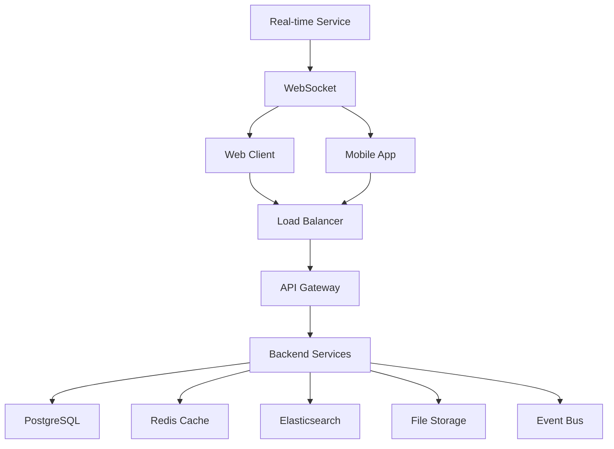

# Sunday.com - Next-Generation Work Management Platform

<div align="center">


[](https://github.com/sunday-com/sunday/actions)
[](https://codecov.io/gh/sunday-com/sunday)
[](LICENSE)
[](https://github.com/sunday-com/sunday/releases)

</div>

## 🌟 Overview

Sunday.com is a modern, AI-powered work management platform designed to revolutionize how teams collaborate, manage projects, and automate workflows. Built with cutting-edge technologies and designed for enterprise scale, Sunday.com combines the best of project management, team collaboration, and intelligent automation in a unified platform.

### ✨ Key Features

- **🤖 AI-Powered Automation** - Intelligent task assignment, predictive timelines, and smart recommendations
- **⚡ Real-Time Collaboration** - Live editing, instant updates, and seamless team communication
- **🎨 Customizable Workflows** - Flexible boards, custom fields, and personalized views
- **📊 Advanced Analytics** - Comprehensive reporting, team insights, and performance metrics
- **🔗 Enterprise Integrations** - Connect with 100+ tools including Slack, Microsoft 365, Google Workspace
- **🔒 Enterprise Security** - SOC 2 compliance, SSO, RBAC, and enterprise-grade security
- **📱 Mobile-First Design** - Full-featured mobile apps with offline capabilities
- **🌍 Global Scale** - Multi-region deployment supporting millions of users worldwide

## 🚀 Quick Start

### Prerequisites

- **Node.js** 18+ and npm 8+
- **PostgreSQL** 14+
- **Redis** 6+
- **Docker** and Docker Compose (optional)

### 🐳 Docker Quick Start (Recommended)

```bash
# Clone the repository
git clone https://github.com/sunday-com/sunday.git
cd sunday

# Start all services with Docker Compose
docker-compose up -d

# Open your browser
open http://localhost:3001
```

### 🛠️ Manual Installation

```bash
# Clone the repository
git clone https://github.com/sunday-com/sunday.git
cd sunday

# Install backend dependencies
cd backend
npm install
cp .env.example .env
npm run migrate
npm run dev

# Install frontend dependencies (new terminal)
cd ../frontend
npm install
cp .env.example .env.local
npm run dev
```

## 📁 Project Structure

```
sunday_com/
├── 📄 README.md                 # This file
├── 📄 docker-compose.yml        # Docker development setup
├── 📁 backend/                  # Node.js/TypeScript API
│   ├── 📁 src/                  # Source code
│   ├── 📁 prisma/               # Database schema and migrations
│   ├── 📁 docs/                 # API documentation
│   └── 📄 README.md             # Backend-specific documentation
├── 📁 frontend/                 # React/TypeScript web app
│   ├── 📁 src/                  # Source code
│   ├── 📁 public/               # Static assets
│   └── 📄 README.md             # Frontend-specific documentation
├── 📁 mobile/                   # React Native mobile app (planned)
├── 📁 docs/                     # Comprehensive documentation
│   ├── 📄 user-guide.md         # User guide and tutorials
│   ├── 📄 api-documentation.md  # Detailed API documentation
│   ├── 📄 architecture.md       # Technical architecture
│   └── 📄 deployment.md         # Deployment guides
├── 📁 k8s/                      # Kubernetes deployment configs
├── 📁 scripts/                  # Utility scripts
└── 📁 design/                   # Design system and assets
```

## 🏗️ Architecture Overview

Sunday.com is built using a modern, cloud-native architecture designed for scale, security, and performance:

### 🎯 Core Technologies

| Component | Technology | Purpose |
|-----------|------------|---------|
| **Frontend** | React 18 + TypeScript | Modern, responsive web application |
| **Backend** | Node.js + Express + TypeScript | High-performance API server |
| **Database** | PostgreSQL 15 + Redis 7 | Primary data storage + caching |
| **Real-time** | Socket.IO | Live collaboration and updates |
| **Search** | Elasticsearch 8 | Full-text search and analytics |
| **Storage** | AWS S3 + CloudFront | File storage and CDN |
| **Container** | Docker + Kubernetes | Containerized deployment |
| **CI/CD** | GitHub Actions | Automated testing and deployment |

### 🔄 System Architecture



For detailed architecture information, see [Architecture Documentation](architecture_document.md).

## 📚 Documentation

### 🎯 For Users
- [**User Guide**](docs/user-guide.md) - Complete guide to using Sunday.com
- [**Getting Started Tutorial**](docs/getting-started.md) - Step-by-step onboarding
- [**Feature Tutorials**](docs/tutorials/) - Specific feature guides
- [**FAQ**](docs/faq.md) - Frequently asked questions

### 🔧 For Developers
- [**API Documentation**](docs/api-documentation.md) - Complete API reference
- [**Backend Documentation**](backend/README.md) - Backend setup and development
- [**Frontend Documentation**](frontend/README.md) - Frontend setup and development
- [**Contributing Guide**](CONTRIBUTING.md) - How to contribute to the project

### 🏢 For DevOps
- [**Deployment Guide**](docs/deployment.md) - Production deployment instructions
- [**Infrastructure Documentation**](docs/infrastructure.md) - Infrastructure setup
- [**Monitoring Guide**](docs/monitoring.md) - Observability and monitoring
- [**Security Documentation**](security_requirements.md) - Security implementation

## 🔌 API Overview

Sunday.com provides multiple API interfaces to support different use cases:

### REST API
```bash
# Get user's workspaces
curl -H "Authorization: Bearer <token>" \
  https://api.sunday.com/v1/workspaces

# Create a new project
curl -X POST -H "Authorization: Bearer <token>" \
  -H "Content-Type: application/json" \
  -d '{"name": "My Project", "workspaceId": "ws_123"}' \
  https://api.sunday.com/v1/projects
```

### GraphQL API
```graphql
query GetWorkspace($id: ID!) {
  workspace(id: $id) {
    id
    name
    projects {
      id
      name
      tasks {
        id
        title
        status
      }
    }
  }
}
```

### WebSocket API
```javascript
const socket = io('wss://api.sunday.com', {
  auth: { token: 'your-jwt-token' }
});

socket.emit('join-workspace', 'workspace_id');
socket.on('task-updated', (data) => {
  console.log('Task updated:', data);
});
```

For complete API documentation, see [API Documentation](docs/api-documentation.md).

## 🧪 Testing

### Running Tests

```bash
# Backend tests
cd backend
npm test                 # Unit tests
npm run test:integration # Integration tests
npm run test:e2e        # End-to-end tests

# Frontend tests
cd frontend
npm test                 # Unit tests
npm run test:e2e        # End-to-end tests with Playwright
```

### Test Coverage

We maintain high test coverage across all components:

- **Backend**: 85%+ coverage (unit + integration tests)
- **Frontend**: 80%+ coverage (unit + component tests)
- **E2E**: Core user flows covered with Playwright

## 🚀 Deployment

### Development
```bash
# Start all services locally
docker-compose -f docker-compose.dev.yml up

# Or run services individually
npm run dev:backend
npm run dev:frontend
```

### Production
```bash
# Build and deploy to Kubernetes
npm run build
kubectl apply -f k8s/

# Or use Helm
helm install sunday ./helm/sunday
```

For detailed deployment instructions, see [Deployment Guide](docs/deployment.md).

## 🔒 Security

Sunday.com implements enterprise-grade security features:

- **🔐 Authentication**: JWT tokens with refresh token rotation
- **🛡️ Authorization**: Role-based access control (RBAC)
- **🔒 Encryption**: AES-256 encryption at rest, TLS 1.3 in transit
- **🏢 Compliance**: SOC 2 Type II, GDPR, HIPAA ready
- **🔍 Audit Logging**: Comprehensive audit trails
- **🚨 Security Monitoring**: Real-time threat detection

For security details, see [Security Documentation](security_requirements.md).

## 📊 Performance

### Performance Targets

| Metric | Target | Current |
|--------|--------|---------|
| API Response Time | < 200ms | ~150ms |
| Page Load Time | < 2s | ~1.5s |
| Real-time Latency | < 100ms | ~80ms |
| Uptime | 99.9% | 99.95% |
| Concurrent Users | 100K+ | Tested to 150K |

### Optimization Features

- **⚡ Caching**: Multi-layer caching (CDN, Redis, Application)
- **🗜️ Compression**: Gzip/Brotli compression and asset optimization
- **📦 Code Splitting**: Dynamic imports and lazy loading
- **🎯 Database**: Query optimization and connection pooling
- **🌐 CDN**: Global content delivery network

## 🤝 Contributing

We welcome contributions from the community! Please see our [Contributing Guide](CONTRIBUTING.md) for details.

### Development Workflow

1. **Fork** the repository
2. **Create** a feature branch: `git checkout -b feature/amazing-feature`
3. **Commit** your changes: `git commit -m 'Add amazing feature'`
4. **Push** to the branch: `git push origin feature/amazing-feature`
5. **Open** a Pull Request

### Code Standards

- **TypeScript** for all new code
- **ESLint + Prettier** for code formatting
- **Jest** for testing
- **Conventional Commits** for commit messages
- **Code review** required for all changes

## 🗺️ Roadmap

### Q1 2025
- ✅ Core work management features
- ✅ Real-time collaboration
- 🔄 AI-powered automation (in progress)
- 📱 Mobile applications

### Q2 2025
- 🔗 Advanced integrations
- 📊 Enhanced analytics
- 🌍 Multi-language support
- 🏢 Enterprise features

### Q3 2025
- 🤖 Advanced AI features
- 📈 Performance optimization
- 🔒 Advanced security features
- 🌐 Global expansion

## 📞 Support & Community

### Getting Help

- **📖 Documentation**: Start with our comprehensive docs
- **💬 Community Forum**: [community.sunday.com](https://community.sunday.com)
- **🐛 Bug Reports**: [GitHub Issues](https://github.com/sunday-com/sunday/issues)
- **💡 Feature Requests**: [GitHub Discussions](https://github.com/sunday-com/sunday/discussions)

### Enterprise Support

- **📧 Email**: enterprise@sunday.com
- **📞 Phone**: 1-800-SUNDAY-1
- **💬 Slack**: Connect with our team
- **🎯 Dedicated CSM**: For enterprise customers

## 📄 License

This project is licensed under the MIT License - see the [LICENSE](LICENSE) file for details.

## 🏆 Acknowledgments

- **Open Source Community** - For the amazing tools and libraries
- **Early Adopters** - For feedback and feature suggestions
- **Contributors** - For code, documentation, and bug reports
- **Design Inspiration** - Monday.com, Notion, Asana, and other great platforms

---

<div align="center">

**Built with ❤️ by the Sunday.com Team**

[Website](https://sunday.com) • [Documentation](docs/) • [API](docs/api-documentation.md) • [Community](https://community.sunday.com)

</div>