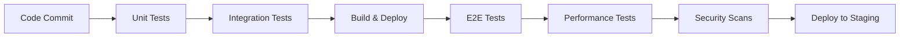

# Sunday.com - Comprehensive Test Plan

## Executive Summary

This document outlines the comprehensive testing strategy for Sunday.com, a modern work management platform. The testing approach covers all aspects of quality assurance including unit testing, integration testing, end-to-end testing, performance testing, security testing, and accessibility testing.

## Project Overview

**Project:** Sunday.com - Work Management Platform
**Platform Type:** Cloud-based SaaS Application
**Testing Timeline:** Aligned with Sprint Development Cycle
**Target Release:** Q1 2025

## Testing Objectives

### Primary Objectives
1. **Functional Validation** - Ensure all features work according to specifications
2. **Performance Assurance** - Validate system meets performance requirements
3. **Security Verification** - Confirm security controls are effective
4. **User Experience Validation** - Ensure platform is intuitive and accessible
5. **Cross-Platform Compatibility** - Verify functionality across browsers and devices
6. **Integration Reliability** - Validate third-party integrations work seamlessly

### Quality Gates
- **Unit Test Coverage:** Minimum 80% line coverage
- **Integration Test Coverage:** All API endpoints tested
- **E2E Test Coverage:** All critical user journeys covered
- **Performance Standards:** < 200ms API response time, < 2s page load
- **Accessibility:** WCAG 2.1 AA compliance
- **Security:** No critical or high-severity vulnerabilities

---

## Testing Scope

### In Scope

#### Core Features
- **User Authentication & Authorization**
  - Registration, login, logout, password reset
  - Multi-factor authentication
  - Single sign-on integration
  - Role-based access control

- **Work Management**
  - Board creation and management
  - Task creation, editing, and deletion
  - Task status updates and progress tracking
  - Custom field management
  - Template system

- **Real-time Collaboration**
  - Live editing and presence indicators
  - Commenting and @mentions
  - Real-time notifications
  - Activity feeds

- **AI-Powered Features**
  - Task assignment suggestions
  - Automated status updates
  - Predictive analytics
  - Content generation

- **Analytics & Reporting**
  - Dashboard widgets
  - Custom reports
  - Data export functionality
  - Performance metrics

- **Integration Ecosystem**
  - Third-party API integrations
  - Webhook management
  - Import/export capabilities

#### Non-Functional Requirements
- **Performance Testing**
  - Load testing (1000+ concurrent users)
  - Stress testing (system breaking point)
  - Volume testing (large data sets)
  - Endurance testing (extended periods)

- **Security Testing**
  - Authentication and authorization
  - Data encryption validation
  - SQL injection prevention
  - XSS protection
  - CSRF protection

- **Usability Testing**
  - User interface responsiveness
  - Navigation flow
  - Accessibility compliance
  - Mobile experience

- **Compatibility Testing**
  - Browser compatibility (Chrome, Firefox, Safari, Edge)
  - Mobile device testing (iOS, Android)
  - Operating system compatibility

### Out of Scope
- Third-party service internal functionality
- Infrastructure provider (AWS/Azure/GCP) services
- Email delivery service internals
- Payment gateway internal processing

---

## Testing Levels

### 1. Unit Testing

**Framework:** Jest + ts-jest
**Coverage Target:** 80% line coverage
**Scope:** Individual functions, classes, and components

#### Backend Unit Testing
- Service layer methods
- Utility functions
- Data validation logic
- Authentication helpers
- Database models

#### Frontend Unit Testing
- React components
- Custom hooks
- State management (Zustand)
- Utility functions
- Form validation

### 2. Integration Testing

**Framework:** Jest + Supertest (Backend), React Testing Library (Frontend)
**Scope:** Component interactions and API integrations

#### API Integration Testing
- REST endpoint functionality
- GraphQL resolver testing
- Database operations
- External service integrations
- Authentication middleware

#### Frontend Integration Testing
- Component composition
- API client integration
- State management integration
- Routing functionality

### 3. End-to-End Testing

**Framework:** Playwright
**Scope:** Complete user workflows and critical business scenarios

#### Critical User Journeys
- User registration and onboarding
- Project setup and board creation
- Task management lifecycle
- Real-time collaboration scenarios
- Reporting and analytics workflows

#### Cross-Browser Testing
- Chrome (latest 2 versions)
- Firefox (latest 2 versions)
- Safari (latest 2 versions)
- Edge (latest 2 versions)

### 4. Performance Testing

**Framework:** k6
**Scope:** System performance under various load conditions

#### Performance Test Types
- **Load Testing:** Normal expected load (100-500 concurrent users)
- **Stress Testing:** Beyond normal capacity (1000+ concurrent users)
- **Volume Testing:** Large data sets (10,000+ tasks per board)
- **Spike Testing:** Sudden traffic increases
- **Endurance Testing:** Extended periods (24+ hours)

#### Key Performance Indicators
- API response time < 200ms (95th percentile)
- Page load time < 2 seconds
- Database query performance < 100ms
- WebSocket message latency < 50ms
- File upload performance (100MB files)

### 5. Security Testing

**Framework:** Custom security test suite + OWASP ZAP
**Scope:** Security vulnerabilities and compliance validation

#### Security Test Areas
- Authentication bypass attempts
- Authorization escalation testing
- SQL injection testing
- Cross-site scripting (XSS) prevention
- Cross-site request forgery (CSRF) protection
- Data encryption validation
- Session management testing
- API security testing

### 6. Accessibility Testing

**Framework:** Jest-axe + Manual testing
**Scope:** WCAG 2.1 AA compliance validation

#### Accessibility Test Areas
- Keyboard navigation
- Screen reader compatibility
- Color contrast ratios
- Focus management
- ARIA labels and roles
- Alternative text for images

---

## Testing Environment Strategy

### Environment Types

#### 1. Development Environment
- **Purpose:** Developer unit and integration testing
- **Data:** Synthetic test data
- **Refresh:** On-demand
- **Access:** Development team

#### 2. Test Environment
- **Purpose:** QA testing and automated test execution
- **Data:** Production-like test data (anonymized)
- **Refresh:** Daily automated refresh
- **Access:** QA team, automated test runners

#### 3. Staging Environment
- **Purpose:** Pre-production validation and user acceptance testing
- **Data:** Production data subset (anonymized)
- **Refresh:** Weekly
- **Access:** All stakeholders

#### 4. Performance Test Environment
- **Purpose:** Performance and load testing
- **Data:** Production-scale test data
- **Infrastructure:** Production-equivalent resources
- **Access:** QA team, performance engineers

### Test Data Management

#### Test Data Categories
- **User Accounts:** Various user roles and permissions
- **Organizations:** Different organization sizes and configurations
- **Projects:** Various project types and states
- **Tasks:** Different task types, statuses, and relationships
- **Custom Fields:** Various field types and configurations

#### Data Refresh Strategy
- Automated test data generation
- Production data anonymization scripts
- Incremental data updates
- Test data versioning

---

## Testing Methodology

### Test Design Techniques

#### 1. Equivalence Partitioning
- Valid and invalid input ranges
- Boundary value analysis
- Error condition testing

#### 2. State Transition Testing
- Task status workflows
- User authentication states
- Board and project lifecycles

#### 3. User Story-Based Testing
- Acceptance criteria validation
- Business rule verification
- User journey testing

#### 4. Risk-Based Testing
- Critical feature prioritization
- Security vulnerability focus
- Performance bottleneck identification

### Test Execution Strategy

#### Automated Testing Pipeline


#### Manual Testing Process
1. **Exploratory Testing** - Unscripted investigation
2. **Usability Testing** - User experience validation
3. **Compatibility Testing** - Cross-browser and device testing
4. **Accessibility Testing** - WCAG compliance validation

---

## Test Automation Strategy

### Automation Pyramid

```
        /\
       /  \
      / UI \     ← E2E Tests (10%)
     /______\
    /        \
   / API/INT  \   ← Integration Tests (30%)
  /____________\
 /              \
/ UNIT TESTS     \ ← Unit Tests (60%)
/________________\
```

### Automation Criteria

#### Good Candidates for Automation
- Repetitive test cases
- Regression testing
- Data-driven testing
- Performance testing
- Security scanning
- API testing

#### Manual Testing Focus
- Usability testing
- Exploratory testing
- Visual validation
- Complex business scenarios
- First-time feature testing

### CI/CD Integration

#### Continuous Integration
- Unit tests run on every commit
- Integration tests run on feature branch merges
- Automated code quality checks
- Security vulnerability scanning

#### Continuous Deployment
- E2E tests run on staging deployment
- Performance tests on performance environment
- Automated rollback on test failures

---

## Risk Assessment

### High-Risk Areas

#### 1. Real-time Collaboration
- **Risk:** Data synchronization conflicts
- **Mitigation:** Extensive WebSocket testing, conflict resolution validation
- **Test Focus:** Concurrent user scenarios, network interruption handling

#### 2. AI-Powered Features
- **Risk:** Unpredictable AI behavior, performance impact
- **Mitigation:** Comprehensive AI model testing, fallback scenarios
- **Test Focus:** AI response validation, performance impact testing

#### 3. Data Security
- **Risk:** Data breaches, unauthorized access
- **Mitigation:** Security-focused testing, penetration testing
- **Test Focus:** Authentication, authorization, data encryption

#### 4. Performance at Scale
- **Risk:** System degradation under load
- **Mitigation:** Comprehensive performance testing
- **Test Focus:** Load testing, stress testing, resource monitoring

#### 5. Third-party Integrations
- **Risk:** Integration failures, data inconsistencies
- **Mitigation:** Mock services for testing, integration monitoring
- **Test Focus:** API integration testing, error handling

### Medium-Risk Areas

#### 1. Mobile Experience
- **Risk:** Feature parity issues, performance problems
- **Mitigation:** Mobile-specific testing, responsive design validation
- **Test Focus:** Cross-device testing, touch interaction validation

#### 2. Custom Field System
- **Risk:** Data type conflicts, validation issues
- **Mitigation:** Comprehensive field type testing
- **Test Focus:** Data validation, field dependency testing

#### 3. Reporting System
- **Risk:** Incorrect calculations, performance issues
- **Mitigation:** Data validation testing, performance optimization
- **Test Focus:** Report accuracy, large dataset handling

---

## Test Metrics and Reporting

### Test Execution Metrics

#### Coverage Metrics
- **Code Coverage:** Line, branch, function coverage
- **Feature Coverage:** User story completion percentage
- **Risk Coverage:** High-risk scenario test percentage

#### Quality Metrics
- **Defect Density:** Defects per feature/KLOC
- **Defect Escape Rate:** Production defects vs. test defects
- **Test Effectiveness:** Defects found in testing vs. production

#### Efficiency Metrics
- **Test Automation Rate:** Automated vs. manual test ratio
- **Test Execution Time:** Average test suite execution time
- **Environment Availability:** Test environment uptime percentage

### Reporting Schedule

#### Daily Reports
- Test execution summary
- Failed test analysis
- Environment status
- Blocker issues

#### Weekly Reports
- Test progress against plan
- Quality metrics trending
- Risk assessment updates
- Resource utilization

#### Sprint Reports
- Sprint testing summary
- Acceptance criteria validation
- Regression test results
- Performance benchmark results

#### Release Reports
- Go/no-go recommendation
- Quality gate validation
- Risk assessment
- Post-release monitoring plan

---

## Tool Stack

### Testing Frameworks

#### Backend Testing
- **Unit Testing:** Jest + ts-jest
- **Integration Testing:** Jest + Supertest
- **API Testing:** Jest + Supertest + Postman/Newman
- **Database Testing:** Jest + Prisma Test Client

#### Frontend Testing
- **Unit Testing:** Jest + React Testing Library
- **Component Testing:** Storybook + Chromatic
- **Visual Regression:** Percy or Chromatic
- **Accessibility:** Jest-axe + Lighthouse CI

#### End-to-End Testing
- **Primary Framework:** Playwright
- **Cross-Browser Testing:** BrowserStack/Sauce Labs
- **Mobile Testing:** Appium (if native apps)

#### Performance Testing
- **Load Testing:** k6
- **Frontend Performance:** Lighthouse CI + WebPageTest
- **Database Performance:** Custom monitoring + Artillery

#### Security Testing
- **Static Analysis:** SonarQube + ESLint Security
- **Dynamic Testing:** OWASP ZAP + Burp Suite
- **Dependency Scanning:** npm audit + Snyk

### CI/CD Integration
- **CI Platform:** GitHub Actions / GitLab CI
- **Test Reporting:** Allure Reports + Jest HTML Reporter
- **Code Coverage:** Codecov / SonarQube
- **Test Management:** TestRail / Zephyr (if needed)

---

## Success Criteria

### Quality Gates for Release

#### Code Quality
- ✅ Unit test coverage ≥ 80%
- ✅ No critical or high-severity security vulnerabilities
- ✅ Code quality gate passed (SonarQube)
- ✅ All linting and formatting checks passed

#### Functional Quality
- ✅ All P0 and P1 user stories tested and accepted
- ✅ Critical user journeys validated end-to-end
- ✅ Regression testing completed successfully
- ✅ API contract tests passing

#### Performance Quality
- ✅ API response time < 200ms (95th percentile)
- ✅ Page load time < 2 seconds
- ✅ System handles 1000+ concurrent users
- ✅ No memory leaks or performance degradation

#### Security & Compliance
- ✅ Security testing completed with no critical findings
- ✅ WCAG 2.1 AA compliance validated
- ✅ Data privacy requirements met
- ✅ Authentication and authorization working correctly

#### Infrastructure & Deployment
- ✅ Deployment automation tested
- ✅ Rollback procedures validated
- ✅ Monitoring and alerting configured
- ✅ Disaster recovery tested

---

## Test Schedule

### Sprint-Based Testing Schedule

#### Sprint Planning (Days 1-2)
- Test planning for new features
- Test case review and updates
- Test environment preparation
- Test data setup

#### Development Phase (Days 3-7)
- Unit testing (developer-led)
- Component testing (developer-led)
- Integration testing preparation
- Test automation script development

#### Testing Phase (Days 8-9)
- Feature testing execution
- Integration testing
- Regression testing
- Exploratory testing

#### Sprint Review (Day 10)
- Test results review
- Quality metrics analysis
- Risk assessment update
- Next sprint planning

### Release Testing Schedule

#### Pre-Release (1 week before)
- Comprehensive regression testing
- Performance testing execution
- Security testing completion
- User acceptance testing

#### Release Week
- Final smoke testing
- Production deployment validation
- Post-deployment monitoring
- Issue triage and hotfix testing

---

## Communication Plan

### Stakeholder Communication

#### Daily Standup
- Test execution status
- Blocker issues
- Test environment status
- Quality concerns

#### Weekly Quality Review
- Test metrics review
- Quality trends analysis
- Risk assessment
- Process improvements

#### Sprint Review
- Testing accomplishments
- Quality gate status
- Lessons learned
- Next sprint focus

### Escalation Matrix

#### Level 1: QA Team Lead
- Test execution issues
- Environment problems
- Resource conflicts

#### Level 2: Engineering Manager
- Quality gate failures
- Schedule conflicts
- Resource allocation

#### Level 3: Product Manager
- Scope changes
- Acceptance criteria conflicts
- Business risk decisions

#### Level 4: CTO/VP Engineering
- Release decisions
- Major quality issues
- Strategic direction

---

## Appendices

### Appendix A: Test Case Template
### Appendix B: Bug Report Template
### Appendix C: Test Environment Setup Guide
### Appendix D: Performance Testing Checklist
### Appendix E: Security Testing Checklist
### Appendix F: Accessibility Testing Checklist

---

*Document Version: 1.0*
*Last Updated: December 2024*
*Review Schedule: Weekly during active development*
*Approval: QA Lead, Engineering Manager, Product Manager*